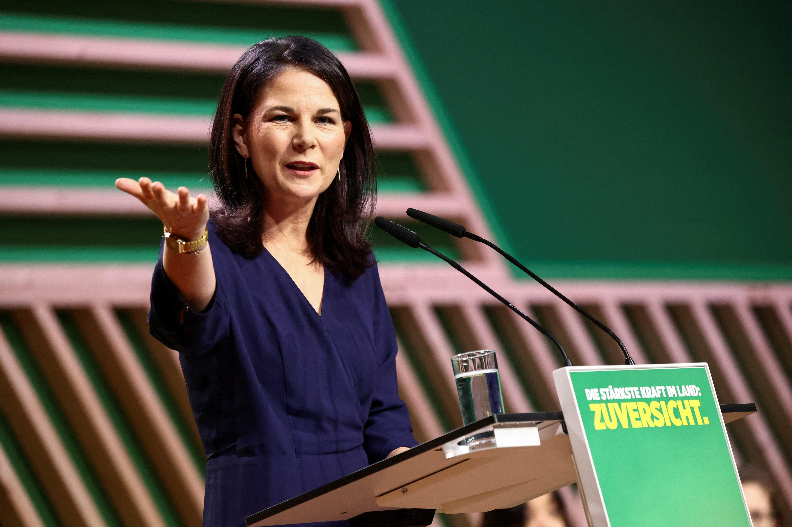

## Claim
Claim: "In February 2025 German Foreign Minister Annalena Baerbock threatened the US with severing ties amid US President Donald Trump's comments on Ukrainian President Volodymyr Zelenskyy and Ukraine."

## Actions
```
image_search("Annalena Baerbock Donald Trump February 2025")
image_search("Annalena Baerbock threatens US sever ties")
```

## Evidence
### Evidence from `image_search`
The search results include images of Annalena Baerbock (, , ). One source is from [Source](https://www.hudson.org/global-economy/what-i-heard-munich-ordinary-germans-long-trump-their-own-kenneth-weinstein).

Another source is from [Source](https://www.reuters.com/world/europe/german-foreign-minister-europe-needs-be-involved-ukraine-talks-2025-02-13/). A third source is from [Source](https://www.plenglish.com/news/2025/02/20/germany-criticizes-trump-for-calling-zelensky-a-dictator/).


### Evidence from `image_search`
The search results include articles and images related to Annalena Baerbock. One source is from [Radio Free Europe/Radio Liberty](https://www.rferl.org/a/germany-china-baerbock-visit-war-ukraine-russia/33223503.html) , another from [The Guardian](https://www.theguardian.com/world/2022/jan/20/annalena-baerbock-the-german-minister-staring-down-russia-over-ukraine) , and a third from [ABC News Australia](https://www.abc.net.au/news/2024-05-05/german-foreign-minister-annalena-baerbock-china-russia-trade/103802558) .


## Elaboration
The evidence confirms that Annalena Baerbock was active in February 2025 and commented on Trump's remarks regarding Zelenskyy and Ukraine. Specifically, one source states that Germany criticized Trump for calling Zelenskyy a dictator ([Source](https://www.plenglish.com/news/2025/02/20/germany-criticizes-trump-for-calling-zelensky-a-dictator/)). However, the evidence does not explicitly state that Baerbock threatened to sever ties with the US.

Therefore, the claim is partially supported, but the specific assertion about severing ties requires further verification.


## Final Judgement
The search results confirm that Annalena Baerbock was active in February 2025 and commented on Trump's remarks regarding Zelenskyy and Ukraine. However, the evidence does not explicitly state that Baerbock threatened to sever ties with the US.

The claim is not entirely supported by the evidence. While Baerbock did comment on Trump's remarks, there is no evidence to support the claim that she threatened to sever ties with the US. Therefore, the claim is considered false. `false`


### Verdict: FALSE

### Justification
The claim is not supported by the evidence. While Annalena Baerbock did comment on Donald Trump's remarks regarding Zelenskyy and Ukraine in February 2025, as evidenced by sources like [Reuters](https://www.reuters.com/world/europe/german-foreign-minister-europe-needs-be-involved-ukraine-talks-2025-02-13/) and [PL English](https://www.plenglish.com/news/2025/02/20/germany-criticizes-trump-for-calling-zelensky-a-dictator/), there is no evidence to support the assertion that she threatened to sever ties with the US.
