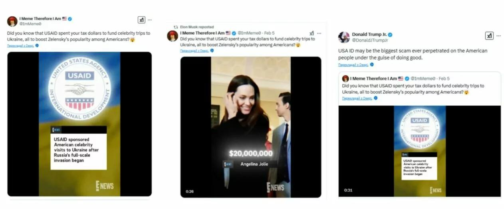
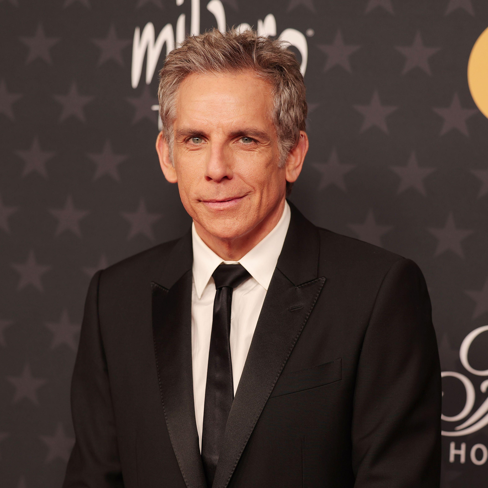

## Claim
Claim: "E! News reported that the United States Agency Aid and Development (USAID) paid millions for celebrities to visit Ukraine."

## Actions
```
image_search("E! News USAID Ukraine celebrities")
```

## Evidence
### Evidence from `image_search`
BBC Verify analyzed an image claiming E! News reported that USAID sponsored American celebrity visits to Ukraine (). Gwaramedia.com debunks a claim that E! News released a video about Hollywood stars receiving USAID money for visits to Ukraine, showing a screenshot of a tweet with the E! News logo and the text "USAID sponsored American celebrity visits to Ukraine after Russia's full-scale invasion began" ().

Vanity Fair discusses Ben Stiller's denial of Elon Musk's retweet claiming USAID funded celebrities' trip to Ukraine ().


## Elaboration
The evidence suggests that the claim is likely false. BBC Verify analyzed an image that falsely claimed E! News reported on USAID sponsoring celebrity visits to Ukraine. Gwaramedia.com debunked a similar claim, showing a screenshot with the E! News logo. Additionally, Vanity Fair reported on Ben Stiller denying a related claim.


## Final Judgement
The evidence indicates that the claim is false. Multiple sources debunked the claim that E! News reported on USAID funding celebrity visits to Ukraine.

`false`


### Verdict: FALSE

### Justification
The claim that E! News reported USAID paid for celebrities to visit Ukraine is false. Multiple sources, including BBC Verify and Gwaramedia.com, debunked the claim, and Vanity Fair reported on a related denial by Ben Stiller.
