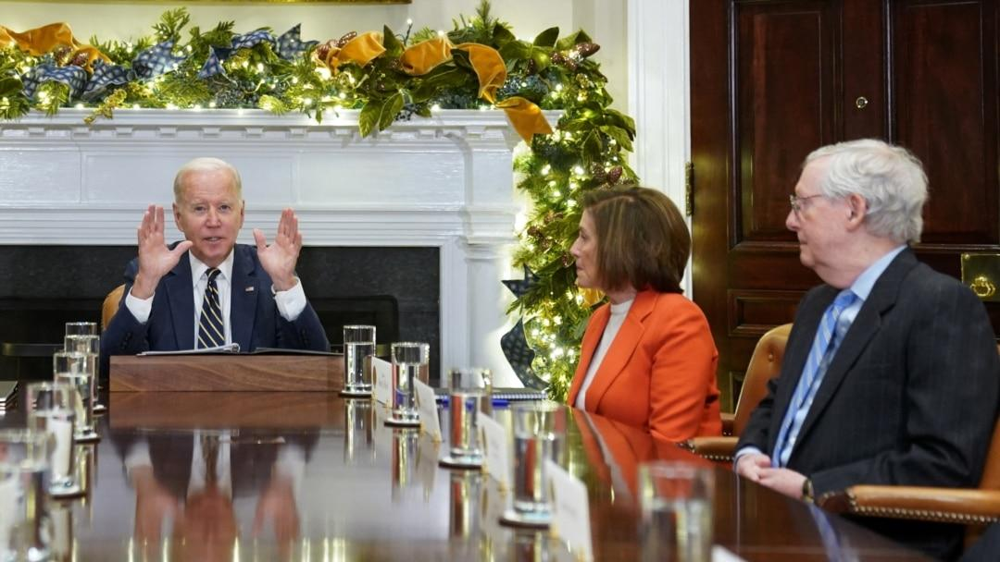
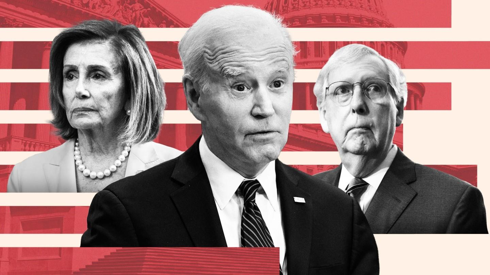
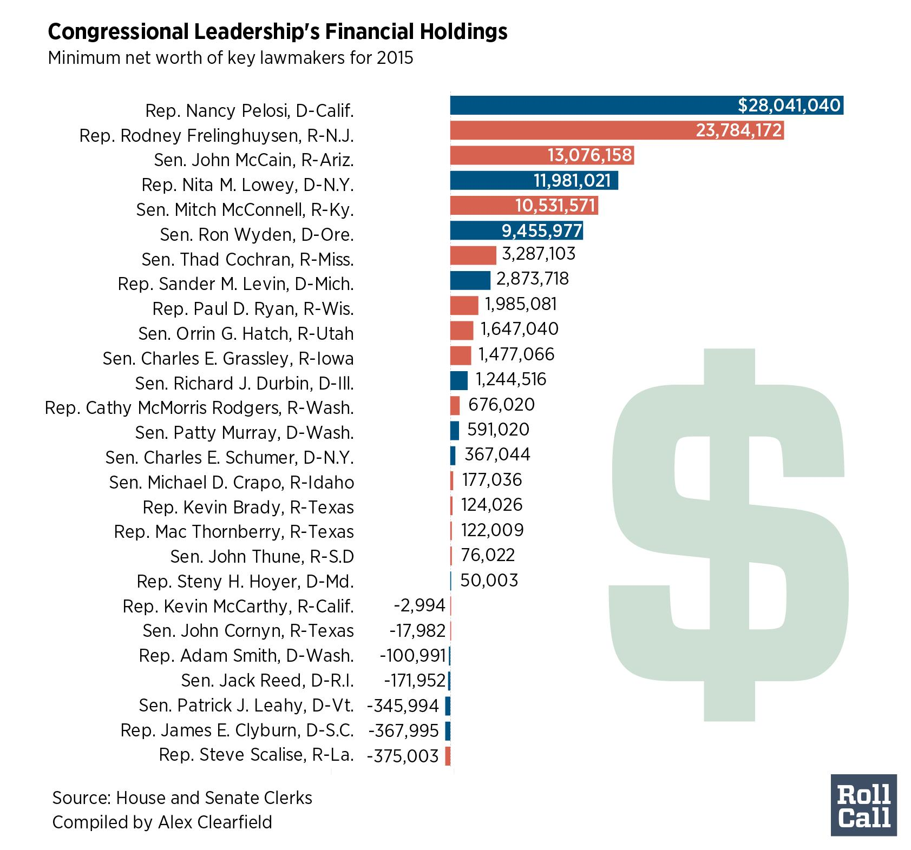
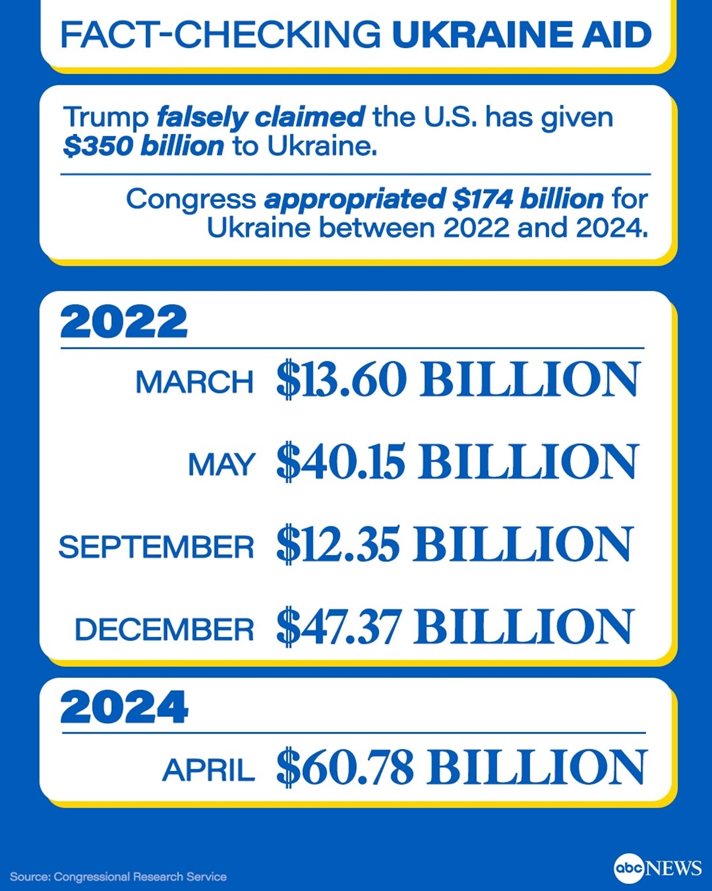
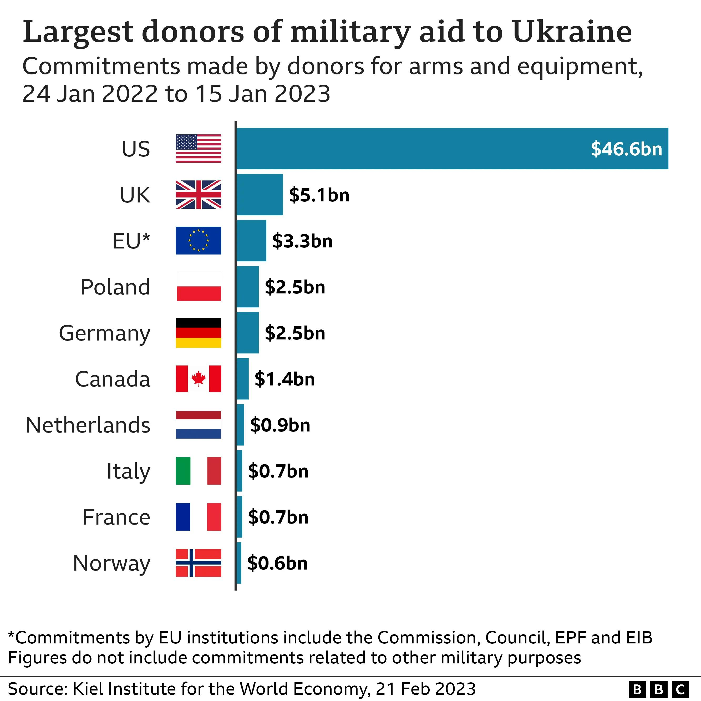
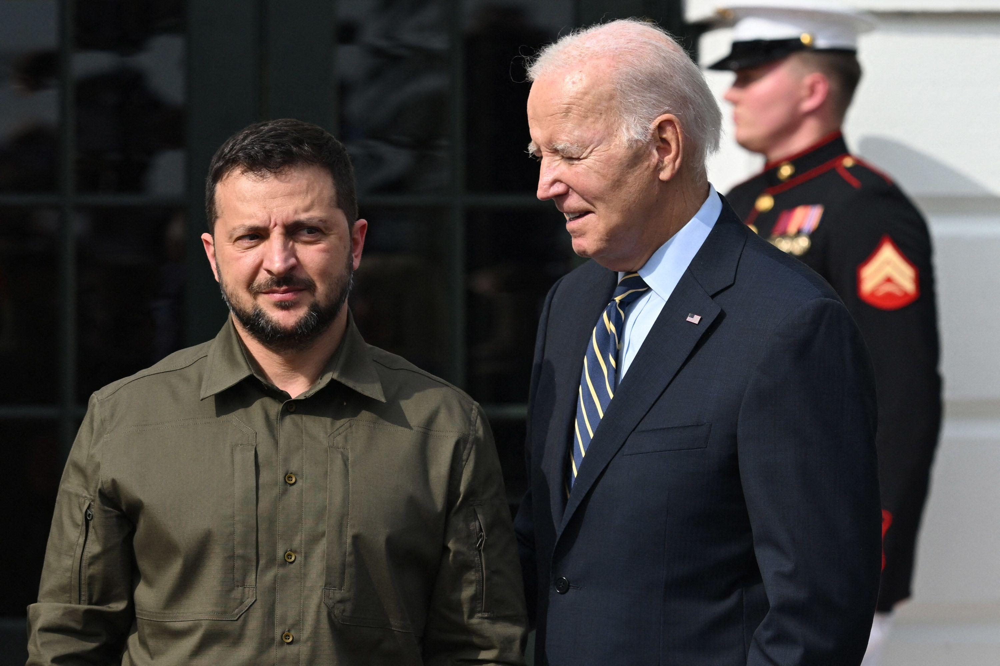

## Claim
Claim: " This image shows an authentic list realeased by Ukraine showing US politicians taking bribes from Ukraine. The highest bribe was 92 Million US-$ for Joe Biden."

## Actions
```
image_search("Joe Biden Mitch McConnell Nancy Pelosi wealth")
image_search("US politicians wealth Ukraine")
```

## Evidence
### Evidence from `image_search`
The Voice of America published an image of Joe Biden, Nancy Pelosi, and Mitch McConnell. ([https://www.voanews.com/a/biden-hosts-congressional-leaders-to-discuss-his-agenda/6855070.html](https://www.voanews.com/a/biden-hosts-congressional-leaders-to-discuss-his-agenda/6855070.html))  The Financial Times published an article about the wealth of US politicians, including Joe Biden, Mitch McConnell, and Nancy Pelosi. ([https://www.ft.com/content/faa721e6-4fcf-4b9b-ae39-9ad6c44ed971](https://www.ft.com/content/faa721e6-4fcf-4b9b-ae39-9ad6c44ed971)) 

Roll Call published an article about the net worth of key lawmakers in 2015, including Nancy Pelosi, Mitch McConnell, and John Cornyn. ([https://rollcall.com/2016/11/28/net-worth-of-leaders-held-stable-during-tough-2015-investment-year/](https://rollcall.com/2016/11/28/net-worth-of-leaders-held-stable-during-tough-2015-investment-year/)) 


### Evidence from `image_search`
ABC News fact-checked claims about US aid to Ukraine, including an image showing the amount of money appropriated by Congress for Ukraine between 2022 and 2024. ([https://abcnews.go.com/Politics/fact-checking-trumps-claims-amount-us-aid-ukraine/story?id=119167409](https://abcnews.go.com/Politics/fact-checking-trumps-claims-amount-us-aid-ukraine/story?id=119167409)) 

The BBC published an article about the largest donors of military aid to Ukraine, with the US being the largest donor. ([https://www.bbc.com/news/world-us-canada-64656301](https://www.bbc.com/news/world-us-canada-64656301))  CNN published an image of Joe Biden with Volodymyr Zelenskyy. ([https://www.cnn.com/2023/09/21/politics/war-funding-ukraine-what-matters](https://www.cnn.com/2023/09/21/politics/war-funding-ukraine-what-matters)) 


## Elaboration
The evidence provides information about the wealth of US politicians and US aid to Ukraine. However, there is no evidence to support the claim that the image is an authentic list released by Ukraine showing US politicians taking bribes from Ukraine. The provided sources discuss the wealth of politicians and US aid to Ukraine, but they do not mention any bribes or a list released by Ukraine.

Therefore, the claim cannot be verified with the available evidence. More information is needed to verify the authenticity of the list and the allegations of bribery.


## Final Judgement
The evidence includes articles and images about the wealth of US politicians and US aid to Ukraine. However, there is no evidence to support the claim that the image is an authentic list released by Ukraine showing US politicians taking bribes. The sources do not mention any bribes or a list released by Ukraine.

`false`

### Verdict: FALSE

### Justification
The claim is false. While the evidence includes information about the wealth of US politicians and US aid to Ukraine, there is no evidence to support the claim that the image is an authentic list released by Ukraine showing US politicians taking bribes. The provided sources, such as those from the [Financial Times](https://www.ft.com/content/faa721e6-4fcf-4b9b-ae39-9ad6c44ed971) and [Roll Call](https://rollcall.com/2016/11/28/net-worth-of-leaders-held-stable-during-tough-2015-investment-year/), discuss the wealth of politicians and US aid to Ukraine, but they do not mention any bribes or a list released by Ukraine.
