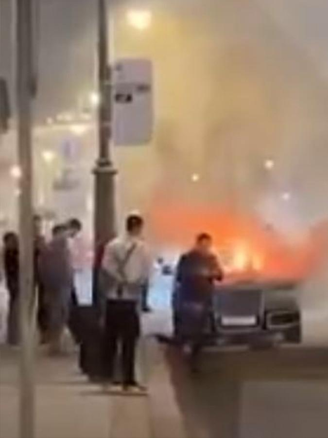
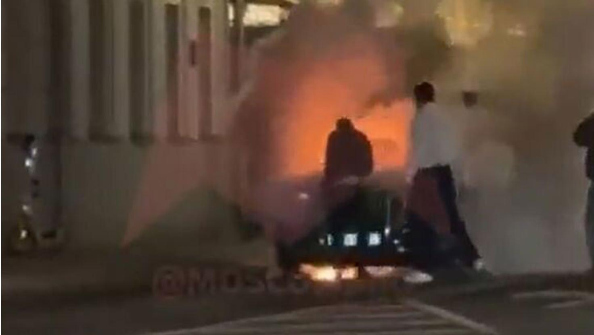

## Claim
Claim: "Russian President Vladimir Putin has died in an explosion in one of his limousines."

## Actions
```
image_search("Vladimir Putin limousine explosion")
```

## Evidence
### Evidence from `image_search`
India Today reports on a limousine from Vladimir Putin's fleet exploding in Moscow and catching fire (). Another source contains an image of a car on fire ().

The Financial Express ([https://www.financialexpress.com/world-news/limousine-from-putins-official-car-fleet-explodes-near-fsb-secret-service-headquarters-details-inside/3793071/](https://www.financialexpress.com/world-news/limousine-from-putins-official-car-fleet-explodes-near-fsb-secret-service-headquarters-details-inside/3793071/)) also reports on the incident.


## Elaboration
The evidence indicates that a limousine from Vladimir Putin's official car fleet exploded and caught fire in Moscow. However, the evidence does not mention anything about Putin being in the car or dying in the explosion.

The claim that Putin died in the explosion is not supported by the provided evidence.


## Final Judgement
A limousine from Vladimir Putin's fleet exploded in Moscow. However, there is no evidence to support the claim that Putin was in the car or died in the explosion.

The claim is not supported by the evidence, as the provided sources only confirm the explosion of a car from Putin's fleet, not his death. `false`


### Verdict: FALSE

### Justification
While a limousine from Vladimir Putin's fleet exploded in Moscow, as reported by sources like [India Today]() and [The Financial Express](https://www.financialexpress.com/world-news/limousine-from-putins-official-car-fleet-explodes-near-fsb-secret-service-headquarters-details-inside/3793071/), there is no evidence to suggest that Putin was in the car or died in the explosion.
