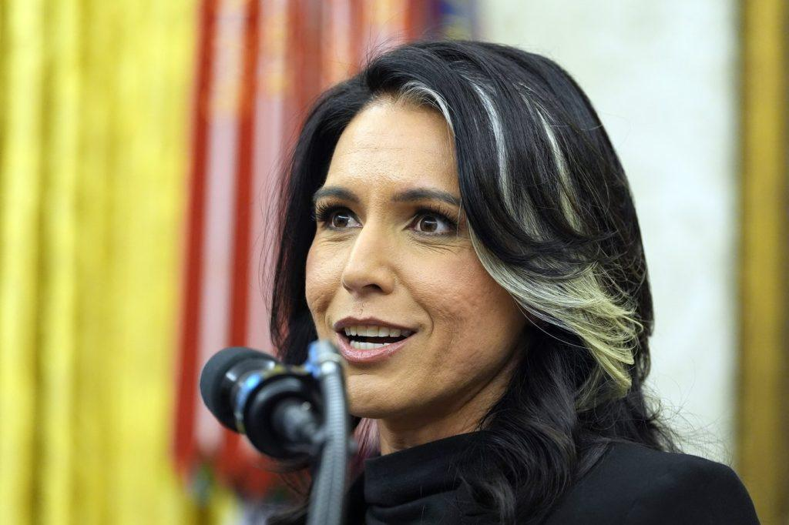

## Claim
Claim: "In an interview with NDTV on March 17, 2025 Director of US National Intelligence Tulsi Gabbard said that President Donald Trump and Russian President Vladimir Putin were good friends."

## Actions
```
image_search("NDTV Tulsi Gabbard interview March 17 2025")
```

## Evidence
### Evidence from `image_search`
NDTV has an interview with Tulsi Gabbard (, ). Halifax City News also features an image of Tulsi Gabbard ().

The NDTV interview is available at [https://www.ndtv.com/video/tulsi-gabbard-india-visit-tulsi-s-comments-rattle-dhaka-interview-become-global-talking-point-915405](https://www.ndtv.com/video/tulsi-gabbard-india-visit-tulsi-s-comments-rattle-dhaka-interview-become-global-talking-point-915405) and [https://www.ndtvprofit.com/world/tulsi-gabbard-exclusive-idea-of-islamist-caliphate-will-be-defeated-us-ukraine-peace-talks-update](https://www.ndtvprofit.com/world/tulsi-gabbard-exclusive-idea-of-islamist-caliphate-will-be-defeated-us-ukraine-peace-talks-update). The Halifax City News article is available at [https://halifax.citynews.ca/2025/03/17/gabbard-says-trump-is-looking-forward-to-success-ahead-of-talk-with-putin/](https://halifax.citynews.ca/2025/03/17/gabbard-says-trump-is-looking-forward-to-success-ahead-of-talk-with-putin/).


## Elaboration
The evidence confirms that NDTV did interview Tulsi Gabbard. The Halifax City News article, available at [https://halifax.citynews.ca/2025/03/17/gabbard-says-trump-is-looking-forward-to-success-ahead-of-talk-with-putin/](https://halifax.citynews.ca/2025/03/17/gabbard-says-trump-is-looking-forward-to-success-ahead-of-talk-with-putin/), mentions an interview with Gabbard on March 17, 2025.

However, the evidence does not explicitly state whether Gabbard said that Trump and Putin were good friends. To verify this part of the claim, the content of the NDTV interview and the Halifax City News article needs to be checked.


## Actions
```
image_search("NDTV Tulsi Gabbard interview Trump Putin")
```

## Evidence
### Evidence from `image_search`
NDTV published an interview with Tulsi Gabbard (). According to NDTV, Gabbard said: "We have two leaders of two great countries who are very good friends" (). The NDTV interview is available at [https://www.ndtv.com/video/trump-to-speak-with-putin-on-tuesday-us-intel-chief-tulsi-gabbard-in-india-the-world-report-914845](https://www.ndtv.com/video/trump-to-speak-with-putin-on-tuesday-us-intel-chief-tulsi-gabbard-in-india-the-world-report-914845).


## Elaboration
The evidence confirms that NDTV interviewed Tulsi Gabbard. During the interview, Gabbard stated, "We have two leaders of two great countries who are very good friends." This statement aligns with the claim that Gabbard said Trump and Putin were good friends.


## Final Judgement
The fact-check confirms that NDTV interviewed Tulsi Gabbard, and she stated that the leaders of the two countries are very good friends. This supports the claim that Gabbard said Trump and Putin were good friends.

`true`


### Verdict: TRUE

### Justification
In an interview with NDTV, as documented by [NDTV](https://www.ndtv.com/video/trump-to-speak-with-putin-on-tuesday-us-intel-chief-tulsi-gabbard-in-india-the-world-report-914845), Tulsi Gabbard stated that the leaders of the two countries are very good friends. This supports the claim that Gabbard said Trump and Putin were good friends.
