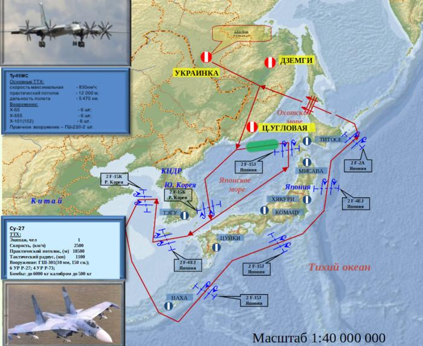
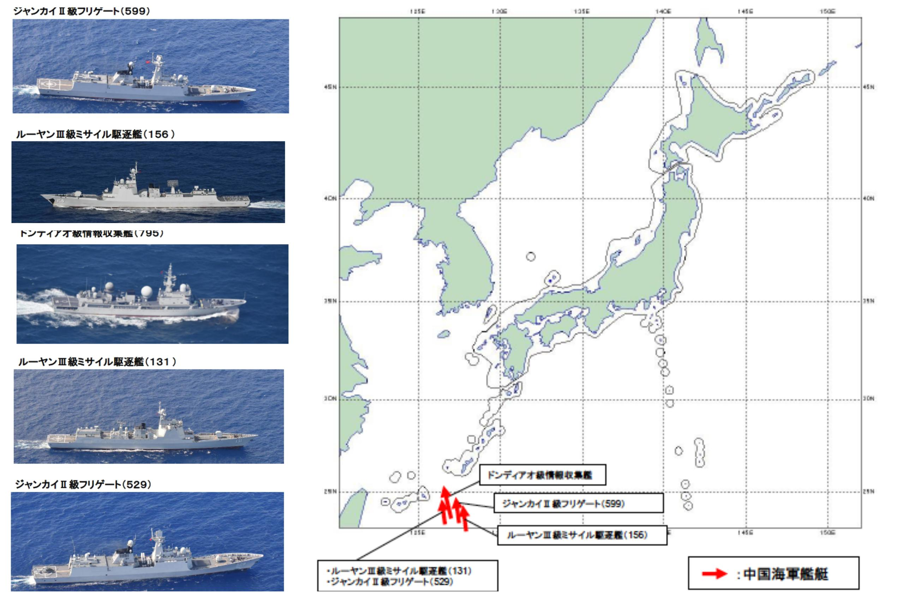
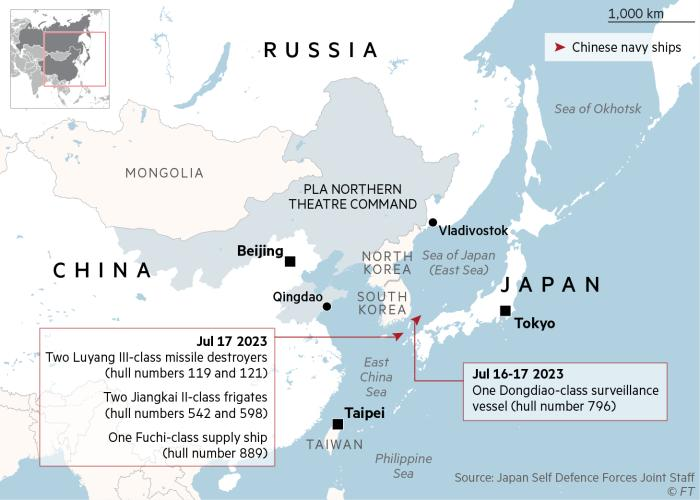
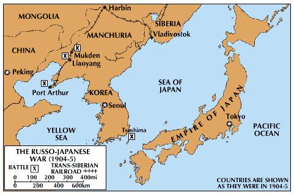
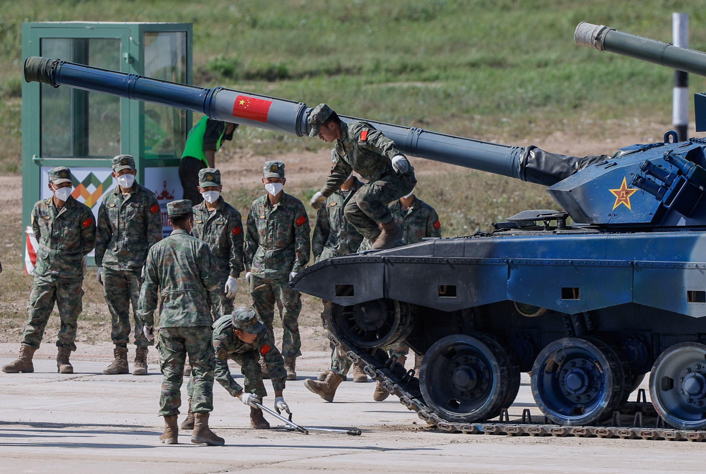
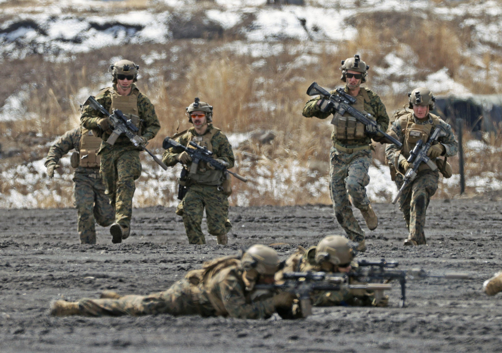

## Claim
Claim: "China and Japan plan to invade the Russian Federation."

## Actions
```
image_search("China Japan Russia military invasion plan")
```

## Evidence
### Evidence from `image_search`
The search results include a map showing military routes and the location of military bases in the area of Japan, Korea, and Russia, along with information about military aircraft . Another result from USNI News shows a map with Chinese and Russian warships near Japan . The first source provided no content.

*   [Source](https://en.wikipedia.org/wiki/Soviet_invasion_of_Manchuria)
*   [Source](https://www.ft.com/content/d345a6e7-2d72-4dcb-9c12-76d571ba75eb)
*   [Source](https://news.usni.org/2022/06/24/chinese-russian-warships-continue-to-circle-japan-defense-minister-says)


## Elaboration
The evidence includes a map showing military routes and bases in the area of Japan, Korea, and Russia, and another map showing Chinese and Russian warships near Japan. This suggests military activity in the region, but it does not confirm any invasion plans.

The presence of military assets and routes does not necessarily indicate an invasion plan. The evidence is insufficient to verify the claim.

To verify the claim, information about any official statements, military strategies, or troop movements that suggest an invasion plan is needed.


## Actions
```
image_search("China Japan Russia military plan invasion")
```

## Evidence
### Evidence from `image_search`
The Financial Times published a map showing the location of Chinese navy ships near Japan and Russia . Britannica includes a map of the Russo-Japanese War (1904-5) .

*   [Source](https://www.ft.com/content/3a6f7efe-b064-45a7-8125-259a51df8a20)
*   [Source](https://www.britannica.com/event/Russo-Japanese-War)


## Elaboration
The evidence shows the presence of Chinese navy ships near Japan and Russia, and a historical map of the Russo-Japanese War. This suggests military activity and historical conflict in the region, but it does not confirm any current invasion plans.

The Financial Times map shows the location of Chinese navy ships, which could be interpreted as a show of force or a strategic positioning. However, this does not directly imply an invasion plan. The Britannica map provides historical context, but it is not relevant to the current claim.

The claim remains unverified due to a lack of direct evidence of invasion plans. Information about official statements, military strategies, or troop movements that suggest an invasion plan is still missing.


## Actions
```
image_search("China Japan Russia military exercises near border")
```

## Evidence
### Evidence from `image_search`
Reuters reports that China and Russia held joint military exercises in 2022 (). CNN reports on naval exercises near Japan ().


## Elaboration
The evidence indicates that China and Russia have conducted joint military exercises, and there have been naval exercises near Japan. However, this does not confirm the claim that China and Japan plan to invade the Russian Federation.

The military exercises could be interpreted as a show of force or a strategic partnership, but they do not directly imply an invasion plan.

The claim remains unverified due to a lack of direct evidence of invasion plans. Information about official statements, military strategies, or troop movements that suggest an invasion plan is still missing.


## Final Judgement
The evidence shows military activity and exercises involving China, Japan, and Russia, but it does not provide any evidence of invasion plans. The search results include maps of military routes and naval activity, as well as reports of joint military exercises. However, these activities do not confirm the claim.

`false`

### Verdict: FALSE

### Justification
The evidence, including maps of military activity and reports of joint military exercises between China, Japan, and Russia, does not provide any direct evidence to support the claim of an invasion plan. The presence of military assets and exercises does not necessarily indicate an invasion plan, and the claim remains unverified.
