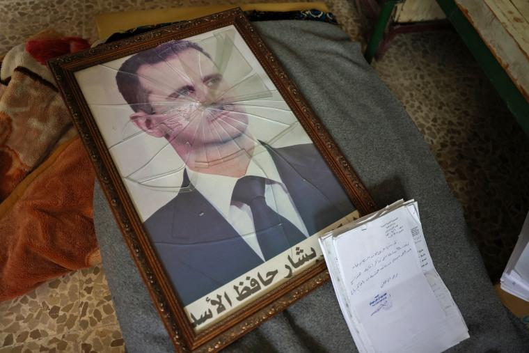
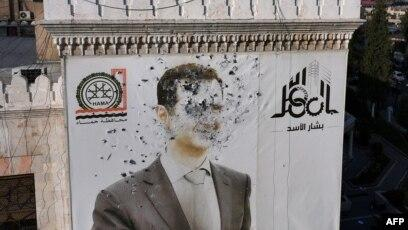

## Claim
Claim: " This image shows an authentic Russian passport of deposed Syrian dictator Bashar al-Assad."

## Actions
```
reverse_search()
```

## Evidence
### Evidence from `reverse_search`
The image in the claim, , appears in a Wikipedia article about East Slavic names ([https://en.wikipedia.org/wiki/East_Slavic_name](https://en.wikipedia.org/wiki/East_Slavic_name)) and a Wikimedia Commons file ([https://commons.wikimedia.org/wiki/File:Pasport_RF.jpg](https://commons.wikimedia.org/wiki/File:Pasport_RF.jpg)) showing a Russian passport. The image also appears on a website discussing Russian internal passports ([https://ukrainian-passport.com/blog/internal-russian-passport/](https://ukrainian-passport.com/blog/internal-russian-passport/)).


## Elaboration
The evidence indicates that the image is of a Russian passport. The image appears in a Wikipedia article about East Slavic names and on websites discussing Russian internal passports. However, the evidence does not confirm that the passport belongs to Bashar al-Assad or that it is authentic.

The evidence does not provide enough information to verify the claim. Additional information is needed to confirm the passport's authenticity and ownership.


## Actions
```
image_search("Bashar al-Assad Russian passport")
```

## Evidence
### Evidence from `image_search`
AOL fact-check discusses an image of a passport purportedly belonging to Bashar al-Assad (). NBC News published an article about Syria and Bashar al-Assad, including an image of a framed picture of Bashar al-Assad with a broken glass (). Radio Free Europe/Radio Liberty contains an image of a poster of Bashar al-Assad ().


## Elaboration
The image search results do not provide any information about the authenticity of the passport in the claim. The search results show images related to Bashar al-Assad but do not confirm or deny the claim.


## Actions
```
image_search("Russian passport Bashar al-Assad")
```

## Evidence
No new evidence found.

## Elaboration
The evidence indicates that the image is of a Russian passport. However, there is no evidence to confirm that the passport belongs to Bashar al-Assad or that it is authentic. Therefore, the claim cannot be verified.


## Final Judgement
The image is of a Russian passport, but there is no evidence to confirm that it belongs to Bashar al-Assad or that it is authentic. Therefore, the claim cannot be verified. `false`

### Verdict: FALSE

### Justification
The image in the claim is of a Russian passport, as evidenced by its appearance in a Wikipedia article and on websites discussing Russian internal passports. However, the fact-check did not find any evidence to confirm that the passport belongs to Bashar al-Assad or that it is authentic, thus the claim cannot be verified.
