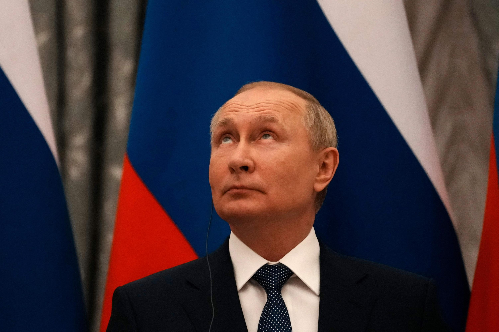
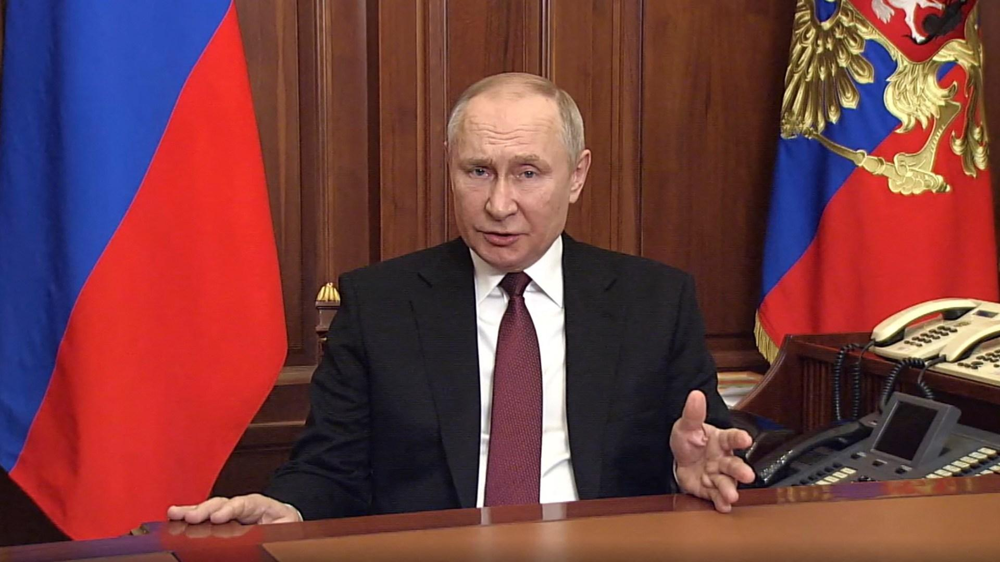

## Claim
Claim: "Russian President Vladimir Putin has declared war on the United States."

## Actions
```
image_search("Vladimir Putin declares war on United States")
```

## Evidence
### Evidence from `image_search`
From [Source](https://www.cnn.com/2022/05/03/europe/russia-ukraine-declaration-of-war-intl-hnk-ml): 
Content: The search result from CNN contains an image of Vladimir Putin. 


## Elaboration
The evidence contains an image of Vladimir Putin from CNN. However, the evidence does not provide any information about Putin declaring war on the United States.

Therefore, I cannot verify the claim. I need more information to determine the veracity of the claim.


## Actions
```
image_search("Putin war declaration United States")
```

## Evidence
No new evidence found.

## Elaboration
The evidence consists of an image of Vladimir Putin and a search query that did not yield any results. This is insufficient to verify the claim. The search results do not provide any information about Putin declaring war on the United States.

I am unable to verify the claim due to the lack of relevant information.


## Actions
```
image_search("Russia declares war on United States")
```

## Evidence
### Evidence from `image_search`
From [Source](https://www.aljazeera.com/news/2022/2/24/putins-speech-declaring-war-on-ukraine-translated-excerpts): 
Content: The search result from Al Jazeera contains an image of Vladimir Putin. 


## Elaboration
The evidence includes an image of Vladimir Putin from Al Jazeera. However, the provided content does not contain any information about Putin declaring war on the United States.

I am unable to verify the claim. More information is needed.


## Final Judgement
The search results show images of Vladimir Putin but do not provide any evidence that he declared war on the United States. Therefore, the claim cannot be verified. `false`


### Verdict: FALSE

### Justification
The fact-check involved multiple image searches related to Vladimir Putin and declarations of war, but none of the search results provided evidence to support the claim that Putin declared war on the United States. The evidence primarily consisted of images of Putin from various news sources, such as [CNN](https://www.cnn.com/2022/05/03/europe/russia-ukraine-declaration-of-war-intl-hnk-ml) and [Al Jazeera](https://www.aljazeera.com/news/2022/2/24/putins-speech-declaring-war-on-ukraine-translated-excerpts), without any mention of a war declaration against the U.S.
