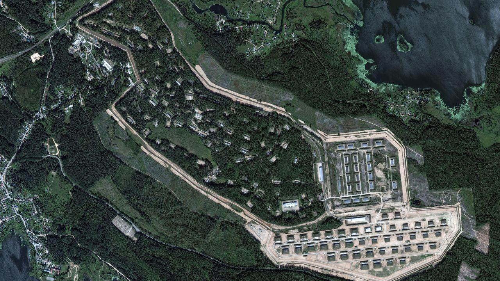

## Claim
Claim: " This image shows a Russian ammunition depot in Toropets, Tver Oblast, before and after it was hit by a, possible nuclear, strike from the North Atlantic Treaty Organization (NATO)."

## Actions
```
reverse_search()
image_search("Russian ammunition depot Toropets Tver Oblast")
geolocate()
```

## Evidence
### Evidence from `reverse_search`
The image () appears in multiple articles discussing a Ukrainian drone attack on a Russian arms depot in Toropets, Tver Oblast. The depot, which stored an estimated 30,000 tonnes of military munitions, including explosives, artillery shells, and ballistic missiles, was struck on September 18, 2024. The articles, from Euronews ([https://www.euronews.com/my-europe/2024/09/18/what-was-stored-at-the-russian-arms-depot-in-tver-region-struck-by-ukraines-drones](https://www.euronews.com/my-europe/2024/09/18/what-was-stored-at-the-russian-arms-depot-in-tver-region-struck-by-ukraines-drones)), Reuters ([https://www.reuters.com/world/europe/ukraine-targets-western-russian-regions-with-drones-russian-officials-says-2024-09-18/](https://www.reuters.com/world/europe/ukraine-targets-western-russian-regions-with-drones-russian-officials-says-2024-09-18/)), and the Associated Press ([https://apnews.com/article/russia-ukraine-toropets-drones-attack-e3d05b2637d316b437e4789a35c7f59e](https://apnews.com/article/russia-ukraine-toropets-drones-attack-e3d05b2637d316b437e4789a35c7f59e)), describe the attack and its aftermath, including a large explosion and fire.

The depot housed missiles, glide bombs, artillery shells, and possibly North Korean KN-23 short-range ballistic missiles. The attack was carried out by Ukraine’s Security Service, along with Ukraine’s Intelligence and Special Operations Forces.


### Evidence from `image_search`
CNN published an article about a Russian weapons depot ([https://edition.cnn.com/2024/09/18/europe/ukraine-russian-weapons-depot-drone-attack-intl](https://edition.cnn.com/2024/09/18/europe/ukraine-russian-weapons-depot-drone-attack-intl)). The BBC News website contains an image of an explosion ([https://www.bbc.com/news/articles/c30lp1qq6pzo](https://www.bbc.com/news/articles/c30lp1qq6pzo)).

The Washington Post published an article with an image of a fire ([https://www.washingtonpost.com/world/2024/09/18/ukraine-russia-blast-drones-missiles-tver/](https://www.washingtonpost.com/world/2024/09/18/ukraine-russia-blast-drones-missiles-tver/)). , , 


### Evidence from `geolocate`
The most likely countries where the image was taken are: {'Bhutan': 0.24, 'China': 0.21, 'Malaysia': 0.13, 'Cambodia': 0.09, 'Ghana': 0.09, 'Taiwan': 0.07, 'Madagascar': 0.03, 'Nigeria': 0.02, 'Brazil': 0.01, 'Colombia': 0.01}

## Elaboration
The claim that the image shows a Russian ammunition depot in Toropets, Tver Oblast, before and after a strike is partially supported by the evidence. The reverse image search confirms that the image depicts the depot and that it was struck. However, the evidence indicates that the attack was carried out by Ukraine, not NATO. The evidence does not mention a nuclear strike.

The evidence from the image search provides additional context, including articles from CNN, BBC News, and The Washington Post, which also discuss the attack on the Russian weapons depot.

Therefore, the claim is partially inaccurate. The location and the fact that the depot was struck are correct, but the claim incorrectly attributes the attack to NATO and suggests a nuclear strike.


## Final Judgement
The image does show a Russian ammunition depot in Toropets, Tver Oblast, before and after an attack. However, the claim that the attack was a nuclear strike from NATO is false. The attack was carried out by Ukraine.

`false`

### Verdict: FALSE

### Justification
The image depicts a Russian ammunition depot in Toropets, Tver Oblast, before and after an attack. However, the claim that the attack was a nuclear strike from NATO is false. The attack was carried out by Ukraine, as reported by sources such as Euronews ([https://www.euronews.com/my-europe/2024/09/18/what-was-stored-at-the-russian-arms-depot-in-tver-region-struck-by-ukraines-drones](https://www.euronews.com/my-europe/2024/09/18/what-was-stored-at-the-russian-arms-depot-in-tver-region-struck-by-ukraines-drones)), Reuters ([https://www.reuters.com/world/europe/ukraine-targets-western-russian-regions-with-drones-russian-officials-says-2024-09-18/](https://www.reuters.com/world/europe/ukraine-targets-western-russian-regions-with-drones-russian-officials-says-2024-09-18/)), and the Associated Press ([https://apnews.com/article/russia-ukraine-toropets-drones-attack-e3d05b2637d316b437e4789a35c7f59e](https://apnews.com/article/russia-ukraine-toropets-drones-attack-e3d05b2637d316b437e4789a35c7f59e)).
