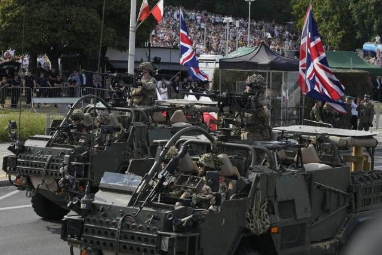

## Claim
Claim: " This image shows a military parade of Poland's army on August 14, 2024, preparing for war with Russia."

## Actions
```
reverse_search()
```

## Evidence
No new evidence found.

## Elaboration
There is no new evidence to analyze the claim.


## Actions
```
image_search("Poland military parade August 14 2024")
image_search("Poland army tanks parade")
```

## Evidence
### Evidence from `image_search`
The web sources discuss military parades in Poland. One article from Militarnyi.com covers a large-scale parade dedicated to the Day of the Polish Army. Another article from KSAT reports on a military parade in Poland on August 15, 2024. , 

*   [Source](https://militarnyi.com/en/news/a-large-scale-parade-dedicated-to-the-day-of-the-polish-army-took-place-in-poland/)
*   [Source](https://www.ksat.com/news/world/2024/08/15/poland-showcases-its-growing-army-on-a-holiday-that-celebrates-its-historic-defeat-of-the-red-army/)


### Evidence from `image_search`
CNN published an article about a military parade in Poland, including an image of tanks (). Al Jazeera reports that Poland held a military parade on August 15, 2023 (). The Globe and Mail also published an article about Poland's military parade, including an image of tanks ().

The articles do not mention the date August 14, 2024, or any preparation for war with Russia.


## Elaboration
The claim that the image shows a military parade on August 14, 2024, is partially supported by the evidence. The evidence confirms that Poland held military parades, including one on August 15, 2024. However, there is no evidence to support the claim that the parade was on August 14, 2024, or that it was preparing for war with Russia.


## Final Judgement
The evidence indicates that Poland held a military parade on August 15, 2024, but there is no evidence to support the claim that the parade was on August 14, 2024, or that it was preparing for war with Russia. Therefore, the claim is not factually accurate. `false`

### Verdict: FALSE

### Justification
The claim is inaccurate. While Poland did hold a military parade, the evidence suggests it occurred on August 15, 2024, not August 14, 2024, as stated in the claim. Furthermore, there is no evidence to support the assertion that the parade was a preparation for war with Russia. Sources like [KSAT](https://www.ksat.com/news/world/2024/08/15/poland-showcases-its-growing-army-on-a-holiday-that-celebrates-its-historic-defeat-of-the-red-army/) and [Militarnyi.com](https://militarnyi.com/en/news/a-large-scale-parade-dedicated-to-the-day-of-the-polish-army-took-place-in-poland/) confirm the parade but do not mention the date or the war preparation.
