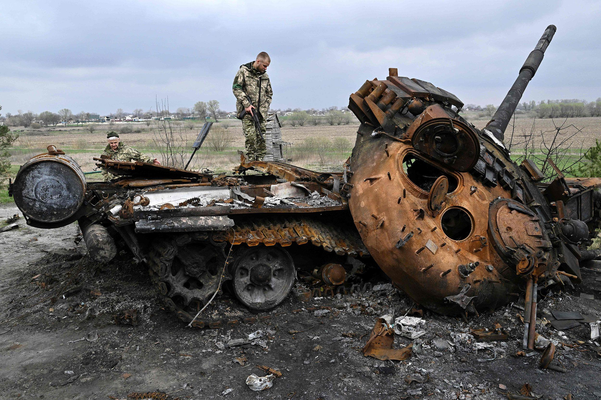
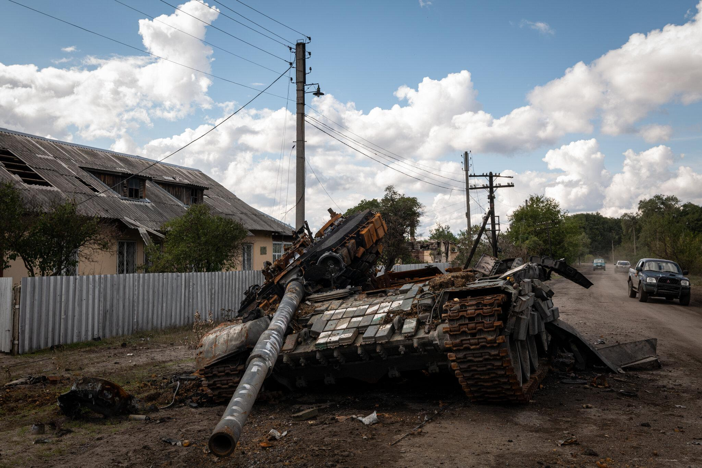

## Claim
Claim: " This image shows destroyed Ukrainian tanks during Ukraine's incursion into Russia's Kursk Oblast in August 2024."

## Actions
```
reverse_search()
image_search("destroyed Ukrainian tanks Kursk Oblast August 2024")
```

## Evidence
### Evidence from `reverse_search`
The image of destroyed tanks () appears in multiple articles. One article from Sputnik Africa, published on October 17, 2024, discusses Ukraine's loss of Leopard tanks since February 2022, including images of Leopard 2 tanks (, ) ([https://en.sputniknews.africa/20241017/ukraine-has-reportedly-lost-about-40-leopard-tanks-since-february-2022-1068726197.html](https://en.sputniknews.africa/20241017/ukraine-has-reportedly-lost-about-40-leopard-tanks-since-february-2022-1068726197.html)).

Another article from The Moscow Times, published on June 13, 2023, reports on Russia capturing German Leopard tanks and U.S. Bradley infantry fighting vehicles, also including the image of destroyed tanks () ([https://www.themoscowtimes.com/2023/06/13/russia-says-german-leopard-tanks-us-bradleys-captured-in-ukraine-a81492](https://www.themoscowtimes.com/2023/06/13/russia-says-german-leopard-tanks-us-bradleys-captured-in-ukraine-a81492)). Defence Security Asia published an article on May 19, 2024, discussing the destruction of German-made Leopard tanks in Ukraine, including an image of a captured Leopard 2A6 tank () ([https://defencesecurityasia.com/en/german-made-leopard-tanks-bear-the-brunt-of-russian-forces-rejuvenation-in-ukraine/](https://defencesecurityasia.com/en/german-made-leopard-tanks-bear-the-brunt-of-russian-forces-rejuvenation-in-ukraine/)).


### Evidence from `image_search`
The Center for European Policy Analysis (CEPA) published an article about the second battle of Kursk, which includes an image of a Ukrainian tank (). Al Jazeera published an article on August 16, 2024, about the conflict in Kursk, which includes an image of a tank (). NBC News discusses the evacuation of Belgorod and Kursk ().

The provided sources do not contain the image in the claim ().


## Elaboration
The evidence does not confirm the claim. While the image of destroyed tanks (

## Actions
```
image_search("destroyed tanks Ukraine Russia war")
```

## Evidence
### Evidence from `image_search`
CNN published an article on April 27, 2022, about destroyed tanks in the Russia-Ukraine war, including an image of a destroyed tank . Reuters published an image of destroyed Russian military vehicles in Ukraine . The New York Times published an article on February 16, 2023, about the war in Ukraine, which includes an image of a destroyed tank .


## Elaboration
The evidence does not confirm the claim. The image search results show destroyed tanks from the Russia-Ukraine war, but none of the provided sources contain the image in the claim. The claim's specifics about the location and date are not supported by the evidence.

Insufficient information is available to verify the claim.


## Actions
```
image_search("destroyed tanks Ukraine war August 2024")
```

## Evidence
### Evidence from `image_search`
DefenseScoop published an article on April 3, 2025, about destroyed tanks in Ukraine, including an image of a destroyed tank (). Newsweek published an article about Russian tank losses in the Ukraine war, including an image of a destroyed tank (). NV.ua, published in August 2024, shows an image of a destroyed tank ().


## Elaboration
The evidence does not confirm the claim. The image search results show destroyed tanks from the Russia-Ukraine war, but none of the provided sources contain the image in the claim. The claim's specifics about the location and date are not supported by the evidence.


## Final Judgement
The image in the claim depicts destroyed tanks, but the provided evidence does not confirm the specific context of the claim, including the location (Kursk Oblast) and the date (August 2024). The search results show images of destroyed tanks from the Russia-Ukraine war, but not the one in the claim. Therefore, the claim cannot be verified. `false`

### Verdict: FALSE

### Justification
The claim is not supported by the evidence. While the image shows destroyed tanks, the provided sources do not confirm the specific context of the claim, including the location (Kursk Oblast) and the date (August 2024). The search results show images of destroyed tanks from the Russia-Ukraine war, but not the one in the claim.
