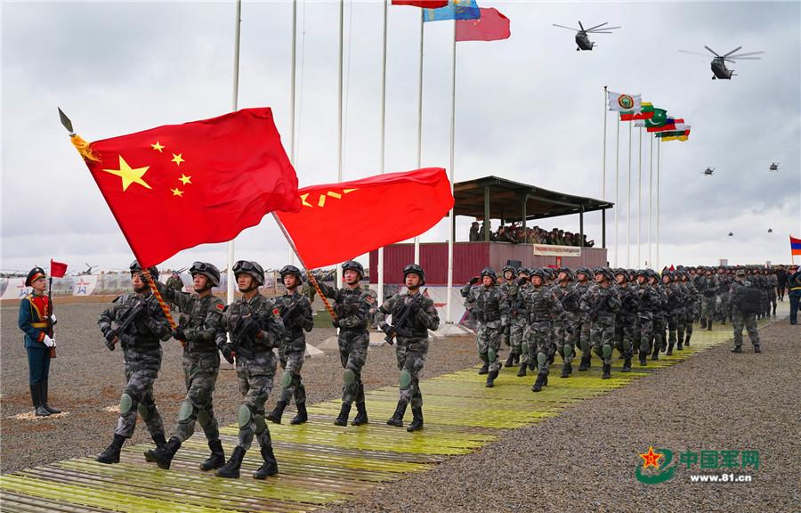
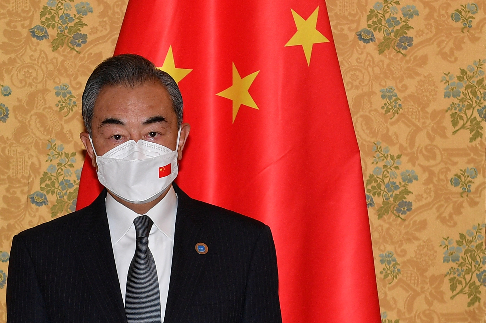

## Claim
Claim: " This image shows the Chinese Communist Party's Red Cross troops in Russia who have changed into winter clothes and set off for the Russian-Ukrainian front to aid Russia in rescuing its occupied territories."

## Actions
```
reverse_search()
image_search("Chinese Red Cross troops Russia Ukraine")
```

## Evidence
### Evidence from `image_search`
The Center for European Policy Analysis (CEPA) published an article about the Red Cross, which includes an image of a military vehicle with a Red Cross symbol (). USNI News published an image of Chinese troops (). CNN published an article about Chinese nationals in Ukraine ().

The provided sources do not contain information about the Chinese Communist Party's Red Cross troops in Russia changing into winter clothes and setting off for the Russian-Ukrainian front to aid Russia in rescuing its occupied territories.


## Elaboration
The evidence does not support the claim. The image search results do not contain information about the Chinese Communist Party's Red Cross troops in Russia changing into winter clothes and setting off for the Russian-Ukrainian front to aid Russia in rescuing its occupied territories.


## Actions
```
image_search("Chinese Red Cross troops Russia Ukraine aid")
```

## Evidence
### Evidence from `image_search`
The Atlantic Council published an article that includes an image of Xi Jinping (). The China Daily published an image of the Red Cross Society of China's aid supplies (). Neither source mentions the Chinese Communist Party's Red Cross troops in Russia changing into winter clothes and setting off for the Russian-Ukrainian front to aid Russia in rescuing its occupied territories.


## Elaboration
The evidence does not support the claim. The image search results do not contain information about the Chinese Communist Party's Red Cross troops in Russia changing into winter clothes and setting off for the Russian-Ukrainian front to aid Russia in rescuing its occupied territories.


## Actions
```
image_search("Chinese Red Cross Russia Ukraine military aid")
```

## Evidence
### Evidence from `image_search`
From [Source](https://www.reuters.com/world/china-provide-ukraine-humanitarian-aid-praises-russia-ties-2022-03-07/): 
Content: Reuters published an article on March 7, 2022, about China providing humanitarian aid to Ukraine. The article includes an image of Wang Yi, China's Foreign Minister, wearing a mask with the Chinese flag on it. 


## Elaboration
The evidence does not support the claim. The image search results do not contain information about the Chinese Communist Party's Red Cross troops in Russia changing into winter clothes and setting off for the Russian-Ukrainian front to aid Russia in rescuing its occupied territories. The search results mention China providing humanitarian aid to Ukraine.


## Final Judgement
The fact-check reveals that the provided evidence does not support the claim. Multiple image searches were conducted, and none of the results contained information about the Chinese Communist Party's Red Cross troops in Russia changing into winter clothes and setting off for the Russian-Ukrainian front to aid Russia in rescuing its occupied territories.

`false`

### Verdict: FALSE

### Justification
The claim is not supported by the evidence. Multiple image searches did not yield any results that corroborate the claim that the Chinese Communist Party's Red Cross troops were deployed to aid Russia in Ukraine.
