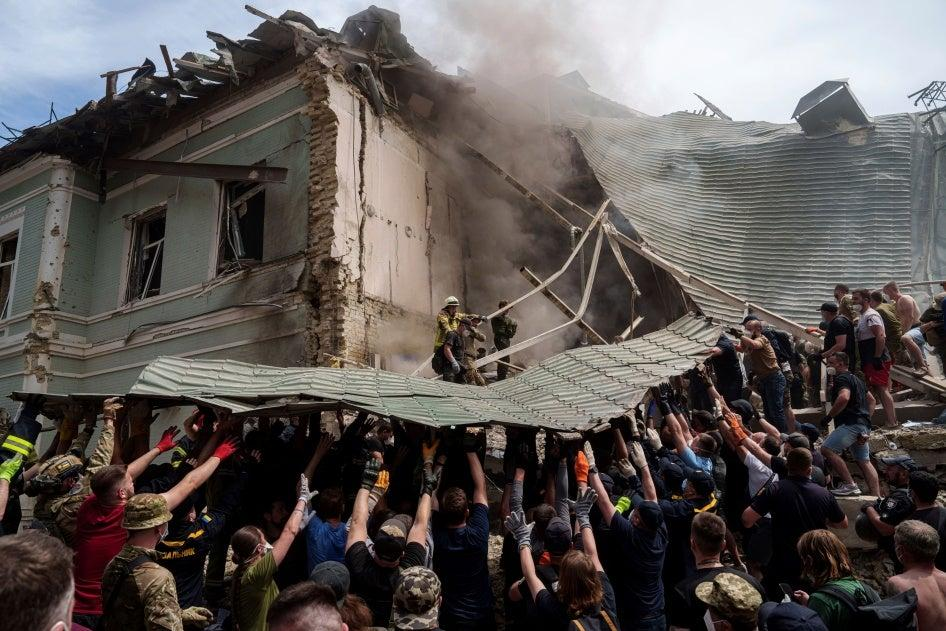
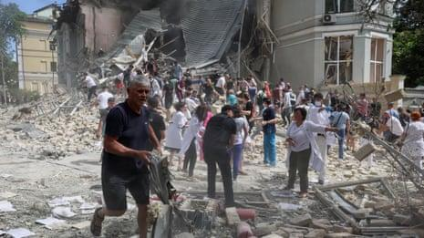
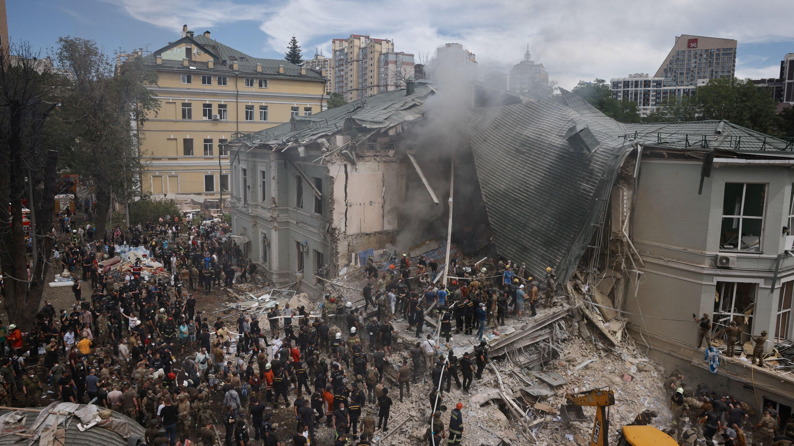

## Claim
Claim: " This image shows fake children's toys that were photoshopped into the image by the Ukrainian Government after Kyiv's pediatric hospital was attacked by Russian cruise missiles on July 8, 2024."

## Actions
```
reverse_search()
image_search("Kyiv pediatric hospital attack July 8 2024")
```

## Evidence
### Evidence from `reverse_search`
The Kyiv Independent published an article on July 9, 2024, reporting on a Russian strike in Kyiv on July 8, 2024, which hit a residential building and the Okhmatdyt hospital. The article includes an image of the aftermath of the attack, showing rubble and emergency personnel. ()

RBC-Ukraine discusses a Russian missile attack on Kyiv on July 8, which hit the Okhmatdyt Children's Hospital. The article mentions that 27 people, including 4 children, were killed and 117 were injured. The image  is present in the article, which was published on August 6.


### Evidence from `image_search`
Human Rights Watch published an article on July 11, 2024, about the Russian attack on a children's hospital in Ukraine on July 8, 2024. ([https://www.hrw.org/news/2024/07/11/russias-july-8-attack-childrens-hospital-ukraine](https://www.hrw.org/news/2024/07/11/russias-july-8-attack-childrens-hospital-ukraine))  Reuters published an article about a Russian missile attack on a children's hospital in Ukraine on July 8, 2024. ([https://www.reuters.com/pictures/russian-missile-attack-hits-ukraine-childrens-hospital-2024-07-08/](https://www.reuters.com/pictures/russian-missile-attack-hits-ukraine-childrens-hospital-2024-07-08/)) 

PBS reports on a Russian missile attack on a Ukrainian children's hospital. ([https://www.pbs.org/newshour/world/russian-missile-attack-hits-ukrainian-childrens-hospital-amid-bombardment-dozens-killed](https://www.pbs.org/newshour/world/russian-missile-attack-hits-ukrainian-childrens-hospital-amid-bombardment-dozens-killed)) 


## Elaboration
The evidence confirms that a Russian missile attack hit a children's hospital in Kyiv on July 8, 2024. The image in the claim () is associated with the aftermath of this attack. The presence of children's toys in the image could be interpreted as a sign of the hospital's function.

The claim states that the toys were photoshopped. However, the evidence does not provide any information about the authenticity of the toys in the image.

Therefore, the veracity of the claim cannot be determined with the available evidence. More information is needed to verify whether the toys were photoshopped.


## Actions
```
image_search("photoshopped toys kyiv hospital attack")
```

## Evidence
### Evidence from `image_search`
From [Source](https://www.theguardian.com/world/article/2024/jul/08/ukraine-horror-russian-bombing-kyiv-childrens-hospital): 
Content: The Guardian published an article on July 8, 2024, about the Russian bombing of a children's hospital in Kyiv. 


## Elaboration
The new evidence does not provide any information about the authenticity of the toys in the image. Therefore, the veracity of the claim cannot be determined with the available evidence. More information is needed to verify whether the toys were photoshopped.


## Actions
```
image_search("toy car rubble kyiv hospital")
```

## Evidence
### Evidence from `image_search`
The BBC published a video about the Russian attack on a children's hospital in Kyiv (

## Elaboration
The evidence continues to lack information about the authenticity of the toys in the image. Therefore, the claim remains unverified.


## Final Judgement
The claim cannot be verified because there is no evidence to confirm or deny that the toys were photoshopped. `false`

### Verdict: FALSE

### Justification
The claim that the image shows photoshopped toys is unverified. While the image depicts the aftermath of a Russian attack on a Kyiv children's hospital on July 8, 2024, as reported by sources like the [Kyiv Independent](https://kyivindependent.com/), [RBC-Ukraine](https://www.rbc.ua/ukr/news/rosiya-obstrilyala-kiyiv-pid-udarom-okhmadit-1720448789.html), and [Human Rights Watch](https://www.hrw.org/news/2024/07/11/russias-july-8-attack-childrens-hospital-ukraine), the provided evidence does not offer any information to confirm or deny the authenticity of the toys in the image.
