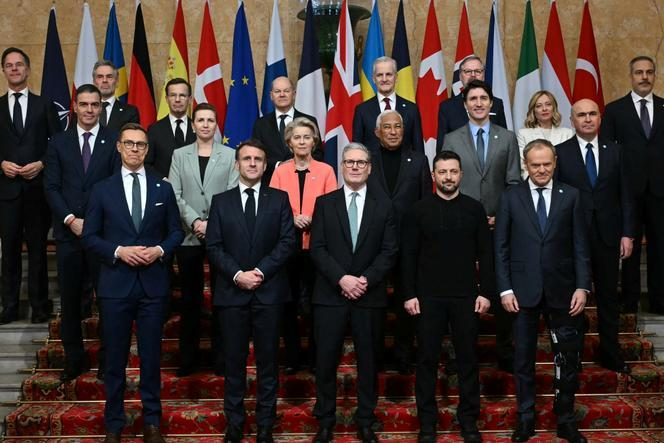

## Claim
Claim: " This is an authentic image of world leaders taking off their suits to symbolically support Ukraine at the London summit on Ukraine on March 2, 2025."

## Actions
```
reverse_search()
image_search("London summit Ukraine March 2 2023 leaders")
```

## Evidence
### Evidence from `image_search`
Le Monde ([https://www.lemonde.fr/en/international/article/2025/03/02/zelensky-joins-european-leaders-at-key-ukraine-summit-in-london_6738729_4.html](https://www.lemonde.fr/en/international/article/2025/03/02/zelensky-joins-european-leaders-at-key-ukraine-summit-in-london_6738729_4.html)) and Al Jazeera ([https://www.aljazeera.com/news/2025/3/2/european-leaders-gather-in-london-to-strengthen-support-for-ukraine](https://www.aljazeera.com/news/2025/3/2/european-leaders-gather-in-london-to-strengthen-support-for-ukraine)) both published articles about the London summit on Ukraine on March 2, 2023, and include photographs of the leaders (, ).

ABC News ([https://abcnews.go.com/International/zelenskyy-set-european-summit-london-after-trump-showdown/story?id=119338966](https://abcnews.go.com/International/zelenskyy-set-european-summit-london-after-trump-showdown/story?id=119338966)) also reported on the European summit in London on Ukraine and included an image of the leaders at a table ().


## Elaboration
The provided evidence indicates that a summit on Ukraine took place in London on March 2, 2023, and includes images of the leaders. However, none of the images show the leaders taking off their suits. Therefore, the claim that the image depicts leaders removing their suits to support Ukraine cannot be verified with the available information.

The evidence includes images of the leaders at the summit, but they are all wearing suits. The claim's assertion about the leaders taking off their suits is not supported by the provided evidence.

To verify the claim, additional evidence would be needed to confirm whether the leaders removed their suits during the summit.


## Final Judgement
The fact-check reveals that a summit on Ukraine occurred in London on March 2, 2023, and images of the leaders are available. However, none of the provided images show the leaders taking off their suits. Therefore, the claim cannot be verified with the available information.

The claim is not supported by the evidence, as the images from the summit show the leaders wearing suits. The claim is therefore not factually accurate. `false`

### Verdict: FALSE

### Justification
The claim is false. While a summit on Ukraine did take place in London on March 2, 2023, as reported by sources like [Le Monde](https://www.lemonde.fr/en/international/article/2025/03/02/zelensky-joins-european-leaders-at-key-ukraine-summit-in-london_6738729_4.html) and [Al Jazeera](https://www.aljazeera.com/news/2025/3/2/european-leaders-gather-in-london-to-strengthen-support-for-ukraine), the available images from the summit, such as those found in the articles, do not depict the leaders removing their suits.
