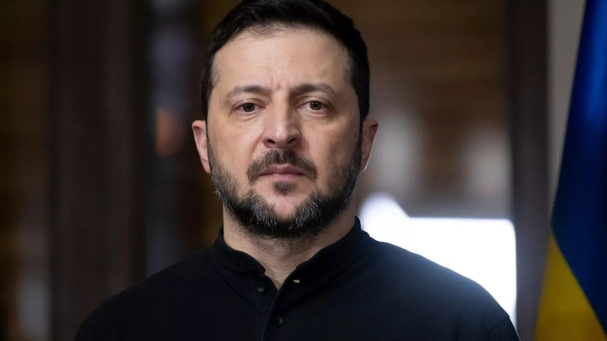

## Claim
Claim: "In February 2025 Ukrainian President Volodymyr Zelenskyy's approval rating in Ukraine was down at 4%."

## Actions
```
image_search("Volodymyr Zelenskyy approval rating February 2025 Ukraine")
```

## Evidence
### Evidence from `image_search`
The Pew Research Center published an article on July 2, 2024, about confidence in Volodymyr Zelenskyy, including a chart showing mixed views globally (). An article from Euronews, published on February 19, 2025, stated that Zelenskyy's approval rating grew to 57% ().

*   [https://abcnews.go.com/International/zelenskyy-4-approval-trump-claims-50/story?id=118959595](https://abcnews.go.com/International/zelenskyy-4-approval-trump-claims-50/story?id=118959595)
*   [https://www.pewresearch.org/global/2024/07/02/confidence-in-zelenskyy-and-support-for-ukraine/](https://www.pewresearch.org/global/2024/07/02/confidence-in-zelenskyy-and-support-for-ukraine/)
*   [https://www.euronews.com/2025/02/19/zelenskyys-approval-rating-grows-to-57-debunking-trumps-4-support-claim](https://www.euronews.com/2025/02/19/zelenskyys-approval-rating-grows-to-57-debunking-trumps-4-support-claim)


## Elaboration
The evidence indicates that the claim is false. An article from Euronews, published on February 19, 2025, states that Zelenskyy's approval rating grew to 57% ([https://www.euronews.com/2025/02/19/zelenskyys-approval-rating-grows-to-57-debunking-trumps-4-support-claim](https://www.euronews.com/2025/02/19/zelenskyys-approval-rating-grows-to-57-debunking-trumps-4-support-claim)).


## Final Judgement
The claim is demonstrably false. Evidence from Euronews indicates that Zelenskyy's approval rating in February 2025 was 57%, not 4%.

`false`

### Verdict: FALSE

### Justification
The claim is false. According to a February 19, 2025, article from Euronews ([https://www.euronews.com/2025/02/19/zelenskyys-approval-rating-grows-to-57-debunking-trumps-4-support-claim](https://www.euronews.com/2025/02/19/zelenskyys-approval-rating-grows-to-57-debunking-trumps-4-support-claim)), Zelenskyy's approval rating was 57% in February 2025, not 4%.
