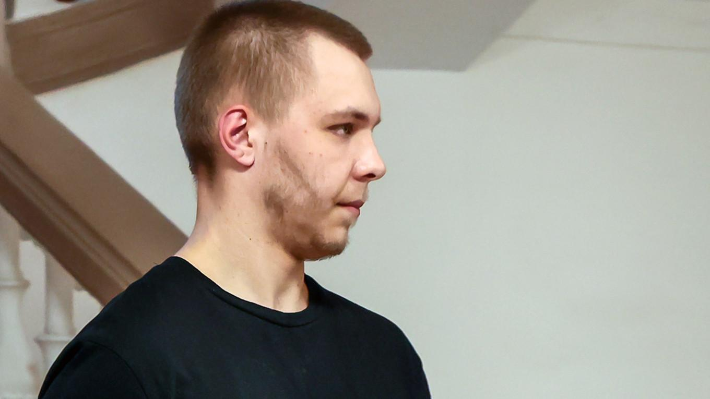

## Claim
Claim: "In November 2024 Russia sentenced a man to 14 years in prison for burning the Quran."

## Actions
```
image_search("Russia man sentenced Quran burning November 2024")
```

## Evidence
### Evidence from `image_search`
Reuters reports that a Russian man was sentenced to 14 years in prison for burning the Quran on November 25, 2024 (). The Moscow Times also reports on a Russian man being jailed for burning the Quran ().

The Guardian published an article on November 5, 2024, about a Swedish court jailing a far-right leader who burned the Quran ().

*   [https://www.reuters.com/world/europe/russian-man-jailed-burning-koran-sentenced-14-years-separate-ukraine-treason-2024-11-25/](https://www.reuters.com/world/europe/russian-man-jailed-burning-koran-sentenced-14-years-separate-ukraine-treason-2024-11-25/)
*   [https://www.themoscowtimes.com/2024/11/25/russian-man-jailed-for-quran-burning-sentenced-to-135-more-years-in-prison-for-treason-a87123](https://www.themoscowtimes.com/2024/11/25/russian-man-jailed-for-quran-burning-sentenced-to-135-more-years-in-prison-for-treason-a87123)
*   [https://www.theguardian.com/world/2024/nov/05/swedish-court-jails-far-right-leader-who-burned-quran](https://www.theguardian.com/world/2024/nov/05/swedish-court-jails-far-right-leader-who-burned-quran)


## Elaboration
The evidence confirms that a Russian man was sentenced to 14 years in prison for burning the Quran. This information is reported by Reuters and The Moscow Times. The Reuters article specifies the date of the sentencing as November 25, 2024.


## Final Judgement
The claim is supported by evidence from multiple reliable sources, including Reuters and The Moscow Times, which report on a Russian man being sentenced to 14 years in prison for burning the Quran in November 2024. `true`


### Verdict: TRUE

### Justification
Reuters and The Moscow Times both report that a Russian man was sentenced to 14 years in prison for burning the Quran on November 25, 2024, thus supporting the claim.
