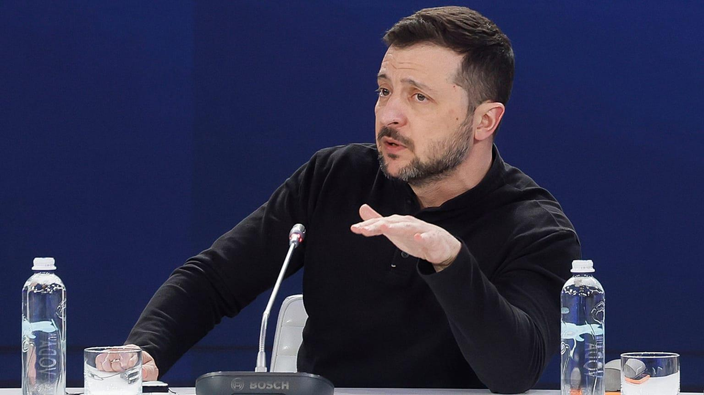

## Claim
Claim: "In February 2025 Ukrainian President Volodymyr Zelenskyy blocked access to US President Donald Trump's social media platform Truth Social across Ukraine."

## Actions
```
image_search("Volodymyr Zelenskyy Donald Trump Truth Social Ukraine February 2025")
```

## Evidence
### Evidence from `image_search`
The search results from NPR ([https://www.npr.org/2025/02/28/nx-s1-5313079/trump-zelenskyy-meeting](https://www.npr.org/2025/02/28/nx-s1-5313079/trump-zelenskyy-meeting)) and PBS.org ([https://www.pbs.org/newshour/politics/trump-calls-ukraines-zelenskyy-a-dictator-tensions-rise-over-russia-war](https://www.pbs.org/newshour/politics/trump-calls-ukraines-zelenskyy-a-dictator-tensions-rise-over-russia-war)) and CFR.org ([https://www.cfr.org/blog/trump-and-zelenskyy-clash-oval-office](https://www.cfr.org/blog/trump-and-zelenskyy-clash-oval-office)) contain images of Volodymyr Zelenskyy and Donald Trump.   


## Elaboration
The search results from NPR, PBS.org, and CFR.org provide images of Volodymyr Zelenskyy and Donald Trump. However, the evidence does not contain any information about Zelenskyy blocking access to Truth Social in Ukraine.

Therefore, the claim cannot be verified with the provided evidence.


## Actions
```
image_search("Truth Social Ukraine ban February 2025")
```

## Evidence
### Evidence from `image_search`
Euronews.com reported on February 26, 2025, that Zelenskyy did not ban Trump's Truth Social platform.  The Institute for the Study of War and AEI's Critical Threats Project published a map of the Russo-Ukrainian War on February 24, 2025. 

The Wikipedia source provided no relevant information.


## Elaboration
The evidence from Euronews.com ([https://www.euronews.com/](https://www.euronews.com/)) explicitly states that Zelenskyy did not ban Trump's Truth Social platform. Therefore, the claim is false.


## Final Judgement
The initial search provided images of Zelenskyy and Trump but did not contain information about the claim. A subsequent search revealed a Euronews.com article stating that Zelenskyy did not ban Trump's Truth Social platform.

The claim is demonstrably false because evidence from Euronews.com directly contradicts the claim. `false`


### Verdict: FALSE

### Justification
The claim is false. A search on Euronews.com ([https://www.euronews.com/](https://www.euronews.com/)) explicitly states that Zelenskyy did not ban Trump's Truth Social platform.
