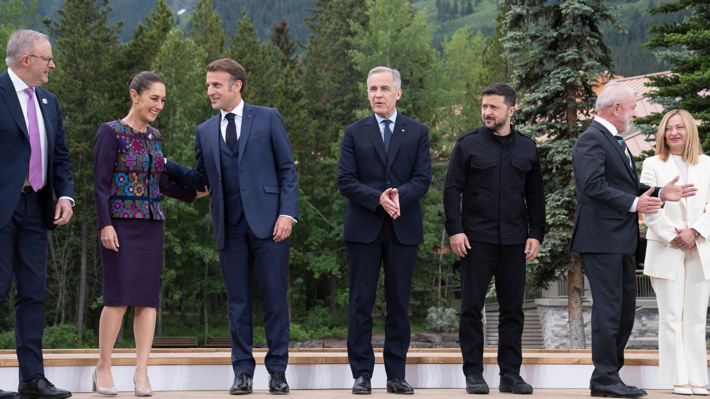
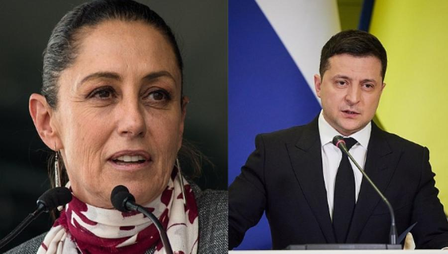
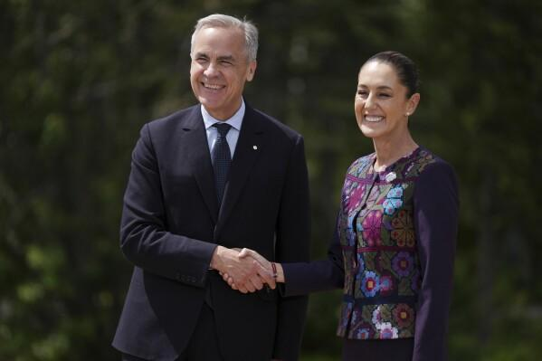
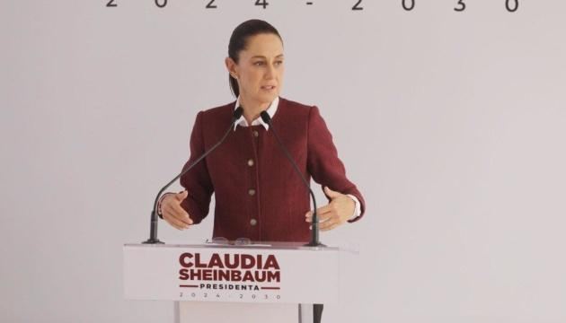

## Claim
Claim: "Mexican President-elect Claudia Sheinbaum rejected an invitation to Ukraine by Volodymr Zelenskyy and said towards him on September 17, 2024: 'If I wanted to see a drug addict, I'd just take a walk around Tijuana.'"

## Actions
```
image_search("Claudia Sheinbaum Volodymyr Zelenskyy meeting")
image_search("Claudia Sheinbaum Ukraine visit invitation")
```

## Evidence
### Evidence from `image_search`
The search results include an image of Claudia Sheinbaum and Volodymyr Zelenskyy together from [cbs42.com](https://www.cbs42.com/news/international/ap-first-face-to-face-between-the-leaders-of-us-and-mexico-will-have-to-wait/) . Additionally, intellinews.com reports that Claudia Sheinbaum turned down an invitation to Ukraine from [intellinews.com](https://www.intellinews.com/mexico-s-president-elect-sheinbaum-turns-down-zelensky-s-invitation-to-ukraine-344262/) . The Associated Press also provides an image of Claudia Sheinbaum from [apnews.com](https://apnews.com/article/mexico-sheinbaum-us-meeting-trump-g7-8f1265a5603f732ae2fd1778919304d1/) .


### Evidence from `image_search`
Ukrinform.net reports that Mexican President-elect Claudia Sheinbaum rejected an invitation to visit Ukraine (). Euromaidan Press also reports that the Mexican President-elect declined an invitation to visit Ukraine ().

Sources:
*   [https://www.ukrinform.net/rubric-polytics/3906832-mexico-presidentelect-rejects-zelenskys-invitation-to-visit-ukraine.html](https://www.ukrinform.net/rubric-polytics/3906832-mexico-presidentelect-rejects-zelenskys-invitation-to-visit-ukraine.html)
*   [https://euromaidanpress.com/2024/09/18/mexican-president-elect-declines-zelenskyys-invitation-to-visit-ukraine/](https://euromaidanpress.com/2024/09/18/mexican-president-elect-declines-zelenskyys-invitation-to-visit-ukraine/)


## Elaboration
The evidence confirms that Claudia Sheinbaum rejected an invitation to visit Ukraine. However, the evidence does not contain any information about the alleged quote attributed to her.

Therefore, the veracity of the claim is uncertain due to the lack of evidence supporting the second part of the claim.


## Actions
```
image_search("Claudia Sheinbaum quote Zelenskyy drug addict")
```

## Evidence
### Evidence from `image_search`
From [Source](https://www.stopfake.org/en/fake-mexican-president-refuses-to-visit-ukraine-calling-zelensky-a-drug-addict/): 
Content: Stopfake.org reports that a quote attributed to Claudia Sheinbaum, where she allegedly said "If I wanted to see a drug addict, I'd just take a walk around Tijuana," is fake. 


## Elaboration
The evidence indicates that the quote attributed to Claudia Sheinbaum is fake. Stopfake.org explicitly labels the quote as false.


## Final Judgement
The evidence confirms that Claudia Sheinbaum rejected an invitation to visit Ukraine. However, the search results show that the quote attributed to her is fake. Therefore, the claim is not factually accurate. `false`

### Verdict: FALSE

### Justification
The claim is false. While Claudia Sheinbaum did decline an invitation to visit Ukraine, the quote attributed to her, "If I wanted to see a drug addict, I'd just take a walk around Tijuana," is fabricated, as reported by [Stopfake.org](https://www.stopfake.org/en/fake-mexican-president-refuses-to-visit-ukraine-calling-zelensky-a-drug-addict/).
