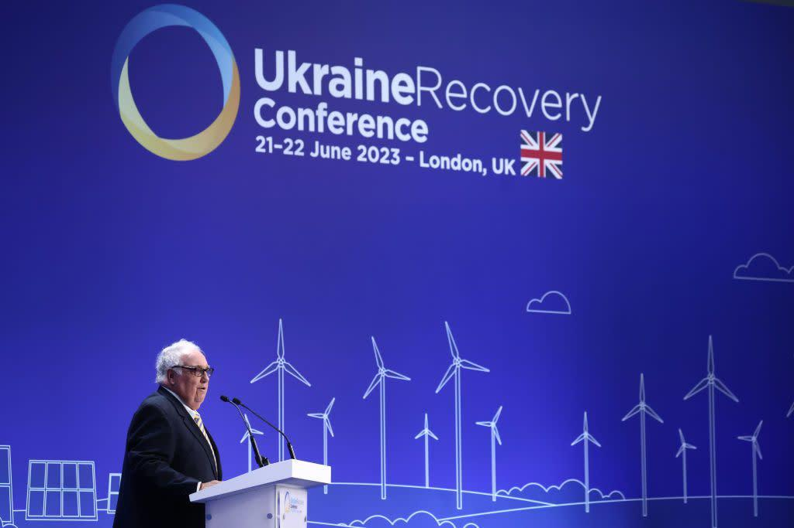

## Claim
Claim: "Warren Buffett has given more than $500 million to Ukraine since 2022."

## Actions
```
image_search("Warren Buffett Ukraine donations")
```

## Evidence
### Evidence from `image_search`
The search results include an image of Howard Buffett with Volodymyr Zelenskyy from [Business Insider](https://www.businessinsider.com/howard-buffett-gives-500-million-to-ukraine) . Another source, [Philanthropy News Digest](https://philanthropynewsdigest.org/news/other-sources/article/?id=14667666&title=US-philanthropist-pledges-$300-million-for-Ukraine-in-2024), mentions a US philanthropist pledging $300 million for Ukraine in 2024 .


## Elaboration
The evidence suggests that Howard Buffett, not Warren Buffett, has been involved in donating to Ukraine. The Business Insider image shows Howard Buffett with Volodymyr Zelenskyy, and the article states that Howard Buffett has given $500 million to Ukraine. Another source mentions a US philanthropist pledging $300 million for Ukraine in 2024.

The claim is about Warren Buffett, but the evidence points to Howard Buffett's donations. Therefore, the claim is likely false.

To verify the claim, information about Warren Buffett's donations to Ukraine is missing.


## Final Judgement
The search results indicate that Howard Buffett, not Warren Buffett, has donated to Ukraine. The evidence includes an image of Howard Buffett with Volodymyr Zelenskyy and mentions of Howard Buffett's donations.

The claim is demonstrably false because the evidence points to Howard Buffett's donations, not Warren Buffett's. `false`


### Verdict: FALSE

### Justification
The claim is false. The evidence indicates that Howard Buffett, not Warren Buffett, has donated to Ukraine. A [Business Insider](https://www.businessinsider.com/howard-buffett-gives-500-million-to-ukraine) article and image show Howard Buffett with Volodymyr Zelenskyy, and another source mentions a US philanthropist pledging funds for Ukraine.
