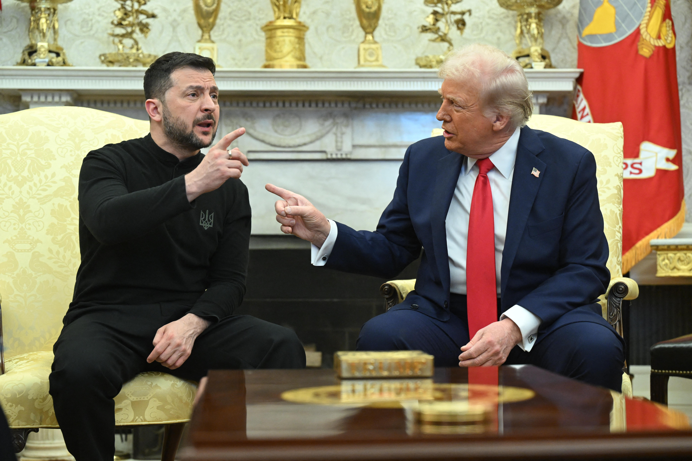

## Claim
Claim: "Ukrainian President Volodymyr Zelenskyy said the U.S. will have 'to send their sons and daughters' to die for Ukraine after having a heated exchange with U.S. President Donald Trump at the White House in February 2025."

## Actions
```
image_search("Volodymyr Zelenskyy Donald Trump White House February 2025")
```

## Evidence
### Evidence from `image_search`
The North Dakota Monitor ([Source](https://northdakotamonitor.com/2025/02/28/repub/trump-zelenskyy-clash-in-oval-office-blowup-over-peace-negotiations/)) published an image of Volodymyr Zelenskyy and Donald Trump in the White House .

The search result from OPB ([Source](https://www.opb.org/article/2025/08/17/european-leaders-to-join-zelenskyy-s-meeting-with-trump/)) contains an image of Donald Trump and Volodymyr Zelenskyy . NPR ([Source](https://www.npr.org/2025/02/28/nx-s1-5313079/trump-zelenskyy-meeting)) also contains an image of Volodymyr Zelenskyy and Donald Trump in the White House .


## Elaboration
The evidence confirms that Donald Trump and Volodymyr Zelenskyy met at the White House. However, the provided search results do not contain any information about the content of their discussions or any statements made by Zelenskyy regarding the U.S. sending troops to Ukraine.

Therefore, the claim cannot be verified based on the available evidence. More information is needed to confirm whether Zelenskyy made the alleged statement.


## Actions
```
image_search("Zelenskyy Trump statement US troops Ukraine")
```

## Evidence
### Evidence from `image_search`
The search results include images of Donald Trump and Volodymyr Zelenskyy together. One article from Al Jazeera ([Source](https://www.aljazeera.com/news/2025/8/20/no-us-troops-in-ukraine-trump-says)) is titled "No US troops in Ukraine, Trump says" . Other sources, such as WHYY ([Source](https://whyy.org/articles/trump-pauses-aid-ukraine-russia-war/))  and the Associated Press ([Source](https://apnews.com/article/trump-russia-ukraine-war-defend-american-troops-85704282576324a36567798e9cb741ec)) , also feature images of the two leaders.


## Elaboration
The new evidence confirms that Trump and Zelenskyy met. An article from Al Jazeera ([Source](https://www.aljazeera.com/news/2025/8/20/no-us-troops-in-ukraine-trump-says)) indicates that Trump stated "No US troops in Ukraine". However, the evidence still does not contain any information about Zelenskyy's statements regarding the U.S. sending troops to Ukraine.

Therefore, the claim remains unverified.


## Actions
```
image_search("Zelenskyy Trump quote US sons daughters Ukraine")
```

## Evidence
### Evidence from `image_search`
The search results include images of Donald Trump and Volodymyr Zelenskyy together , . Al Jazeera published an article on February 21, 2025, fact-checking claims about Zelenskyy and Trump. The Reuters source does not contain any relevant information.


## Elaboration
The search results continue to show images of Trump and Zelenskyy together. The Al Jazeera article, published on February 21, 2025, fact-checks claims about Zelenskyy and Trump. However, the evidence does not provide the specific quote from Zelenskyy as stated in the claim.

Therefore, the claim remains unverified.


## Final Judgement
The fact-check reveals that while Donald Trump and Volodymyr Zelenskyy met at the White House, there is no evidence to support the claim that Zelenskyy made the specific statement about the U.S. having to send their sons and daughters to die for Ukraine. The search results show images of the two leaders together and articles discussing their meetings, but none of the sources provide the alleged quote.

`false`


### Verdict: FALSE

### Justification
The fact-check found no evidence to support the claim that Volodymyr Zelenskyy made the statement about the U.S. sending troops to Ukraine after a heated exchange with Donald Trump. While images confirm that the two leaders met at the White House, the search results, including articles from sources like Al Jazeera ([Source](https://www.aljazeera.com/news/2025/8/20/no-us-troops-in-ukraine-trump-says)), do not contain the alleged quote.
