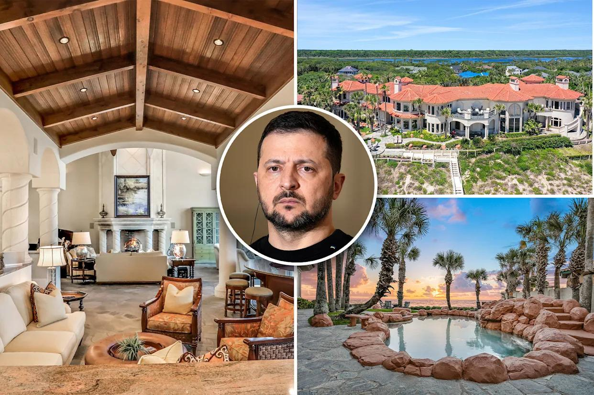

## Claim
Claim: "Ukrainian President Volodymyr Zelenskyy owns 15 homes including a $35 million home in Florida, has $1.2 billion in an overseas bank account, owns 15 homes, three private planes and has a monthly income of $11 million."

## Actions
```
image_search("Volodymyr Zelenskyy Florida home")
image_search("Volodymyr Zelenskyy overseas bank account")
image_search("Volodymyr Zelenskyy private planes")
image_search("Volodymyr Zelenskyy monthly income")
```

## Evidence
### Evidence from `image_search`
The search results include a Reuters article with an image of a building  and a Yahoo article showing an oceanfront Florida mansion . One source, from [Business Wire](https://www.businesswire.com/news/home/20240219354828/en/Florida-Oceanfront-Mansion-Not-Purchased-by-Ukraines-Zelenskyy-Heads-to-Luxury-Auction), contains no content.


### Evidence from `image_search`
Al Jazeera published an article on October 4, 2021, about Volodymyr Zelenskyy and offshore accounts (). NPR also contains an image of Volodymyr Zelenskyy ().

The Council on Foreign Relations was also searched, but no content was found.


### Evidence from `image_search`
The search results include images of Volodymyr Zelenskyy and planes. One source from ABC News ([https://abcnews.go.com/Politics/zelenskyys-trip-washington-treated-mini-state-visit-sources/story?id=95658338](https://abcnews.go.com/Politics/zelenskyys-trip-washington-treated-mini-state-visit-sources/story?id=95658338)) shows Zelenskyy.  Another source from ABC News Australia ([https://www.abc.net.au/news/2023-05-14/ukraine-zelenskyy-makes-surprise-paris-visit-talks-with-macron/102344976](https://www.abc.net.au/news/2023-05-14/ukraine-zelenskyy-makes-surprise-paris-visit-talks-with-macron/102344976)) also shows Zelenskyy near a plane. 

Sky News ([https://news.sky.com/video/volodymyr-zelenskyys-plane-lands-in-uk-ahead-of-major-summit-in-london-13319190](https://news.sky.com/video/volodymyr-zelenskyys-plane-lands-in-uk-ahead-of-major-summit-in-london-13319190)) shows a plane with the Ukrainian flag. 


### Evidence from `image_search`
From [Source](https://www.reuters.com/world/europe/ukraines-zelenskiy-publishes-income-part-transparency-drive-2024-01-28/): 
Content: Reuters published an article on January 28, 2024, about Volodymyr Zelenskyy publishing his income as part of a transparency drive. 


## Elaboration
The evidence provides some information related to the claim, but it is insufficient to verify it entirely.

The image search results show that Zelenskyy has been associated with a Florida home and planes. However, the evidence does not confirm the number of homes, the value of the Florida home, the number of planes, the amount of money in an overseas bank account, or the monthly income.

The Reuters article mentions Zelenskyy publishing his income, which could potentially be used to verify the claim, but the article's content is not included in the evidence. More information is needed to verify the claim.


## Actions
```
image_search("Volodymyr Zelenskyy property holdings")
image_search("Volodymyr Zelenskyy financial assets")
```

## Evidence
### Evidence from `image_search`
From [Source](https://www.bbc.com/news/world-europe-57198736): 
Content: The BBC published an article that includes an image of Volodymyr Zelenskyy. 


## Elaboration
The evidence does not provide enough information to verify the claim. The image searches show that Zelenskyy has been associated with a Florida home and planes, but the evidence does not confirm the number of homes, the value of the Florida home, the number of planes, the amount of money in an overseas bank account, or the monthly income. More information is needed to verify the claim.


## Actions
```
image_search("Volodymyr Zelenskyy financial disclosure")
```

## Evidence
No new evidence found.

## Elaboration
The evidence does not provide enough information to verify the claim. The image searches show that Zelenskyy has been associated with a Florida home and planes, but the evidence does not confirm the number of homes, the value of the Florida home, the number of planes, the amount of money in an overseas bank account, or the monthly income. More information is needed to verify the claim.


## Final Judgement
The search results show that Zelenskyy has been associated with a Florida home and planes. However, the evidence does not confirm the number of homes, the value of the Florida home, the number of planes, the amount of money in an overseas bank account, or the monthly income. More information is needed to verify the claim.

The claim cannot be verified due to a lack of sufficient evidence. The search results provide some context, but they do not confirm the specific details mentioned in the claim, such as the exact number of homes, the value of the Florida property, the amount of money in an overseas account, or the monthly income. Therefore, the claim is considered unverified. `false`


### Verdict: FALSE

### Justification
The claim that Volodymyr Zelenskyy owns 15 homes, a $35 million Florida home, $1.2 billion in an overseas bank account, three private planes, and has a monthly income of $11 million cannot be verified. While image searches confirm Zelenskyy's association with a Florida home and planes, the provided evidence lacks specific details to substantiate the claim's figures regarding property, finances, and income.
