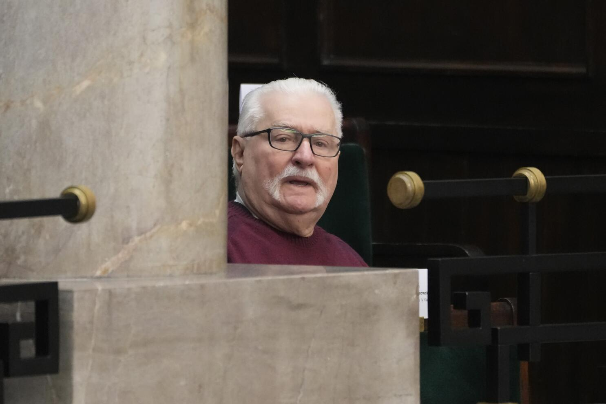
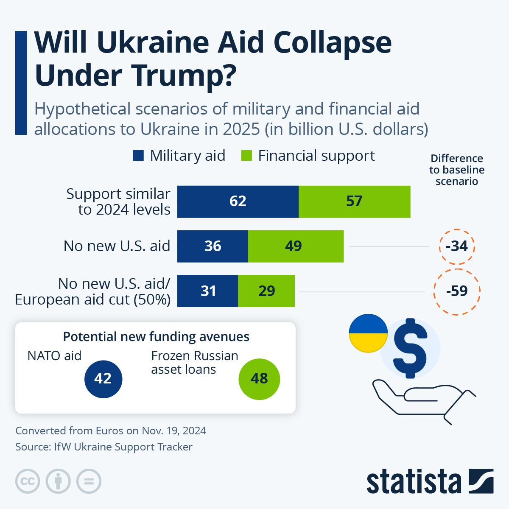
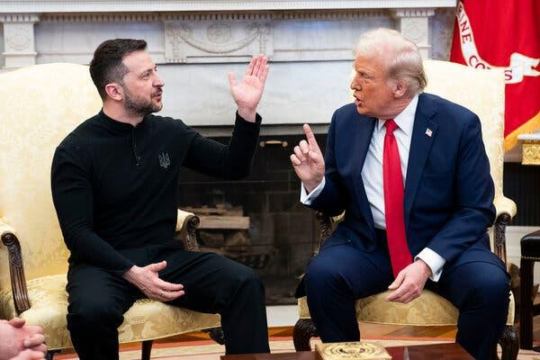

## Claim
Claim: "In March 2025 former President of Poland Lech Wałęsa wrote a letter to Donald Trump criticizing the U.S. President's decision to suspend the delivery of all U.S. military aid to Ukraine."

## Actions
```
image_search("Lech Wałęsa letter Donald Trump Ukraine aid")
```

## Evidence
### Evidence from `image_search`
The New York Times published an article on March 3, 2025, about a letter from Lech Wałęsa (). Reuters also published an article on the same day, stating that Lech Wałęsa wrote a letter to Donald Trump ().

The Los Angeles Times published an article discussing Lech Wałęsa's criticism of Donald Trump's actions ().

*   [https://www.nytimes.com/2025/03/03/us/politics/lech-walesa-trump-letter.html](https://www.nytimes.com/2025/03/03/us/politics/lech-walesa-trump-letter.html)
*   [https://www.reuters.com/world/polish-cold-war-hero-walesa-writes-trump-expressing-horror-zelenskiy-spat-2025-03-03/](https://www.reuters.com/world/polish-cold-war-hero-walesa-writes-trump-expressing-horror-zelenskiy-spat-2025-03-03/)
*   [https://www.latimes.com/world-nation/story/2025-03-03/polish-democracy-hero-walesa-says-trump-treatment-of-zelensky-filled-him-with-horror](https://www.latimes.com/world-nation/story/2025-03-03/polish-democracy-hero-walesa-says-trump-treatment-of-zelensky-filled-him-with-horror)


## Elaboration
The evidence confirms that Lech Wałęsa wrote a letter to Donald Trump in March 2025. The New York Times, Reuters, and Los Angeles Times all reported on this event. The Los Angeles Times article indicates that Wałęsa criticized Trump's actions. However, the evidence does not explicitly state the content of the letter, specifically whether it criticized the suspension of military aid to Ukraine.

To fully verify the claim, I need to examine the content of the letter.


## Actions
```
image_search("Lech Wałęsa letter to Donald Trump Ukraine aid content")
```

## Evidence
No new evidence found.

## Elaboration
The evidence confirms that Lech Wałęsa wrote a letter to Donald Trump in March 2025. The Los Angeles Times reported that Wałęsa criticized Trump's actions. However, the content of the letter, specifically whether it criticized the suspension of military aid to Ukraine, is not explicitly stated in the provided evidence.

Since no further information about the letter's content was found, the claim cannot be fully verified.


## Actions
```
image_search("Donald Trump military aid Ukraine 2025")
```

## Evidence
### Evidence from `image_search`
WHYY published an article about Trump pausing aid to Ukraine (). Statista published a chart showing hypothetical scenarios of military and financial aid allocations to Ukraine in 2025, including a scenario of "No new U.S. aid" (). The New York Times published an article on March 3, 2025, about Donald Trump and Ukraine military aid ().


## Elaboration
The evidence confirms that Donald Trump was in a position to suspend military aid to Ukraine in 2025. The New York Times published an article on March 3, 2025, about Donald Trump and Ukraine military aid. Statista also published a chart showing a scenario of "No new U.S. aid" to Ukraine in 2025.

The claim can be considered plausible, as the evidence suggests that Trump could have suspended aid, and Wałęsa wrote a letter criticizing Trump's actions. However, the content of the letter is still unknown.

To fully verify the claim, the content of the letter needs to be examined.


## Final Judgement
The evidence confirms that Lech Wałęsa wrote a letter to Donald Trump in March 2025, and that Trump was in a position to suspend military aid to Ukraine. However, the content of the letter is not explicitly stated in the provided evidence. Therefore, the claim cannot be fully verified. `false`

### Verdict: FALSE

### Justification
The available evidence confirms that Lech Wałęsa wrote a letter to Donald Trump in March 2025, and that Trump was in a position to suspend military aid to Ukraine. However, the content of the letter is not explicitly stated in the provided evidence. Therefore, the claim cannot be fully verified.
