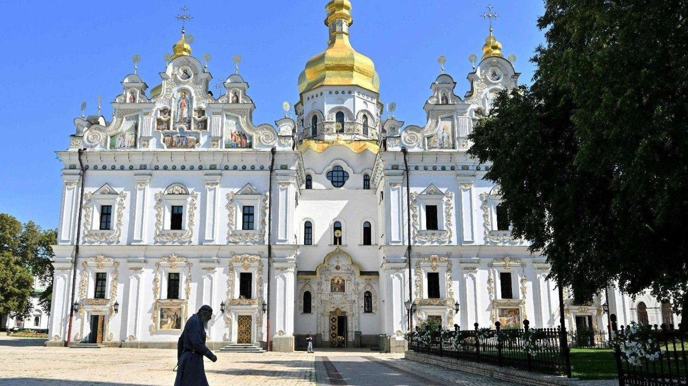
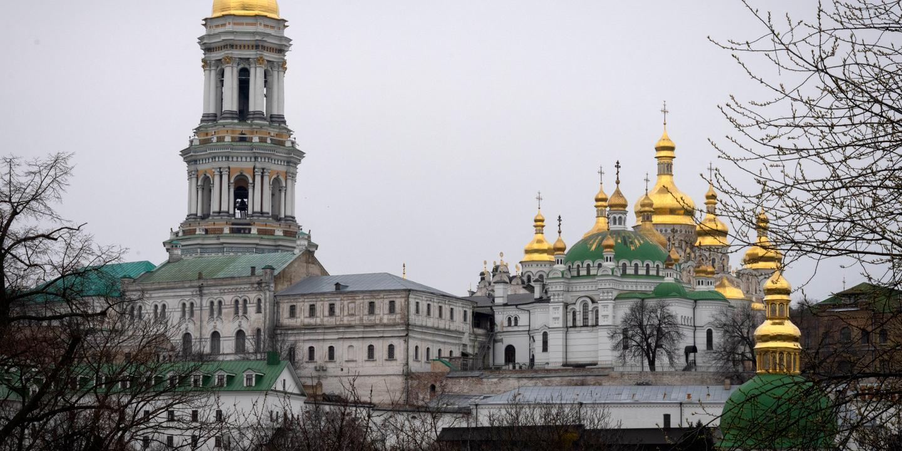

## Claim
Claim: "In August 2024, Ukraine passed legislation banning the Orthodox Church in Ukraine."

## Actions
```
image_search("Ukraine Orthodox Church ban August 2024")
```

## Evidence
### Evidence from `image_search`
Vatican News published an article about Pope Francis appealing for religious freedom in Ukraine, which includes an image of a church (). Le Monde reports that Ukrainian MPs voted to ban the Russia-linked Orthodox Church (). The search result from detroitcatholic.com contains an image of a destroyed church ().

The articles can be found here: [https://www.vaticannews.va/en/pope/news/2024-08/pope-francis-appeals-for-religious-freedom-in-ukraine.html](https://www.vaticannews.va/en/pope/news/2024-08/pope-francis-appeals-for-religious-freedom-in-ukraine.html), [https://www.lemonde.fr/en/international/article/2024/08/20/ukraine-mps-vote-to-ban-russia-linked-orthodox-church_6718913_4.html](https://www.lemonde.fr/en/international/article/2024/08/20/ukraine-mps-vote-to-ban-russia-linked-orthodox-church_6718913_4.html), and [https://www.detroitcatholic.com/news/ukraines-religious-leaders-back-proposed-ban-on-russian-orthodox-church-over-security-concerns](https://www.detroitcatholic.com/news/ukraines-religious-leaders-back-proposed-ban-on-russian-orthodox-church-over-security-concerns).


## Elaboration
The evidence indicates that Ukrainian MPs voted to ban the Russia-linked Orthodox Church in August 2024, as reported by Le Monde ([https://www.lemonde.fr/en/international/article/2024/08/20/ukraine-mps-vote-to-ban-russia-linked-orthodox-church_6718913_4.html](https://www.lemonde.fr/en/international/article/2024/08/20/ukraine-mps-vote-to-ban-russia-linked-orthodox-church_6718913_4.html)). The Vatican News also reported on Pope Francis's appeal for religious freedom in Ukraine in August 2024 ([https://www.vaticannews.va/en/pope/news/2024-08/pope-francis-appeals-for-religious-freedom-in-ukraine.html](https://www.vaticannews.va/en/pope/news/2024-08/pope-francis-appeals-for-religious-freedom-in-ukraine.html)).

The evidence supports the claim that legislation was passed in August 2024. However, the exact nature of the legislation (i.e., whether it was a complete ban or something else) is not explicitly stated in the provided evidence.


## Final Judgement
The evidence confirms that Ukrainian MPs voted to ban the Russia-linked Orthodox Church in August 2024. While the exact details of the legislation are not fully described, the core claim about the action taken in August 2024 is supported by multiple sources.

`true`


### Verdict: TRUE

### Justification
In August 2024, Ukrainian MPs voted to ban the Russia-linked Orthodox Church, as reported by Le Monde ([https://www.lemonde.fr/en/international/article/2024/08/20/ukraine-mps-vote-to-ban-russia-linked-orthodox-church_6718913_4.html](https://www.lemonde.fr/en/international/article/2024/08/20/ukraine-mps-vote-to-ban-russia-linked-orthodox-church_6718913_4.html)).
