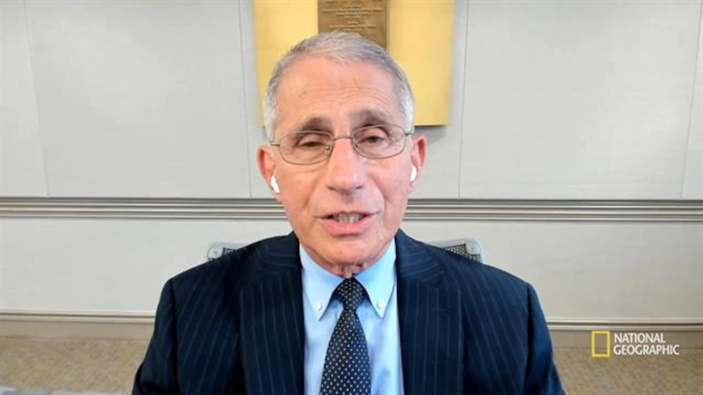
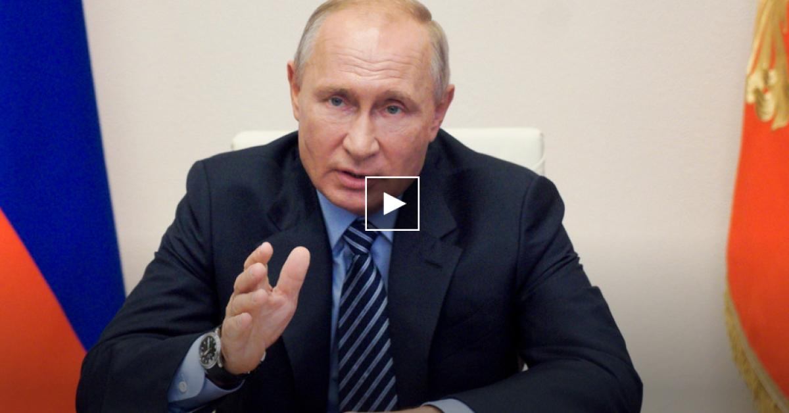
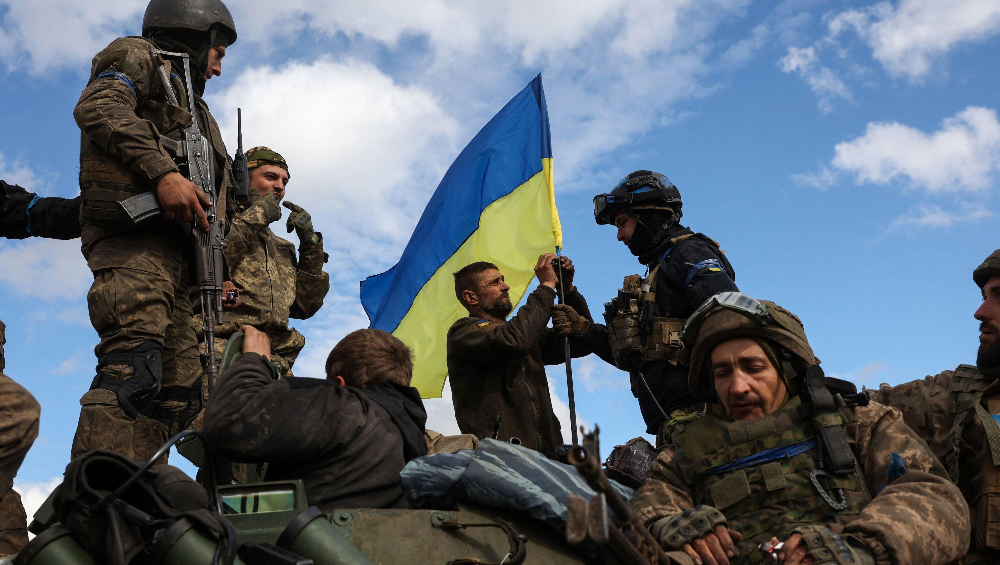
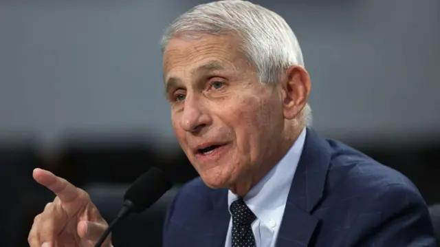
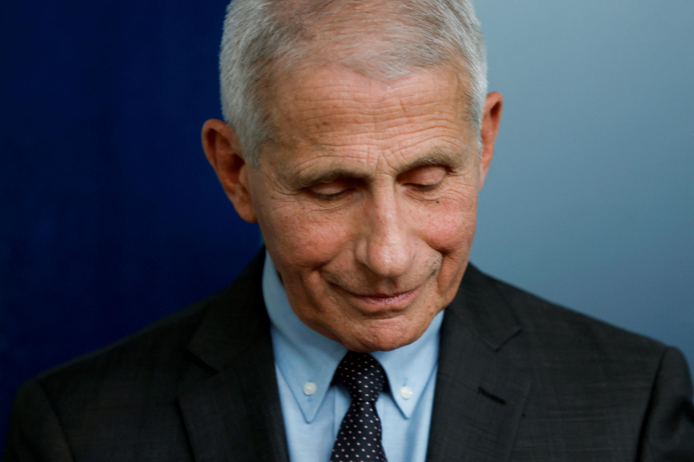

## Claim
Claim: "In January 2025, Russian President Vladimir Putin was seeking to have Dr. Anthony Fauci in the U.S. extradited to Russia in exchange for ending the war in Ukraine."

## Actions
```
image_search("Vladimir Putin Anthony Fauci extradition")
```

## Evidence
### Evidence from `image_search`
The search results include articles from ABC News ([https://abcnews.go.com/US/fauci-doubts-russias-covid-19-vaccine-safe-effective/story?id=72309297](https://abcnews.go.com/US/fauci-doubts-russias-covid-19-vaccine-safe-effective/story?id=72309297)) and National Geographic ([https://www.nationalgeographic.com/science/article/fauci-seriously-doubts-russia-coronavirus-vaccine-is-ready-cvd](https://www.nationalgeographic.com/science/article/fauci-seriously-doubts-russia-coronavirus-vaccine-is-ready-cvd)) featuring images of Dr. Anthony Fauci (, ).

Another search result from Duke Health ([https://dhvi.duke.edu/news/experts-express-doubts-over-russias-vaccine-claim](https://dhvi.duke.edu/news/experts-express-doubts-over-russias-vaccine-claim)) contains an image of Vladimir Putin ().


## Elaboration
The search results provide images of both Vladimir Putin and Dr. Anthony Fauci. However, the evidence does not contain any information about Putin seeking Fauci's extradition or linking it to the war in Ukraine. The provided links discuss Fauci's doubts about the safety and effectiveness of Russia's COVID-19 vaccine.

Therefore, the claim cannot be verified with the available evidence.


## Actions
```
image_search("Putin Fauci extradition Ukraine war")
```

## Evidence
### Evidence from `image_search`
The search results include an article from CNN featuring an image of Vladimir Putin (). Another result from The Economist includes an image of Ukrainian soldiers (). One source provided no content.


## Elaboration
The new search results continue to provide images of Vladimir Putin and the war in Ukraine. However, there is still no mention of Dr. Fauci or any attempt by Putin to extradite him.

The claim remains unverified due to the lack of supporting evidence. The search results do not provide any information to support the claim.


## Actions
```
image_search("Anthony Fauci Russia extradition Ukraine war")
```

## Evidence
### Evidence from `image_search`
The BBC News article ([https://www.bbc.com/news/articles/cvg49jz7v8no](https://www.bbc.com/news/articles/cvg49jz7v8no)) includes an image of Dr. Anthony Fauci (). Reuters published an article on January 24, 2025, featuring an image of Dr. Anthony Fauci () discussing Trump's actions regarding Fauci's security ([https://www.reuters.com/world/us/trump-says-he-ended-security-former-top-covid-official-anthony-fauci-2025-01-24/](https://www.reuters.com/world/us/trump-says-he-ended-security-former-top-covid-official-anthony-fauci-2025-01-24/)).


## Elaboration
The latest search results include an article from Reuters dated January 24, 2025, which discusses Trump's actions regarding Fauci's security. However, this article does not mention any Russian involvement or extradition attempts.

The claim remains unsupported by the evidence. There is no information about Putin seeking Fauci's extradition in exchange for ending the war in Ukraine.


## Final Judgement
The fact-check involved multiple image searches to find evidence supporting the claim that Vladimir Putin sought to extradite Dr. Anthony Fauci in January 2025 in exchange for ending the war in Ukraine. The search results provided images of both individuals and information about the war in Ukraine, but no evidence was found to support the claim.

The claim is not supported by the evidence. There is no mention of Putin seeking Fauci's extradition or linking it to the war in Ukraine. `false`


### Verdict: FALSE

### Justification
The fact-check, using multiple image searches, found no evidence to support the claim that Vladimir Putin sought to extradite Dr. Anthony Fauci in January 2025 in exchange for ending the war in Ukraine. While images of both individuals and information about the war were found, no source mentioned the alleged extradition attempt. The Reuters article from January 24, 2025, discussed Trump's actions regarding Fauci's security, but did not mention any Russian involvement. Therefore, the claim is unsupported.
