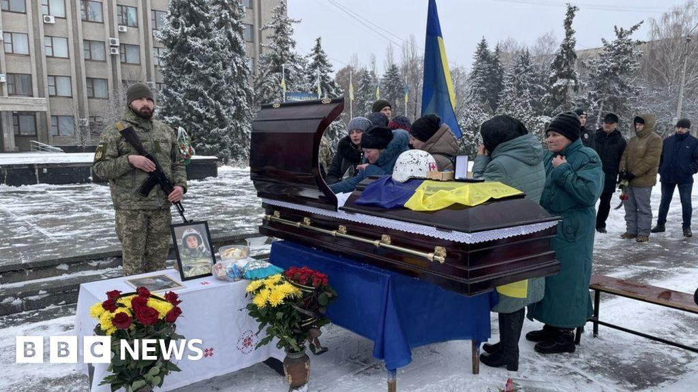
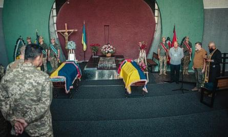
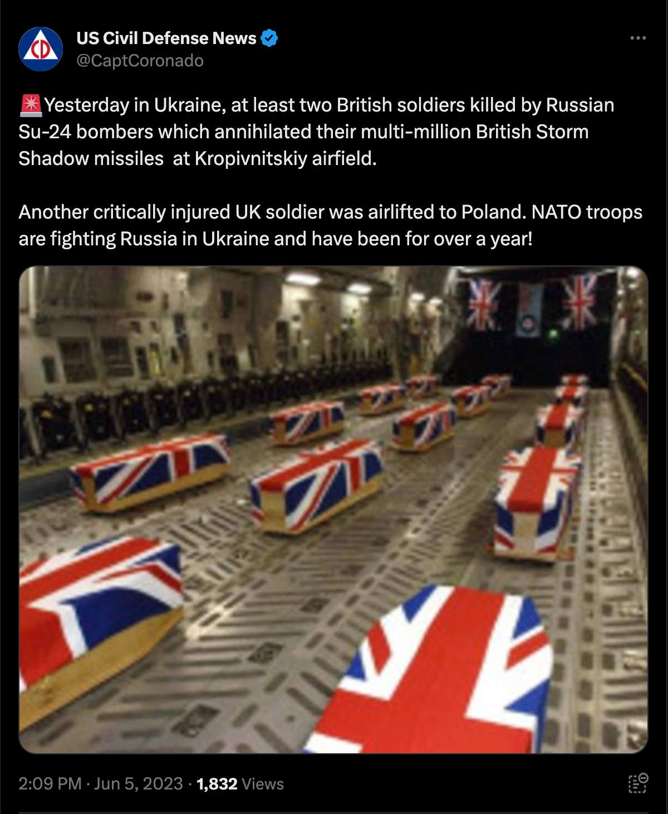
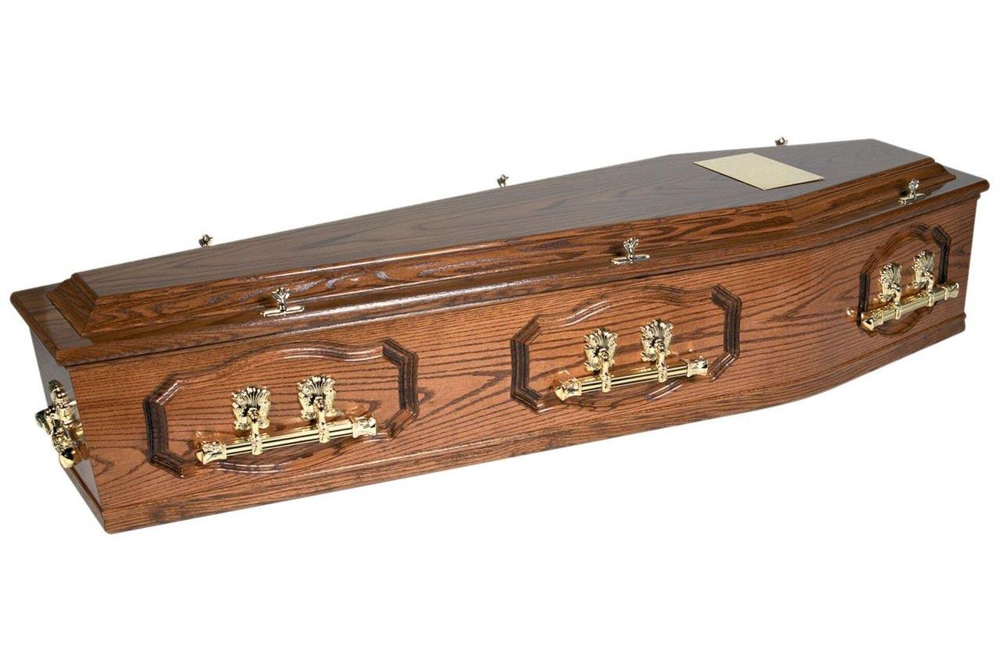

## Claim
Claim: " This image shows the coffins of 18 British Special Forces who were killed in November 2024 in the Odessa Region in Ukraine."

## Actions
```
reverse_search()
image_search("British coffins Ukraine")
image_search("British coffins Odessa")
```

## Evidence
### Evidence from `image_search`
The BBC News published an article about the funeral of a British volunteer in Ukraine. () The Guardian published an article about the death of a Briton in Ukraine, which includes an image of coffins. ()

An image of coffins draped in the Union Jack is not of the remains of British soldiers killed in Ukraine. () The image was shared on Twitter on June 5, 2023.


### Evidence from `image_search`
From [Source](https://www.brunskillfunerals.co.uk/traditional-coffins/): 
Content: The search result shows an image of a traditional coffin. 


## Elaboration
The image of coffins draped in the Union Jack is not of the remains of British soldiers killed in Ukraine. The image was shared on Twitter on June 5, 2023. The claim is therefore false.


## Final Judgement
The image in the claim shows coffins draped in the Union Jack, but it is not related to British soldiers killed in Ukraine. The image was shared on Twitter on June 5, 2023. Therefore, the claim is not factually accurate.

`false`

### Verdict: FALSE

### Justification
The image in the claim, showing coffins draped in the Union Jack, is not related to British soldiers killed in Ukraine. The image was shared on Twitter on June 5, 2023, making the claim false.
