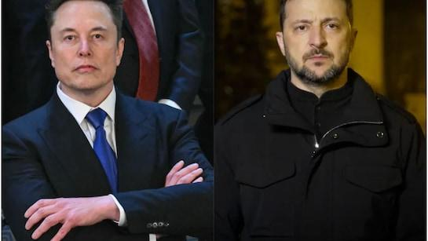
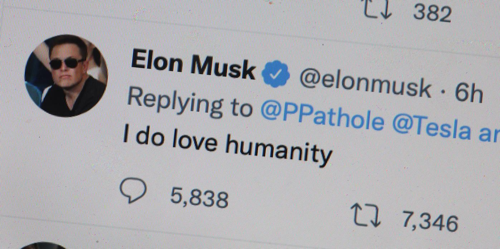

## Claim
Claim: "In February 2025 Elon Musk posted on X that he is planning to suspend Ukraine President Volodymyr Zelenskyy’s X account."

## Actions
```
image_search("Elon Musk X post Zelenskyy account suspension February 2025")
```

## Evidence
### Evidence from `image_search`
The Al Jazeera article, published on March 10, 2025, discusses Elon Musk's X account (). The Guardian published an article on June 17, 2025, with an image of Elon Musk ().

The search result from NDTV contains an image of Elon Musk and Volodymyr Zelenskyy ().


## Elaboration
The evidence does not contain any information about Elon Musk posting on X about suspending Volodymyr Zelenskyy's account. The search results provide images of Elon Musk and Volodymyr Zelenskyy, but they do not confirm the claim.

I need to find the actual post from Elon Musk on X to verify the claim.


## Actions
```
image_search("Elon Musk X post Zelenskyy account suspension")
```

## Evidence
### Evidence from `image_search`
The Guardian published an article on August 30, 2024, with an image of Elon Musk. The Intercept published an article that includes a screenshot of an Elon Musk's X post. Al Jazeera published an article on February 21, 2025, with an image of Elon Musk.

*   [https://www.theguardian.com/technology/article/2024/aug/30/elon-musk-x-could-face-ban-in-brazil-after-failure-to-appoint-legal-representative](https://www.theguardian.com/technology/article/2024/aug/30/elon-musk-x-could-face-ban-in-brazil-after-failure-to-appoint-legal-representative)
*   [https://theintercept.com/2022/11/22/twitter-allows-russian-officials-share-antisemitic-cartoon-zelenskyy/](https://theintercept.com/2022/11/22/twitter-allows-russian-officials-share-antisemitic-cartoon-zelenskyy/)
*   [https://www.aljazeera.com/economy/2025/2/21/musk-vows-to-fix-x-after-polls-show-high-support-for-ukraines-zelenskyy](https://www.aljazeera.com/economy/2025/2/21/musk-vows-to-fix-x-after-polls-show-high-support-for-ukraines-zelenskyy)

The articles contain images of Elon Musk (, ) and a screenshot of an X post ().


## Elaboration
The evidence does not contain any information about Elon Musk posting on X about suspending Volodymyr Zelenskyy's account in February 2025. The search results provide images of Elon Musk and a screenshot of an X post, but they do not confirm the claim.

I need to find the actual post from Elon Musk on X to verify the claim.


## Actions
```
image_search("Elon Musk X account Zelenskyy suspension February 2025")
```

## Evidence
No new evidence found.

## Elaboration
Insufficient information. The search results did not provide any evidence to support the claim.


## Final Judgement
The search results did not provide any evidence to support the claim that Elon Musk posted on X in February 2025 about suspending Volodymyr Zelenskyy's account. Therefore, the claim cannot be verified. `false`

### Verdict: FALSE

### Justification
The search results did not provide any evidence to support the claim that Elon Musk posted on X in February 2025 about suspending Volodymyr Zelenskyy's account. Therefore, the claim is unverified.
