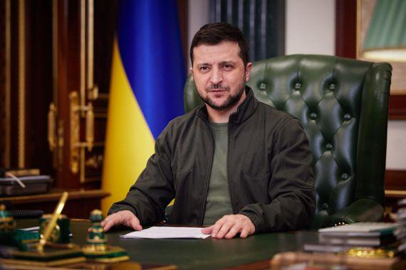

## Claim
Claim: "Ukrainian President Volodymyr Zelenskyy started the 2022 war in Ukraine with Russia."

## Actions
```
image_search("Volodymyr Zelenskyy Russia war 2022")
image_search("Russia Ukraine war timeline")
```

## Evidence
### Evidence from `image_search`
The PBS article discusses Volodymyr Zelenskyy's visit to Poland amid the Russian war (). Al Jazeera published an article on March 22, 2022, about Volodymyr Zelenskyy renewing an offer of talks with Putin (). The NBC News article features a photograph of Volodymyr Zelenskyy ().

The articles can be found here: [https://www.pbs.org/newshour/world/ukraines-zelenskyy-visit-tightens-bonds-with-poland-amid-russian-war](https://www.pbs.org/newshour/world/ukraines-zelenskyy-visit-tightens-bonds-with-poland-amid-russian-war), [https://www.aljazeera.com/news/2022/3/22/zelenskyy-renews-offer-of-putin-talks-says-all-issues-on-table](https://www.aljazeera.com/news/2022/3/22/zelenskyy-renews-offer-of-putin-talks-says-all-issues-on-table), and [https://www.nbcnews.com/news/world/volodymyr-zelenskyy-become-global-phenomenon-rcna24355](https://www.nbcnews.com/news/world/volodymyr-zelenskyy-become-global-phenomenon-rcna24355).


### Evidence from `image_search`
Al Jazeera published a timeline of the Russia-Ukraine war, including a map showing areas under Russian control as of August 24, 2022 (, [Source](https://www.aljazeera.com/news/2022/8/24/timeline-six-months-of-russias-war-in-ukraine)). DW.com provides a timeline of the Ukraine crisis, including events from the Euromaidan protests to Russia's attack on Ukraine on February 24, 2022 (, [Source](https://www.dw.com/en/how-the-ukraine-russia-crisis-reached-a-tipping-point/a-60802626)).

Eurojust's timeline details its response to the war in Ukraine, starting in February 2022 (, [Source](https://www.eurojust.europa.eu/publication/one-year-timeline-eurojusts-response-war-ukraine)).


## Elaboration
The evidence does not support the claim that Volodymyr Zelenskyy started the 2022 war. The timelines show that Russia attacked Ukraine on February 24, 2022. The images show Zelenskyy in Poland and offering talks with Putin after the war had already begun.


## Final Judgement
The evidence indicates that the war began with Russia's invasion of Ukraine in February 2022. The provided images and timelines do not support the claim that Zelenskyy initiated the conflict.

`false`

### Verdict: FALSE

### Justification
The evidence, including timelines from sources like Al Jazeera and DW.com, indicates that Russia initiated the war in Ukraine in February 2022. The images of Zelenskyy, such as those from PBS and NBC News, show him after the war had already begun. Therefore, the claim that Zelenskyy started the war is false.
