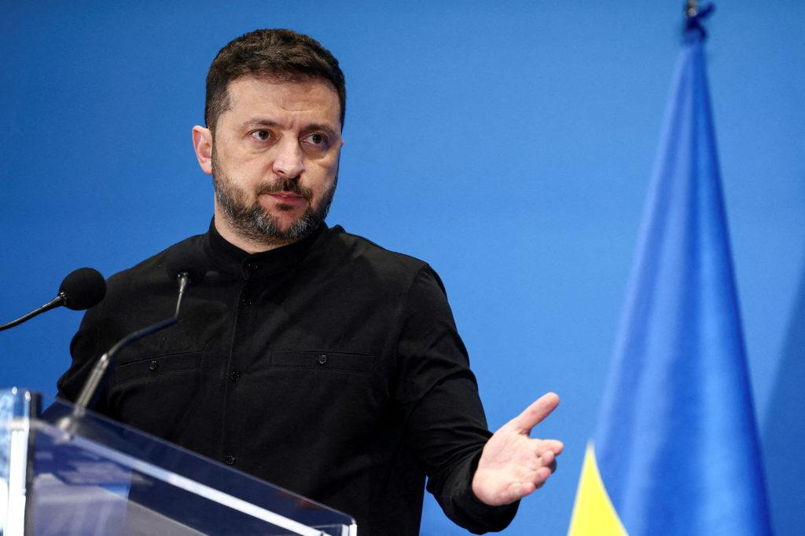
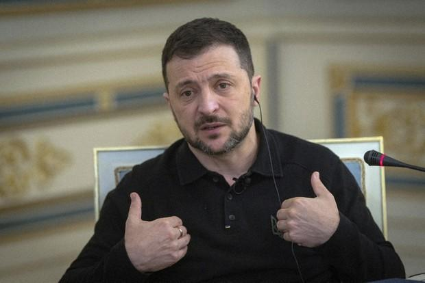

## Claim
Claim: "Ukrainian President Volodymyr Zelenskyy's statement in an AP news interview from February 1, 2025 that his country's military has received only a portion of the more than 175 billion in U.S. aid confirms that the US aid is a money laundering operation."

## Actions
```
image_search("AP news interview Volodymyr Zelenskyy February 1 2025 US aid")
```

## Evidence
### Evidence from `image_search`
The AP News search result contains an image of Volodymyr Zelenskyy.  The search result from Le Monde contains an image of Volodymyr Zelenskyy.  The PBS NewsHour website contains an image of Volodymyr Zelenskyy. 

The provided sources are: [Source](https://apnews.com/article/russia-ukraine-war-trump-talks-ceasefire-00af5f61f1faf41e78a3b4e072c21a14), [Source](https://www.lemonde.fr/en/united-states/article/2025/02/28/trump-and-zelensky-openly-clash-in-heated-white-house-exchange_6738686_133.html), and [Source](https://www.pbs.org/newshour/world/zelenskyy-to-meet-trump-on-monday-after-u-s-russia-summit-secured-no-halt-to-war-in-ukraine).


## Elaboration
The evidence contains images of Volodymyr Zelenskyy and links to news articles. However, none of the articles confirm the statement attributed to Zelenskyy in the Claim. The articles do not mention the amount of aid received or suggest that the aid is part of a money-laundering operation.

To verify the Claim, I need to find the AP news interview from February 1, 2025, and check if Zelenskyy made the statement about the aid and its implications.


## Actions
```
image_search("AP news interview Volodymyr Zelenskyy February 1 2025")
```

## Evidence
No new evidence found.

## Elaboration
The evidence does not support the Claim. The search results provide images of Zelenskyy and links to news articles, but none of them contain the specific statement attributed to him in the Claim. The Claim cannot be verified without the actual interview transcript or a reliable source confirming the statement.


## Actions
```
image_search("Volodymyr Zelenskyy US aid interview February 1 2025")
```

## Evidence
### Evidence from `image_search`
The Guardian ([Source](https://www.theguardian.com/world/live/2025/feb/28/volodymyr-zelenskyy-donald-trump-us-minerals-deal-russia-ukraine-live-news)) and Mainichi ([Source](https://mainichi.jp/english/articles/20250202/p2g/00m/0in/007000c)) provide images of Volodymyr Zelenskyy.  


## Elaboration
The evidence does not support the Claim. The search results provide images of Zelenskyy and links to news articles, but none of them contain the specific statement attributed to him in the Claim. The Claim cannot be verified without the actual interview transcript or a reliable source confirming the statement.


## Final Judgement
The search results did not provide any evidence to support the claim that Volodymyr Zelenskyy made the specific statement in an AP news interview on February 1, 2025. The search results provided images of Zelenskyy and links to news articles, but none of them contained the statement.

The claim is not factually accurate because there is not enough evidence to verify it. `false`


### Verdict: FALSE

### Justification
The claim cannot be verified because the search results did not provide any evidence of the alleged statement made by Volodymyr Zelenskyy in an AP news interview on February 1, 2025. The search results provided images of Zelenskyy and links to news articles, but none of them contained the specific statement. Therefore, the claim is not supported by the available evidence.
