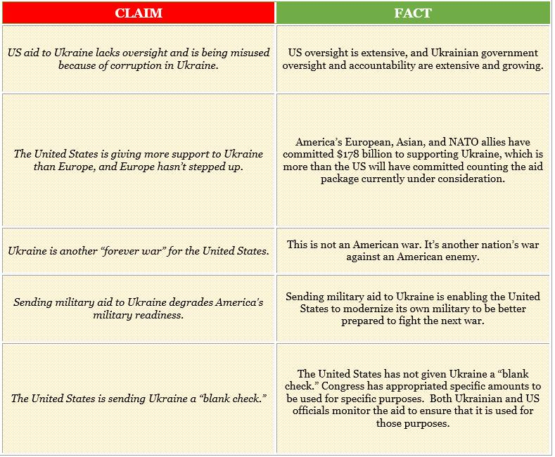
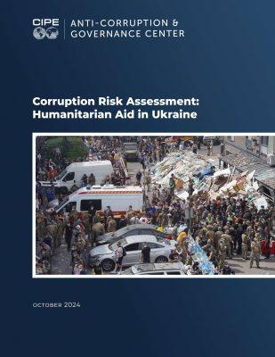
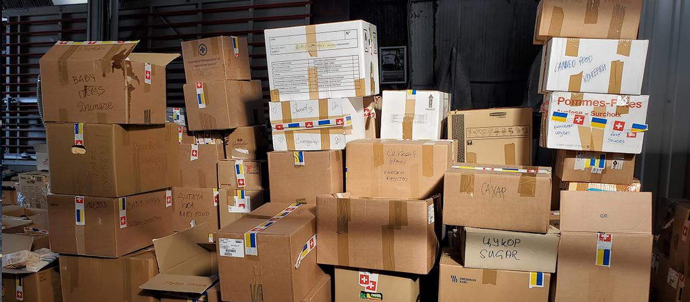
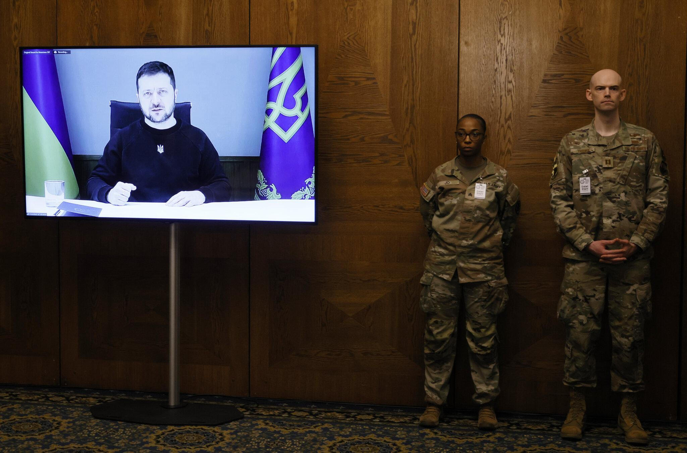

## Claim
Claim: "Half of all US aid to Ukraine was laundered and sent back to Democrat candidates for re-election."

## Actions
```
image_search("US aid Ukraine laundered Democrat candidates")
```

## Evidence
### Evidence from `image_search`
From [Source](https://www.reuters.com/world/us/us-house-vote-long-awaited-95-billion-ukraine-israel-aid-package-2024-04-20/): 
Content: Reuters published an article on April 20, 2024, about the US House vote on a Ukraine aid package. The article includes an image of the US and Ukrainian flags. 


## Elaboration
The provided evidence does not contain any information to support the claim that US aid to Ukraine was laundered and sent back to Democrat candidates. The evidence is a Reuters article about a US House vote on a Ukraine aid package, accompanied by an image of US and Ukrainian flags.


## Actions
```
image_search("US aid to Ukraine corruption")
```

## Evidence
### Evidence from `image_search`
The Institute for the Study of War published a fact sheet stating that US aid to Ukraine lacks oversight and is being misused because of corruption in Ukraine, but also stating that US oversight is extensive, and Ukrainian government oversight and accountability are extensive and growing. ([https://www.understandingwar.org/backgrounder/fact-sheet-us-assistance-ukraine](https://www.understandingwar.org/backgrounder/fact-sheet-us-assistance-ukraine))  The Center for International Private Enterprise (CIPE) published a report in October 2024 titled "Corruption Risk Assessment: Humanitarian Aid in Ukraine". ([https://www.cipe.org/resources/corruption-risk-assessment-humanitarian-aid-in-ukraine/](https://www.cipe.org/resources/corruption-risk-assessment-humanitarian-aid-in-ukraine/)) 

The International Bar Association published an article that includes an image of boxes with aid supplies. ([https://www.ibanet.org/Russia-Ukraine-US-aid-delay-critical-as-country-looks-to-boost-frontline-fight](https://www.ibanet.org/Russia-Ukraine-US-aid-delay-critical-as-country-looks-to-boost-frontline-fight)) 


## Elaboration
The evidence suggests that there are concerns about corruption and misuse of US aid to Ukraine. The Institute for the Study of War states that US aid lacks oversight and is being misused because of corruption in Ukraine, but also states that US oversight is extensive, and Ukrainian government oversight and accountability are extensive and growing. The Center for International Private Enterprise (CIPE) published a report on corruption risk assessment of humanitarian aid in Ukraine. However, none of the evidence supports the claim that half of the aid was laundered and sent back to Democrat candidates.


## Actions
```
image_search("US aid Ukraine laundered Democrat candidates evidence")
```

## Evidence
### Evidence from `image_search`
From [Source](https://www.nytimes.com/2023/01/27/us/politics/ukraine-corruption-scandal.html): 
Content: The New York Times published an article on January 27, 2023, about a corruption scandal in Ukraine. 


## Elaboration
The evidence does not support the claim. While there are reports of corruption and misuse of aid in Ukraine, there is no evidence to suggest that half of the US aid was laundered and sent back to Democrat candidates.


## Final Judgement
The fact-check reveals that while there are concerns about corruption and misuse of US aid to Ukraine, there is no evidence to support the claim that half of the aid was laundered and sent back to Democrat candidates. The provided evidence includes articles about US aid packages, corruption risks, and a corruption scandal in Ukraine, but none of them mention the claim.

`false`


### Verdict: FALSE

### Justification
The fact-check found no evidence to support the claim. While there are reports of corruption and misuse of US aid to Ukraine, the provided sources, including a Reuters article on aid packages and reports from the Institute for the Study of War and the Center for International Private Enterprise, do not mention the laundering of funds to Democrat candidates.
