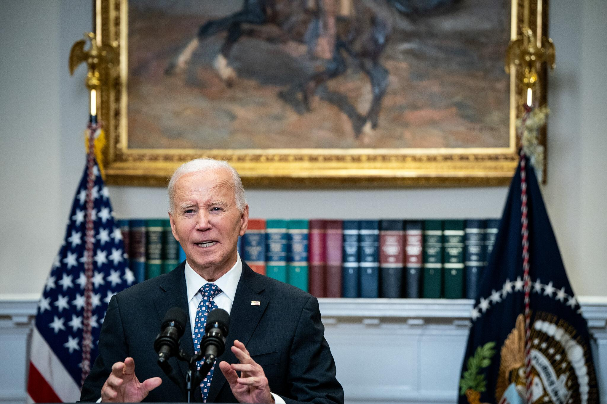

## Claim
Claim: "In remarks to reporters on September 29, 2024 US President Joe Biden announced that no more aid would be provided for the areas affected by Hurrican Helene, but 2.4 billion US-$ more for Ukraine."

## Actions
```
image_search("Joe Biden Hurricane Helene Ukraine aid September 29 2024")
```

## Evidence
### Evidence from `image_search`
Le Monde published an article on September 30, 2024, stating that Biden pledged to aid victims of Hurricane Helene.  The New York Times provides an image of Joe Biden. 

*   [Source](https://www.lemonde.fr/en/united-states/article/2024/09/30/biden-pledges-to-aid-victims-of-hurrican-helene-as-long-as-it-takes_6727795_133.html)
*   [Source](https://apnews.com/article/hurricane-helene-recover-biden-visit-823be75adbed4fa1d7c108a207dbb3e3)
*   [Source](https://www.nytimes.com/video/us/politics/100000009730976/biden-helene.html)


## Elaboration
The evidence contradicts the claim. Le Monde reported that Biden pledged aid to Hurricane Helene victims. The claim states that Biden announced no more aid for the affected areas.


## Final Judgement
The search results show that Biden pledged aid to Hurricane Helene victims, contradicting the claim that he announced no more aid. Therefore, the claim is demonstrably false. `false`


### Verdict: FALSE

### Justification
Based on the search results, including a report from Le Monde ([Source](https://www.lemonde.fr/en/united-states/article/2024/09/30/biden-pledges-to-aid-victims-of-hurrican-helene-as-long-as-it-takes_6727795_133.html)), President Biden pledged aid to victims of Hurricane Helene, directly contradicting the claim that he announced no further aid.
