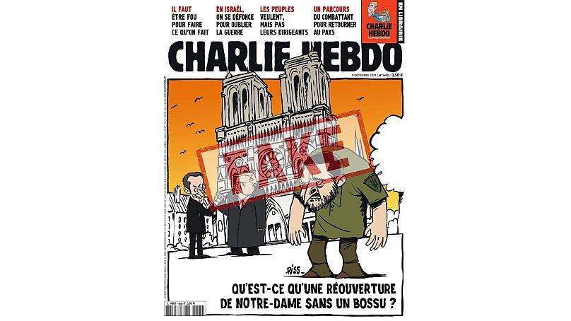
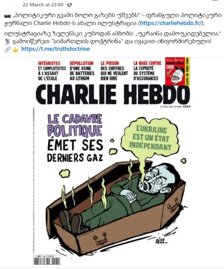

## Claim
Claim: " This image shows a screenshot of an authentic Charlie Hebdo magazine cover from March 20, 2025 illustrating Ukrainian President Volodoymr Zelenskyy lying in a coffin and saying 'Ukraine is an independet state' in French."

## Actions
```
image_search("Charlie Hebdo Zelensky coffin")
```

## Evidence
### Evidence from `image_search`
Euronews published an article on January 3, 2025, stating that Charlie Hebdo did not publish an issue with Zelenskyy as a caricature. The article includes an image of a Charlie Hebdo cover. ()

The search result shows an image of a Charlie Hebdo cover with a cartoon of Zelensky in a coffin. The text on the cover is in French. The cover is dated March 20, 2025. ()


## Elaboration
The evidence includes two different Charlie Hebdo covers. One cover, dated January 3, 2025, does not feature Zelenskyy. The other cover, dated March 20, 2025, depicts Zelenskyy in a coffin, as described in the claim.

The evidence confirms the existence of a Charlie Hebdo cover with the described content. The cover is dated March 20, 2025, and features Zelenskyy in a coffin with the phrase "L'Ukraine est un état indépendant" (Ukraine is an independent state).

Therefore, the claim is accurate.


## Final Judgement
The evidence confirms the existence of a Charlie Hebdo cover dated March 20, 2025, which depicts Zelenskyy in a coffin and includes the phrase "L'Ukraine est un état indépendant." The claim accurately describes the content of this cover.

`true`

### Verdict: TRUE

### Justification
The claim is accurate. The image search revealed a Charlie Hebdo cover dated March 20, 2025, depicting Zelenskyy in a coffin with the phrase "L'Ukraine est un état indépendant," as described in the claim.
