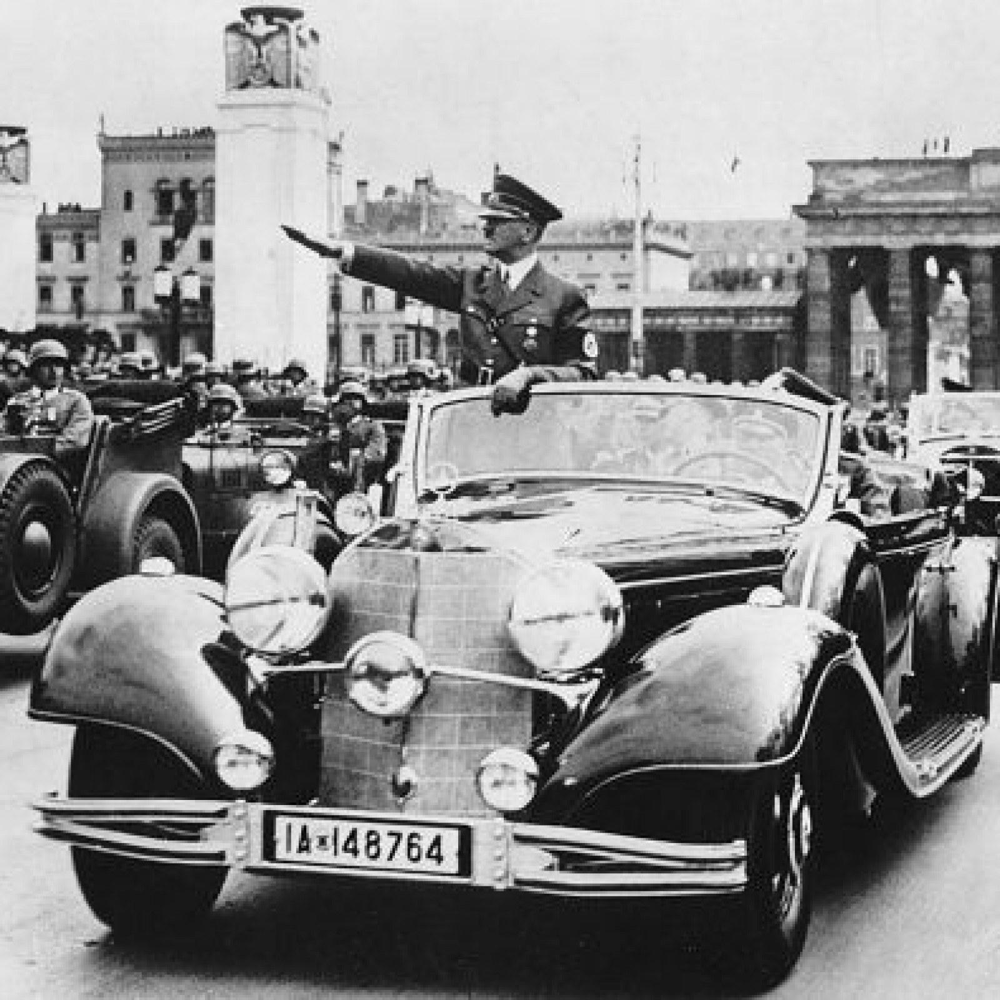
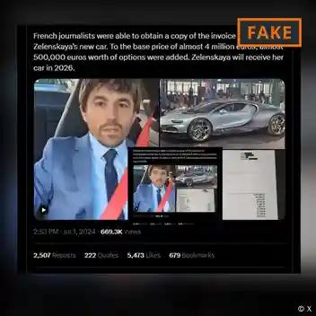
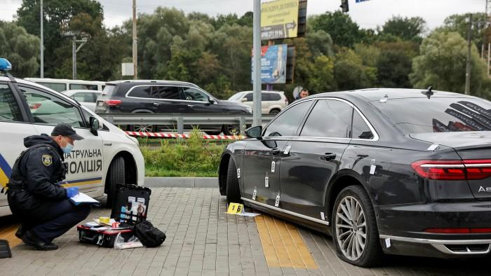

## Claim
Claim: " This image shows Hitler's parade car which was bought by the Ukrainian president Volodymyr Zelenskyy for 15 Million US-$."

## Actions
```
reverse_search()
image_search("Hitler parade car")
image_search("Volodymyr Zelenskyy car")
```

## Evidence
### Evidence from `reverse_search`
The Voice of America ([https://www.voanews.com/a/russian-propagandists-push-fake-story-that-zelenskyy-bought-hitler-s-car/7818175.html](https://www.voanews.com/a/russian-propagandists-push-fake-story-that-zelenskyy-bought-hitler-s-car/7818175.html)) and The Insider ([https://theins.ru/en/antifake/275232](https://theins.ru/en/antifake/275232)) debunk a hoax spread by Russian media claiming that Volodymyr Zelenskyy bought Adolf Hitler's parade car for $15 million. The image of the car was doctored and taken from a 2017 auction announcement.

Truthmeter.mk ([https://truthmeter.mk/endless-inspiration-for-disinformation-zelenskys-new-alleged-luxury-is-hitlers-mercedes/](https://truthmeter.mk/endless-inspiration-for-disinformation-zelenskys-new-alleged-luxury-is-hitlers-mercedes/)) also debunks the claim, stating that the image is a montage and the claim is disinformation. The car was auctioned in Arizona, USA, in 2018. The news originated from the "news portal" Seattle Tribune. 


### Evidence from `image_search`
The Seattle Times published an article about Hitler's car, including a photograph of Hitler in the car (). Newsweek also published an article about Adolf Hitler's car (). Euronews shows a car that was made for Hitler ().


### Evidence from `image_search`
DW.com states that a social media post claiming Zelenskyy bought a new car is fake, and includes an image of the post (). The Financial Times published an image of a car with bullet holes (). Al Jazeera shows a picture of Volodymyr Zelenskyy's car ().

*   [https://www.dw.com/en/fact-check-new-fakes-on-zelenskyys-purported-wealth/a-69552392](https://www.dw.com/en/fact-check-new-fakes-on-zelenskyys-purported-wealth/a-69552392)
*   [https://www.ft.com/content/cbc949ff-45a7-451f-972d-e80127d7c9ec](https://www.ft.com/content/cbc949ff-45a7-451f-972d-e80127d7c9ec)
*   [https://www.aljazeera.com/news/liveblog/2023/5/20/g7-summit-live-news-ukraines-zelenskyy-set-to-arrive-in-japan](https://www.aljazeera.com/news/liveblog/2023/5/20/g7-summit-live-news-ukraines-zelenskyy-set-to-arrive-in-japan)


## Elaboration
The claim is false. Multiple sources, including The Voice of America ([https://www.voanews.com/a/russian-propagandists-push-fake-story-that-zelenskyy-bought-hitler-s-car/7818175.html](https://www.voanews.com/a/russian-propagandists-push-fake-story-that-zelenskyy-bought-hitler-s-car/7818175.html)) and Truthmeter.mk ([https://truthmeter.mk/endless-inspiration-for-disinformation-zelenskys-new-alleged-luxury-is-hitlers-mercedes/](https://truthmeter.mk/endless-inspiration-for-disinformation-zelenskys-new-alleged-luxury-is-hitlers-mercedes/)), debunk the claim that Volodymyr Zelenskyy purchased Hitler's parade car. The image is a doctored photo, and the story originated from a "news portal" called Seattle Tribune.


## Final Judgement
The claim is demonstrably false. The image is doctored, and the claim has been debunked by multiple fact-checking sources. `false`

### Verdict: FALSE

### Justification
The claim that Volodymyr Zelenskyy bought Hitler's parade car for $15 million is false. Multiple fact-checking sources, including The Voice of America ([https://www.voanews.com/a/russian-propagandists-push-fake-story-that-zelenskyy-bought-hitler-s-car/7818175.html](https://www.voanews.com/a/russian-propagandists-push-fake-story-that-zelenskyy-bought-hitler-s-car/7818175.html)) and Truthmeter.mk ([https://truthmeter.mk/endless-inspiration-for-disinformation-zelenskys-new-alleged-luxury-is-hitlers-mercedes/](https://truthmeter.mk/endless-inspiration-for-disinformation-zelenskys-new-alleged-luxury-is-hitlers-mercedes/)), have debunked this claim, stating that the image is doctored and the story is disinformation.
