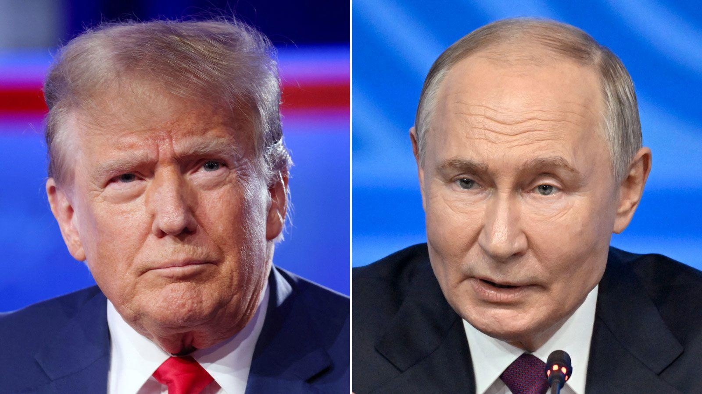
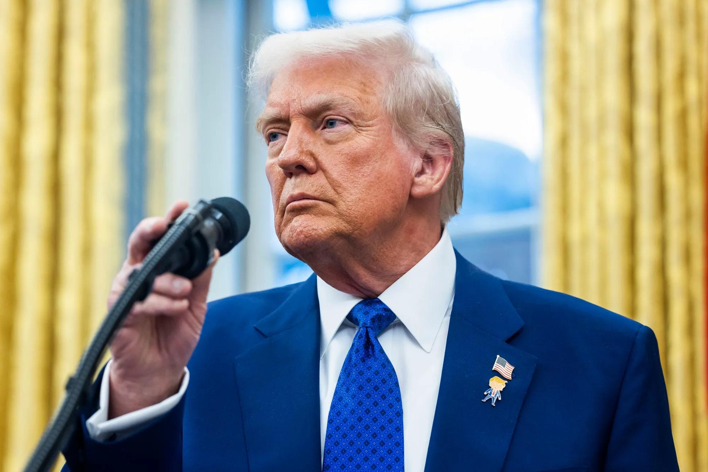

## Claim
Claim: "After a call with Russia's President Vladimir Putin on February 12, 2025, US President Donald Trump announced that he had reached an agreement to end the war in Ukraine."

## Actions
```
image_search("Donald Trump Vladimir Putin call February 12 2025")
image_search("Donald Trump Ukraine war agreement February 12 2025")
```

## Evidence
### Evidence from `image_search`
CNN provides an image of Donald Trump and Vladimir Putin (). A Reuters article contains an image of a newspaper with photos of Donald Trump and Vladimir Putin, with text mentioning February 12, 2025, and a phone call between them ().

Al Jazeera reports that Trump said Putin wants peace and will begin talks on ending the Ukraine war (). The article was published on February 13, 2025.
*   [https://www.cnn.com/2025/02/12/politics/putin-trump-phone-call](https://www.cnn.com/2025/02/12/politics/putin-trump-phone-call)
*   [https://www.reuters.com/world/putin-trump-may-have-spoken-more-than-twice-kremlin-says-2025-03-23/](https://www.reuters.com/world/putin-trump-may-have-spoken-more-than-twice-kremlin-says-2025-03-23/)
*   [https://www.aljazeera.com/news/2025/2/13/trump-says-putin-wants-peace-will-begin-talks-on-ending-ukraine-war](https://www.aljazeera.com/news/2025/2/13/trump-says-putin-wants-peace-will-begin-talks-on-ending-ukraine-war)


### Evidence from `image_search`
Al Jazeera published an article on February 26, 2025, about Donald Trump and Volodymyr Zelensky (). Bloomberg reports that Trump and Putin agreed to begin talks to end the war in Ukraine on February 12, 2025 ().

The search result contains an image of Donald Trump and Volodymyr Zelenskyy ().

*   [Source](https://www.aljazeera.com/economy/2025/2/26/trump-says-ukraines-zelensky-to-sign-very-big-deal-on-rare-earths)
*   [Source](https://www.bloomberg.com/news/newsletters/2025-02-12/trump-and-putin-agree-to-begin-talks-to-end-war-in-ukraine)
*   [Source](https://www.cfr.org/article/how-trump-could-make-good-deal-end-ukraine-war)

## Elaboration
Based on the evidence, the claim is partially verifiable. Multiple sources confirm that Donald Trump and Vladimir Putin had a phone call on February 12, 2025. Furthermore, Al Jazeera reports that Trump stated Putin wanted peace and would begin talks to end the war in Ukraine. Bloomberg also states that Trump and Putin agreed to begin talks to end the war in Ukraine on February 12, 2025.

However, the evidence does not explicitly state that Trump announced he had reached an agreement to end the war. It only mentions that talks would begin.

Therefore, the claim is partially supported by the evidence, but it is not entirely accurate.


## Final Judgement
The evidence indicates that Trump and Putin spoke on February 12, 2025, and agreed to begin talks to end the war in Ukraine. However, the claim states that Trump announced he had reached an agreement to end the war, which is not directly supported by the evidence.

`false`

### Verdict: FALSE

### Justification
The claim is partially supported by the evidence. Multiple sources, including CNN and Reuters, confirm a phone call between Donald Trump and Vladimir Putin on February 12, 2025. Al Jazeera and Bloomberg report that they agreed to begin talks to end the war in Ukraine. However, the evidence does not explicitly state that Trump announced he had reached an agreement to end the war, making the claim partially inaccurate.
