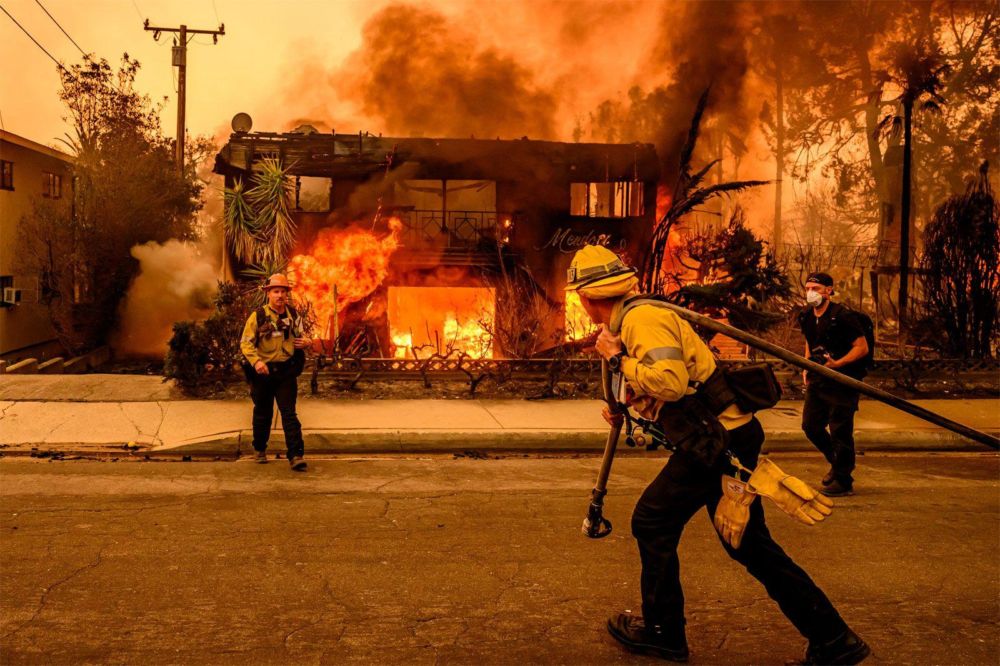
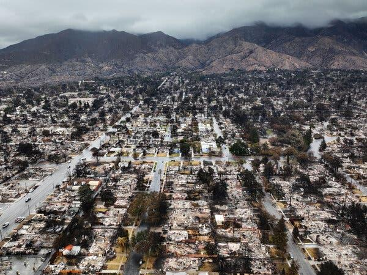
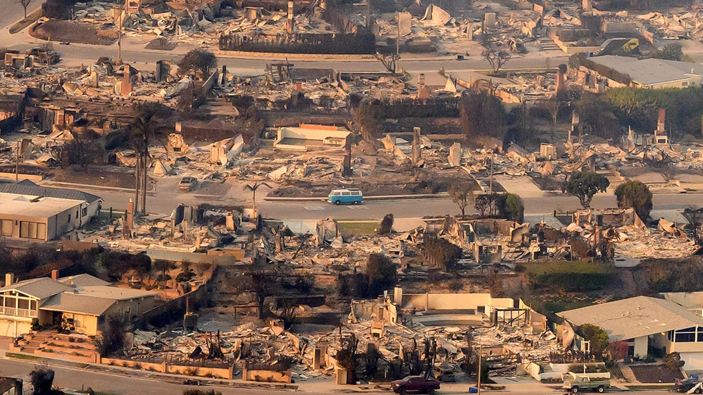

## Claim
Claim: "During the January 2025 wildfires, eight mansions belonging to Ukrainian military officials burned down in Los Angeles, California."

## Actions
```
image_search("January 2025 wildfires Los Angeles")
image_search("Ukrainian military officials mansions burned Los Angeles")
```

## Evidence
### Evidence from `image_search`
The search results include images of wildfires in Los Angeles. One source, from [Source](https://unu.edu/inweh/collection/january-2025-los-angeles-wildfires-once-generation-events-now-happen-frequently), shows an image of wildfires . Reuters published images of wildfires in Los Angeles  ([Source](https://www.reuters.com/pictures/scenes-los-angeles-wildfires-rage-2025-01-08/3TQRCJ3GGFNF5I6YEQ3524YLTE/)).

Britannica.com also contains an image of a house on fire during the Los Angeles wildfires  ([Source](https://www.britannica.com/event/Los-Angeles-wildfires-of-2025)).


### Evidence from `image_search`
The search results include images of areas damaged by wildfires in Los Angeles. One source, from NPR, shows a coastal area with fire damage . Another source, from The New York Times, provides an aerial view of the damage . A third source, from CFR.org, shows a neighborhood destroyed by fire .

The provided sources do not mention any information about Ukrainian military officials or their mansions.


## Elaboration
The evidence confirms that there were wildfires in Los Angeles in January 2025, and that these fires caused significant damage. However, the search results do not contain any information about Ukrainian military officials or their mansions being affected by the fires.

Therefore, the claim cannot be verified with the available information. Additional information is needed to confirm whether any mansions belonging to Ukrainian military officials burned down.


## Actions
```
image_search("Ukrainian military officials Los Angeles wildfires")
```

## Evidence
### Evidence from `image_search`
The Guardian published an article on January 13, 2025, about Zelenskyy offering Ukraine's help to fight California wildfires, including an image of military personnel (). The Los Angeles Times published an image of firefighters extinguishing a fire (). Politico.eu published an article about Ukraine offering to send firefighters to help California battle wildfires ().
*   [https://www.theguardian.com/us-news/2025/jan/13/zelenskyy-offers-ukraines-help-to-fight-california-wildfires-after-trump-jr-post](https://www.theguardian.com/us-news/2025/jan/13/zelenskyy-offers-ukraines-help-to-fight-california-wildfires-after-trump-jr-post)
*   [https://www.latimes.com/world-nation/story/2025-03-07/russia-attacks-ukraines-energy-supplies-as-us-cuts-its-access-to-satellite-images](https://www.latimes.com/world-nation/story/2025-03-07/russia-attacks-ukraines-energy-supplies-as-us-cuts-its-access-to-satellite-images)
*   [https://www.politico.eu/article/ukraine-volodymyr-zelenskyy-offers-send-150-firefighters-help-california-battle-wildfires/](https://www.politico.eu/article/ukraine-volodymyr-zelenskyy-offers-send-150-firefighters-help-california-battle-wildfires/)

## Elaboration
The new evidence indicates that Ukraine offered assistance to California during the wildfires, including sending firefighters. However, the search results still do not provide any information about Ukrainian military officials' mansions being burned down.

Therefore, the claim remains unverified.


## Actions
```
image_search("Los Angeles wildfire damage mansions Ukrainian military officials")
```

## Evidence
No new evidence found.

## Elaboration
The evidence confirms the existence of wildfires in Los Angeles in January 2025 and Ukraine's offer of assistance. However, there is no evidence to support the claim that eight mansions belonging to Ukrainian military officials burned down.

**Verdict:** The claim is unverified due to a lack of supporting evidence.


## Final Judgement
The search results confirm the existence of wildfires in Los Angeles in January 2025 and Ukraine's offer of assistance. However, there is no evidence to support the claim that eight mansions belonging to Ukrainian military officials burned down.

The claim is not supported by the available evidence, as there is no mention of Ukrainian military officials' mansions being affected by the wildfires. `false`


### Verdict: FALSE

### Justification
The fact-check reveals that while there were indeed wildfires in Los Angeles in January 2025, and Ukraine offered assistance, there is no evidence to support the claim that eight mansions belonging to Ukrainian military officials burned down. Therefore, the claim is unverified.
