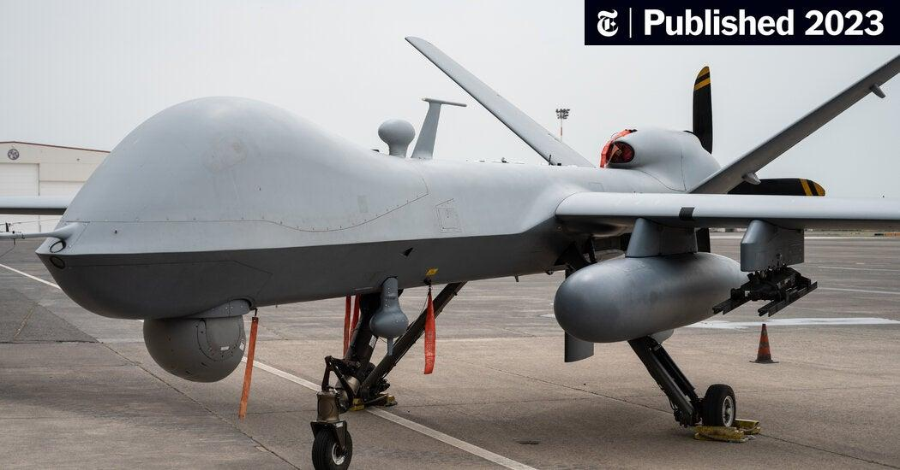

## Claim
Claim: " This image shows a US drone which was shot down in March 2025 by the Houthis using Russian missiles."

## Actions
```
reverse_search()
image_search("US drone shot down Houthis Russian missiles")
```

## Evidence
### Evidence from `reverse_search`
The image 

### Evidence from `image_search`
The New York Times published an article in 2023 about a US drone (). CNN reports on the Houthis' attacks on ships in the Red Sea (). USNI News published on December 16, 2023, showing a U.S. warship shooting down Houthi-launched drones in the Red Sea ().

The provided sources do not contain information about the image in the claim ().


## Elaboration
The evidence does not support the claim. The image search results do not provide any information about the image in the claim. The evidence mentions US drones and Houthi attacks, but it does not link them to the image in the claim.

Insufficient information is available to verify the claim.


## Actions
```
geolocate()
```

## Evidence
### Evidence from `geolocate`
The most likely countries where the image was taken are: {'Israel': 0.64, 'Palestine': 0.13, 'United Arab Emirates': 0.12, 'Jordan': 0.08, 'Tunisia': 0.01, 'Albania': 0.0, 'Andorra': 0.0, 'Argentina': 0.0, 'Australia': 0.0, 'Austria': 0.0}

## Elaboration
The geolocation analysis suggests that the image was most likely taken in Israel. This contradicts the claim that the event occurred in a location related to the Houthis. The evidence does not support the claim.


## Final Judgement
The image search and geolocation analysis do not provide any information to support the claim. The geolocation analysis suggests the image was taken in Israel, which contradicts the claim.

`false`

### Verdict: FALSE

### Justification
The image in the claim, which is purported to show a US drone shot down by the Houthis, was geolocated to Israel, contradicting the claim's context. Furthermore, image searches did not yield any results that support the claim. Therefore, the claim is false.
