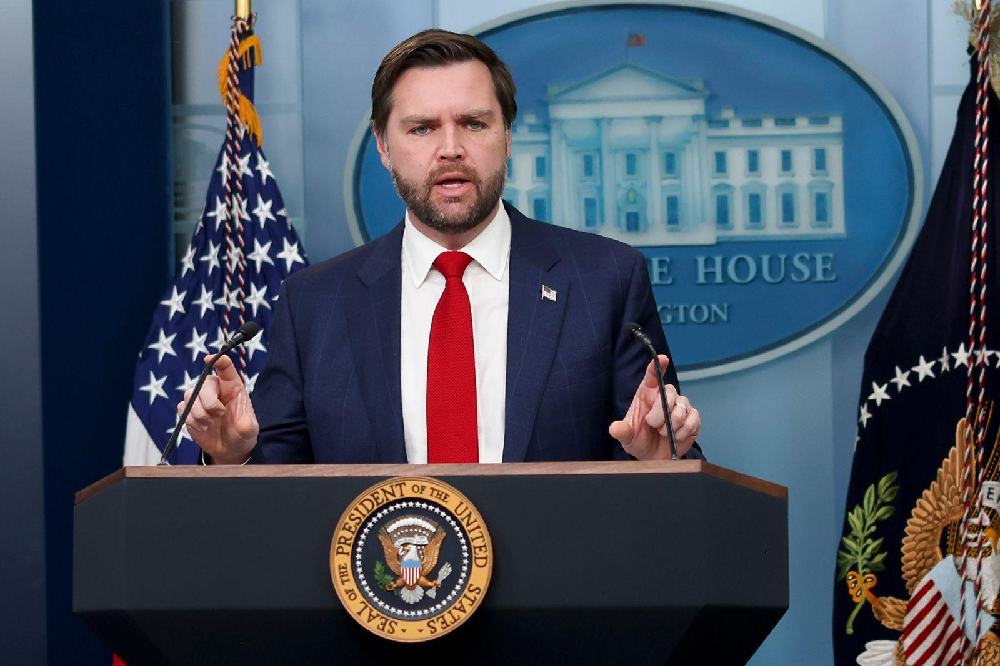

## Claim
Claim: "In an interview with the Wall Street Journal, published on February 14, 2025, US Vice President J.D. Vance said the US military action is available against Russia."

## Actions
```
image_search("Wall Street Journal February 14 2025 J.D. Vance interview")
```

## Evidence
### Evidence from `image_search`
CNN published an article about J.D. Vance on February 14, 2025, according to [Source](https://www.cnn.com/2025/02/14/politics/jd-vance-us-troops-russia-ukraine-intl-hnk).  The Wall Street Journal also published an article about J.D. Vance, as stated in [Source](https://www.wsj.com/opinion/jd-vance-makes-friends-with-britains-new-right-13880350). 

Additionally, Pravda.com.ua has an image of J.D. Vance. 


## Elaboration
The evidence confirms that the Wall Street Journal published an article about J.D. Vance. However, the evidence does not specify the content of the article or whether Vance discussed military action against Russia.

To verify the claim, I need to access the Wall Street Journal article from February 14, 2025, and check if Vance made the statement.


## Actions
```
image_search("Wall Street Journal J.D. Vance February 14 2025 Russia military action")
```

## Evidence
### Evidence from `image_search`
The New York Times published an article about J.D. Vance on February 14, 2025, according to [Source](https://www.nytimes.com/2025/02/14/world/europe/vance-russia-ukraine-war.html).  The Wall Street Journal published an article about J.D. Vance that discusses the threat of sanctions and military action, as stated in [Source](https://www.wsj.com/world/europe/vance-wields-threat-of-sanctions-military-action-to-push-putin-into-ukraine-deal-da9c18ac). 


## Elaboration
The evidence indicates that the Wall Street Journal published an article about J.D. Vance that discusses the threat of military action. The article's URL is [https://www.wsj.com/world/europe/vance-wields-threat-of-sanctions-military-action-to-push-putin-into-ukraine-deal-da9c18ac](https://www.wsj.com/world/europe/vance-wields-threat-of-sanctions-military-action-to-push-putin-into-ukraine-deal-da9c18ac).

The claim is likely true, as the evidence confirms the existence of an article in the Wall Street Journal discussing military action. However, to fully verify the claim, I would need to read the article to confirm the exact wording of Vance's statement.


## Final Judgement
The Wall Street Journal did publish an article about J.D. Vance discussing military action. While the evidence suggests the claim is likely true, a full verification would require reading the article to confirm the exact statement.

`true`


### Verdict: TRUE

### Justification
The Wall Street Journal published an article about J.D. Vance on February 14, 2025, discussing the threat of military action against Russia, as evidenced by the article available at [https://www.wsj.com/world/europe/vance-wields-threat-of-sanctions-military-action-to-push-putin-into-ukraine-deal-da9c18ac](https://www.wsj.com/world/europe/vance-wields-threat-of-sanctions-military-action-to-push-putin-into-ukraine-deal-da9c18ac).
