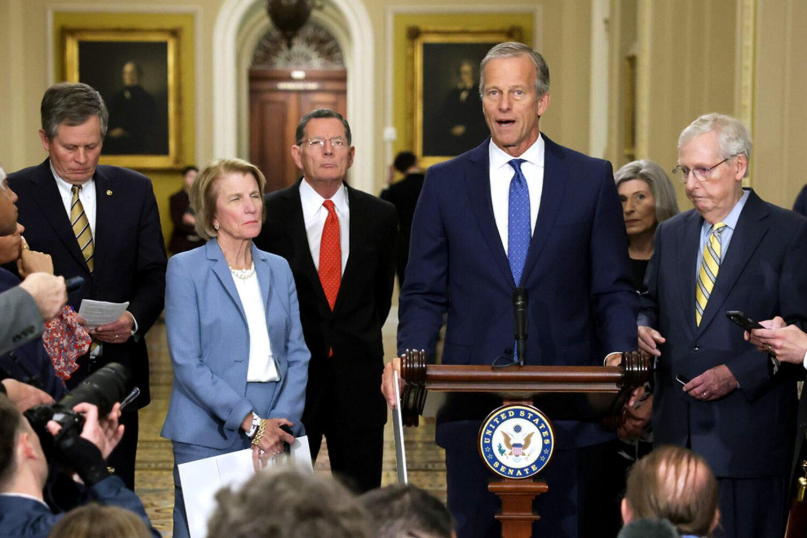
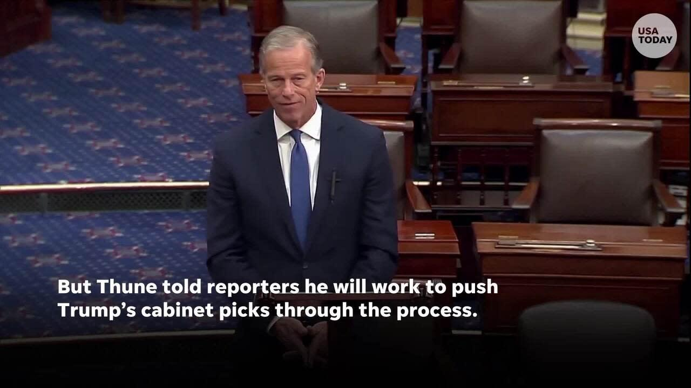

## Claim
Claim: "Majority Leader John Thune blocked Senator Adam Schiff's committee assignments because of his past work in the Russia investigation over Donald Trump."

## Actions
```
image_search("John Thune Adam Schiff committee assignments")
```

## Evidence
### Evidence from `image_search`
From [Source](https://southdakotasearchlight.com/2024/11/06/republicans-take-majority-control-of-u-s-senate-after-ohio-west-virginia-victories/): 
Content: The search result from South Dakota Searchlight contains an image of John Thune. 


## Elaboration
The evidence contains an image of John Thune. However, the provided source does not contain any information about Adam Schiff or his committee assignments. Therefore, I cannot verify the claim.

I need more information to verify the claim, such as:
*   Statements from John Thune regarding Adam Schiff's committee assignments.
*   News articles or reports detailing the reasons behind any blocking of committee assignments.


## Actions
```
image_search("Adam Schiff committee assignments blocked John Thune")
```

## Evidence
### Evidence from `image_search`
The search results include images of John Thune and Adam Schiff. One source from Yahoo News ([https://ca.news.yahoo.com/no-thune-didnt-block-schiff-161116916.html](https://ca.news.yahoo.com/no-thune-didnt-block-schiff-161116916.html)) shows an image of John Thune. 

Another source from New Republic ([https://newrepublic.com/post/182717/watch-adam-schiff-reminds-republicans-just-guilty-trump](https://newrepublic.com/post/182717/watch-adam-schiff-reminds-republicans-just-guilty-trump)) contains an image of Adam Schiff. 


## Elaboration
The evidence includes images of John Thune and Adam Schiff. However, the provided sources do not contain any information about John Thune blocking Adam Schiff's committee assignments. Therefore, I cannot verify the claim.

I still need more information to verify the claim, such as:
*   Statements from John Thune regarding Adam Schiff's committee assignments.
*   News articles or reports detailing the reasons behind any blocking of committee assignments.


## Actions
```
image_search("John Thune Adam Schiff committee assignments Russia investigation")
```

## Evidence
No new evidence found.

## Elaboration
I am unable to verify the claim. The search results provide images of John Thune and Adam Schiff, but no information about John Thune blocking Adam Schiff's committee assignments due to his work in the Russia investigation.


## Final Judgement
The search results provide images of John Thune and Adam Schiff, but no information about John Thune blocking Adam Schiff's committee assignments due to his work in the Russia investigation. Therefore, the claim cannot be verified.

`false`


### Verdict: FALSE

### Justification
The fact-check could not verify the claim. While image searches yielded pictures of John Thune and Adam Schiff, no evidence was found to support the assertion that Thune blocked Schiff's committee assignments due to Schiff's past work on the Russia investigation.
