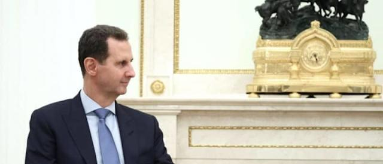

## Claim
Claim: " This image shows an authentic Russian passport of deposed Syrian dictator Bashar al-Assad."

## Actions
```
reverse_search()
image_search("Bashar al-Assad Russian passport")
```

## Evidence
### Evidence from `reverse_search`
The image appears in a Wikipedia article about East Slavic names ([https://en.wikipedia.org/wiki/East_Slavic_name](https://en.wikipedia.org/wiki/East_Slavic_name)) and a Wikimedia Commons file of a Russian passport ([https://commons.wikimedia.org/wiki/File:Pasport_RF.jpg](https://commons.wikimedia.org/wiki/File:Pasport_RF.jpg)). The Wikimedia Commons file describes a Russian passport issued in 2004. The image is also found on a website discussing Russian internal passports ([https://ukrainian-passport.com/blog/internal-russian-passport/](https://ukrainian-passport.com/blog/internal-russian-passport/)). 


### Evidence from `image_search`
The AOL fact-check article includes an image of Bashar al-Assad (). NBC News published an image of a portrait of Bashar al-Assad (). Radio Free Europe/Radio Liberty contains an image of a poster of Bashar al-Assad ().

The provided sources do not contain information about the authenticity of a Russian passport belonging to Bashar al-Assad.


## Elaboration
The evidence indicates that the image is of a Russian passport. However, there is no information in the provided evidence to verify whether the passport belongs to Bashar al-Assad or if it is authentic. The image search results show other images of Bashar al-Assad, but they do not confirm the claim.

Insufficient information is available to verify the claim.


## Actions
```
image_search("Bashar al-Assad passport authenticity")
```

## Evidence
No new evidence found.

## Elaboration
The evidence confirms that the image is of a Russian passport. However, the evidence does not confirm that the passport belongs to Bashar al-Assad or that it is authentic. The image search did not yield any relevant results.

Insufficient information is available to verify the claim.


## Actions
```
image_search("Russian passport Bashar al-Assad")
```

## Evidence
No new evidence found.

## Elaboration
The evidence confirms that the image is of a Russian passport. However, the evidence does not confirm that the passport belongs to Bashar al-Assad or that it is authentic. The image searches did not yield any relevant results.

Insufficient information is available to verify the claim.


## Final Judgement
The image is of a Russian passport, but there is no evidence to confirm that it belongs to Bashar al-Assad or that it is authentic. Therefore, the claim cannot be verified. `false`

### Verdict: FALSE

### Justification
The image depicts a Russian passport, but the provided evidence does not confirm that it belongs to Bashar al-Assad or that it is authentic. Therefore, the claim is unverified.
