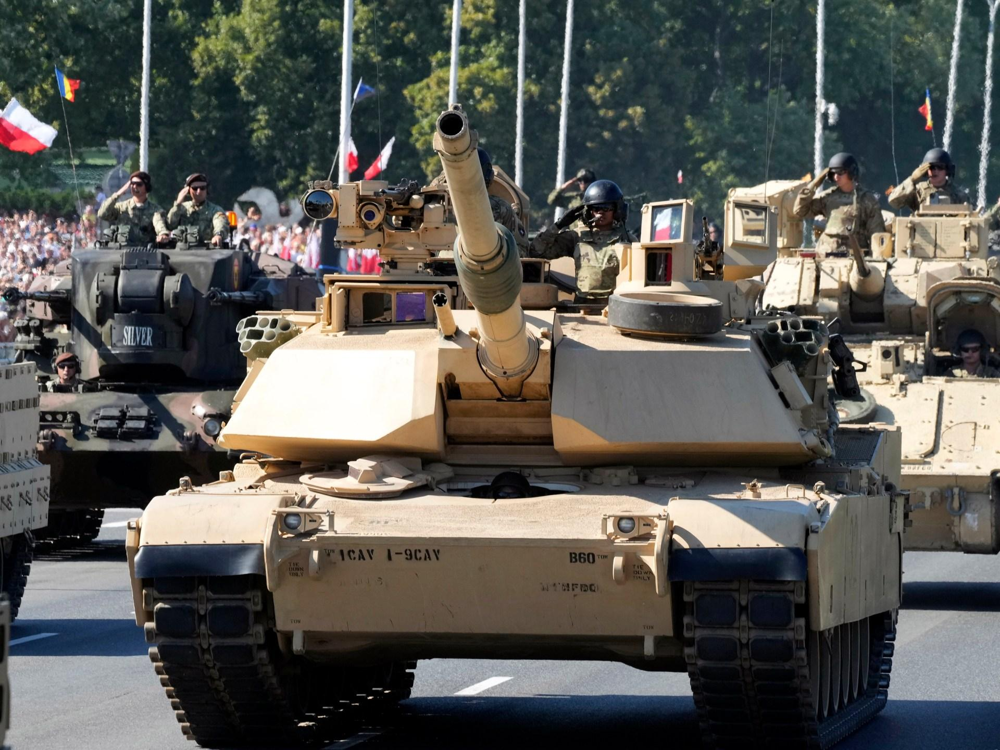

## Claim
Claim: " This image shows a military parade of Poland's army on August 14, 2024, preparing for war with Russia."

## Actions
```
reverse_search()
image_search("Poland army parade tanks")
```

## Evidence
### Evidence from `image_search`
CNN published an article about a military parade in Poland on August 15, 2023, and Al Jazeera reports that Poland held a military parade. , 

The provided sources do not mention the date August 14, 2024, or any preparation for war with Russia.


## Elaboration
The evidence confirms that Poland held a military parade. However, the provided evidence does not support the claim that the parade occurred on August 14, 2024, or that it was a preparation for war with Russia. The evidence mentions a parade on August 15, 2023.

The claim's date and the reason for the parade are not supported by the evidence.


## Final Judgement
The evidence confirms that Poland held a military parade, but the provided sources do not support the claim that the parade occurred on August 14, 2024, or that it was a preparation for war with Russia.

The claim is not factually accurate because the date and the reason for the parade are not supported by the evidence. `false`


### Verdict: FALSE

### Justification
The image depicts a military parade in Poland, which is confirmed by sources like CNN and Al Jazeera. However, the claim that the parade occurred on August 14, 2024, and was a preparation for war with Russia is not supported by the evidence.
