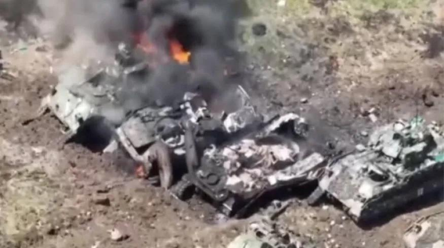

## Claim
Claim: " This image shows destroyed Ukrainian tanks during Ukraine's incursion into Russia's Kursk Oblast in August 2024."

## Actions
```
reverse_search()
image_search("destroyed Ukrainian tanks Kursk Oblast August 2024")
```

## Evidence
### Evidence from `reverse_search`
The image  appears in articles discussing destroyed tanks in the context of the Russia-Ukraine war. One article from Sputnik Africa, published on October 17, 2024, mentions Ukraine's loss of around 40 Leopard tanks since February 2022. Another article from The Moscow Times, published on June 13, 2023, states that Russia captured German Leopard tanks and U.S. Bradley infantry fighting vehicles in the Zaporizhzhia region. A Defence Security Asia article from May 19, 2024, discusses the destruction of German-made Leopard tanks in Ukraine.

The articles do not mention Ukraine's incursion into Russia's Kursk Oblast or the date August 2024.


### Evidence from `image_search`
The Center for European Policy Analysis (CEPA) published an article about the second battle of Kursk, which includes an image of a Ukrainian tank (). Al Jazeera published an article on August 16, 2024, about Russia's claims of eliminating a Ukrainian unit in Kursk, which includes an image of a tank (). NBC News published an article about the evacuation of Belgorod and Kursk, which includes an image of a tank ().

The articles can be found at the following URLs: [https://cepa.org/article/the-second-battle-of-kursk-an-omen-of-doom/](https://cepa.org/article/the-second-battle-of-kursk-an-omen-of-doom/), [https://www.aljazeera.com/news/2024/8/16/russia-says-it-eliminated-ukrainian-unit-as-kyiv-claims-advances-in-kursk](https://www.aljazeera.com/news/2024/8/16/russia-says-it-eliminated-ukrainian-unit-as-kyiv-claims-advances-in-kursk), and [https://www.nbcnews.com/news/world/russia-evacuates-belgorod-kursk-incursion-fire-nuclear-plant-rcna166172](https://www.nbcnews.com/news/world/russia-evacuates-belgorod-kursk-incursion-fire-nuclear-plant-rcna166172).


## Elaboration
The evidence suggests that the image depicts destroyed tanks and is related to the Russia-Ukraine war. However, the provided articles do not explicitly confirm the claim that the image shows destroyed Ukrainian tanks during Ukraine's incursion into Russia's Kursk Oblast in August 2024. The reverse image search results mention destroyed tanks but do not specify the location or date. The image search results mention the Kursk region and the date August 2024, but the provided images do not match the original image.

Therefore, the claim cannot be verified based on the available evidence. Additional information is needed to confirm the specific context of the image, including the location and the date.


## Actions
```
image_search("destroyed tanks Ukraine Russia war")
```

## Evidence
### Evidence from `image_search`
CNN published an article about destroyed tanks in the Russia-Ukraine war (). Reuters published an image of destroyed Russian military vehicles (). The New York Times published an article about the Russia-Ukraine war, which includes an image of a destroyed tank (), published on February 16, 2023. The URLs are: [https://www.cnn.com/2022/04/27/europe/russia-tanks-blown-turrets-intl-hnk-ml](https://www.cnn.com/2022/04/27/europe/russia-tanks-blown-turrets-intl-hnk-ml), [https://www.reuters.com/news/picture/destroyed-russian-military-vehicles-stre-idUSRTS6EQ4P](https://www.reuters.com/news/picture/destroyed-russian-military-vehicles-stre-idUSRTS6EQ4P), and [https://www.nytimes.com/2023/02/16/world/europe/russia-tanks-ukraine-war.html](https://www.nytimes.com/2023/02/16/world/europe/russia-tanks-ukraine-war.html).


## Elaboration
The additional evidence confirms that images of destroyed tanks are associated with the Russia-Ukraine war. However, none of the provided sources specifically mention the Kursk Oblast, August 2024, or Ukrainian incursions. Therefore, the claim remains unverified due to a lack of specific supporting evidence.


## Actions
```
image_search("destroyed tanks Kursk Oblast August 2024")
```

## Evidence
No new evidence found.

## Elaboration
The claim remains unverified. While the image search results confirm the existence of destroyed tanks in the context of the Russia-Ukraine war, no evidence directly supports the claim that the image depicts destroyed Ukrainian tanks during an incursion into Russia's Kursk Oblast in August 2024. The search results did not yield any matching images or articles that confirm the specific details of the claim.


## Final Judgement
The image shows destroyed tanks, and the search results confirm that destroyed tanks are associated with the Russia-Ukraine war. However, there is no evidence to support the claim that the image depicts destroyed Ukrainian tanks during an incursion into Russia's Kursk Oblast in August 2024. The search results did not yield any matching images or articles that confirm the specific details of the claim.

`false`

### Verdict: FALSE

### Justification
The claim is unverified. While the image depicts destroyed tanks and is related to the Russia-Ukraine war, there is no evidence to support the specific details of the claim, including the location (Kursk Oblast) and the date (August 2024). The search results did not yield any matching images or articles that confirm the claim.
