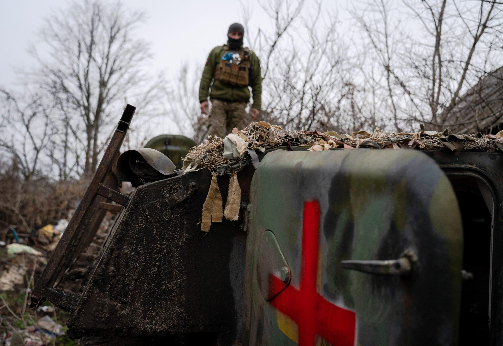
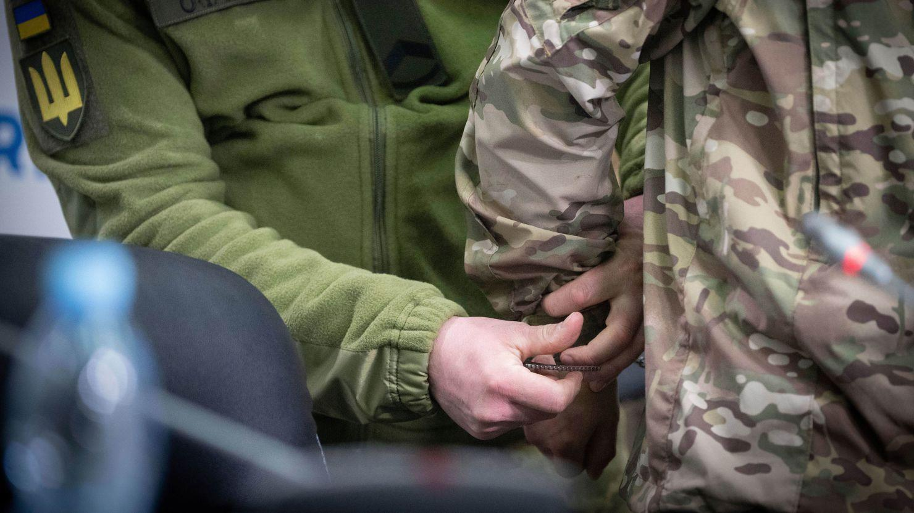

## Claim
Claim: " This image shows the Chinese Communist Party's Red Cross troops in Russia who have changed into winter clothes and set off for the Russian-Ukrainian front to aid Russia in rescuing its occupied territories."

## Actions
```
reverse_search()
image_search("Chinese Red Cross troops Russia Ukraine")
```

## Evidence
### Evidence from `image_search`
The Center for European Policy Analysis (CEPA) published an article about the Red Cross, including an image of a military vehicle with a Red Cross symbol (). The USNI News website published an image of Chinese troops (). CNN published an article on April 16, 2025, about Chinese nationals in Ukraine ().

The provided sources do not contain information about the claim.


## Elaboration
The evidence does not support the claim. The image search results do not contain information about Chinese Red Cross troops aiding Russia in rescuing occupied territories. The search results include images of a military vehicle with a Red Cross symbol, Chinese troops, and Chinese nationals in Ukraine.


## Final Judgement
The image search results do not contain information about the claim. The search results include images of a military vehicle with a Red Cross symbol, Chinese troops, and Chinese nationals in Ukraine.

The claim is not supported by the evidence. Therefore, the claim is considered false. `false`


### Verdict: FALSE

### Justification
The claim is unsupported by the evidence. Image searches revealed images of a military vehicle with a Red Cross symbol, Chinese troops, and Chinese nationals in Ukraine, but no information about Chinese Red Cross troops aiding Russia in rescuing occupied territories.
