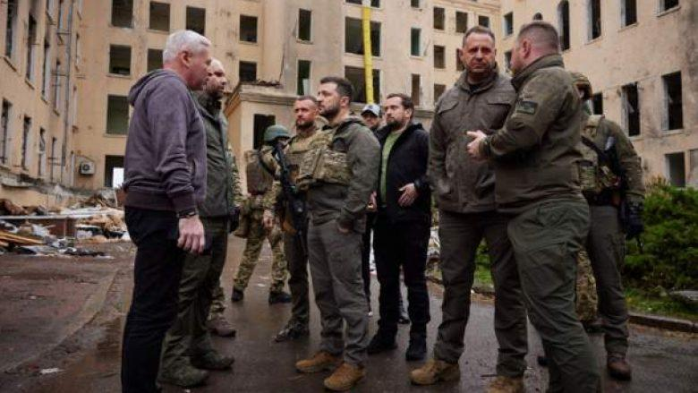
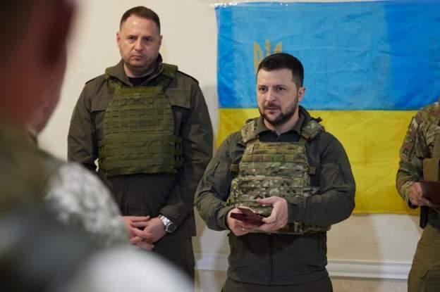
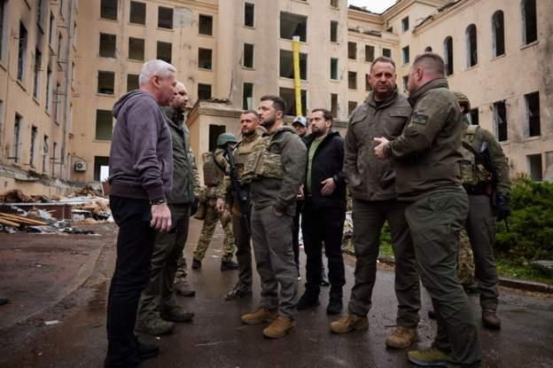
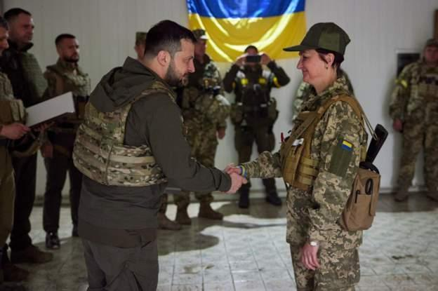

## Claim
Claim: " This image shows Ukrainian President Volodymyr Zelensky arriving in August 2024 in the Sudzha of Kursk region, Russia, which had just been occupied by Ukrainian troops in the Kursk Offensive, and meeting with representatives of the people there."

## Actions
```
reverse_search()
```

## Evidence
### Evidence from `reverse_search`
The image () appears in articles about Volodymyr Zelensky's visit to the front lines in the Kharkiv region. The BBC article ([https://www.bbc.com/news/live/world-europe-61612803](https://www.bbc.com/news/live/world-europe-61612803)) and the Telegrafi.com article ([https://telegrafi.com/en/zelensky-on-a-rare-trip-outside-kiev-visited-the-front-line-where-he-met-ukrainian-troops/](https://telegrafi.com/en/zelensky-on-a-rare-trip-outside-kiev-visited-the-front-line-where-he-met-ukrainian-troops/)) both feature the image. The Telegrafi.com article also includes other images of Zelensky (, , , , ).

The image was also found on a website ([https://global.solarpriceza.com/merchant/zelensky-on-the-front-line-02eb5d0-19-29474101-2-21/](https://global.solarpriceza.com/merchant/zelensky-on-the-front-line-02eb5d0-19-29474101-2-21/)), but the content is not available.


## Elaboration
The claim that the image shows Zelensky in the Sudzha of Kursk region, Russia, in August 2024 is not supported by the evidence. The evidence indicates that the image is from Zelensky's visit to the front lines in the Kharkiv region. The BBC and Telegrafi.com articles ([https://www.bbc.com/news/live/world-europe-61612803](https://www.bbc.com/news/live/world-europe-61612803), [https://telegrafi.com/en/zelensky-on-a-rare-trip-outside-kiev-visited-the-front-line-where-he-met-ukrainian-troops/](https://telegrafi.com/en/zelensky-on-a-rare-trip-outside-kiev-visited-the-front-line-where-he-met-ukrainian-troops/)) confirm this.

The claim also mentions the Kursk Offensive, which is not mentioned in the provided evidence. The date of the image is not specified in the evidence, but the articles suggest it was taken during the ongoing conflict.

Therefore, the claim is inaccurate because it misidentifies the location and the context of the image.


## Final Judgement
The image shows Volodymyr Zelensky in the Kharkiv region, not the Sudzha of Kursk region, Russia. The claim also incorrectly states the date and the context of the image.

The claim is demonstrably false because the location and context of the image are misrepresented. `false`

### Verdict: FALSE

### Justification
The image depicts Ukrainian President Volodymyr Zelensky's visit to the front lines in the Kharkiv region, as evidenced by the BBC ([https://www.bbc.com/news/live/world-europe-61612803](https://www.bbc.com/news/live/world-europe-61612803)) and Telegrafi.com articles ([https://telegrafi.com/en/zelensky-on-a-rare-trip-outside-kiev-visited-the-front-line-where-he-met-ukrainian-troops/](https://telegrafi.com/en/zelensky-on-a-rare-trip-outside-kiev-visited-the-front-line-where-he-met-ukrainian-troops/)), not in the Sudzha of Kursk region, Russia, as the claim states.
