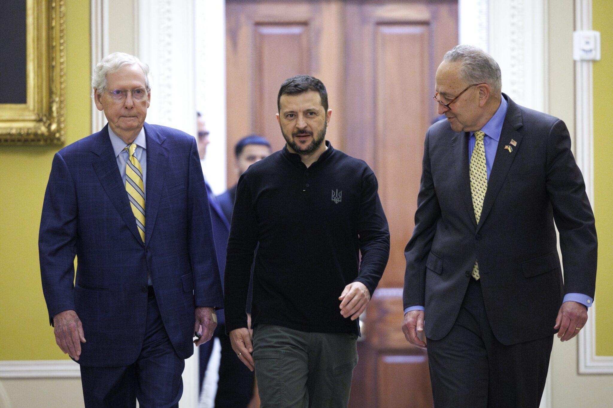
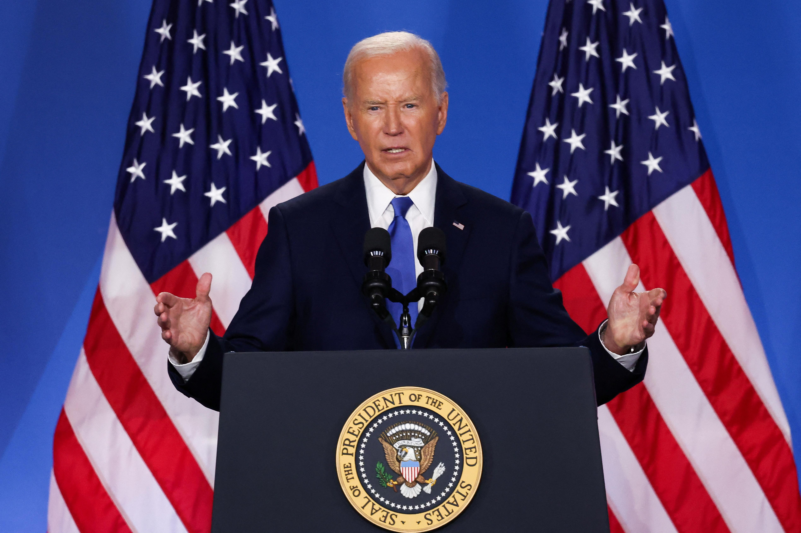
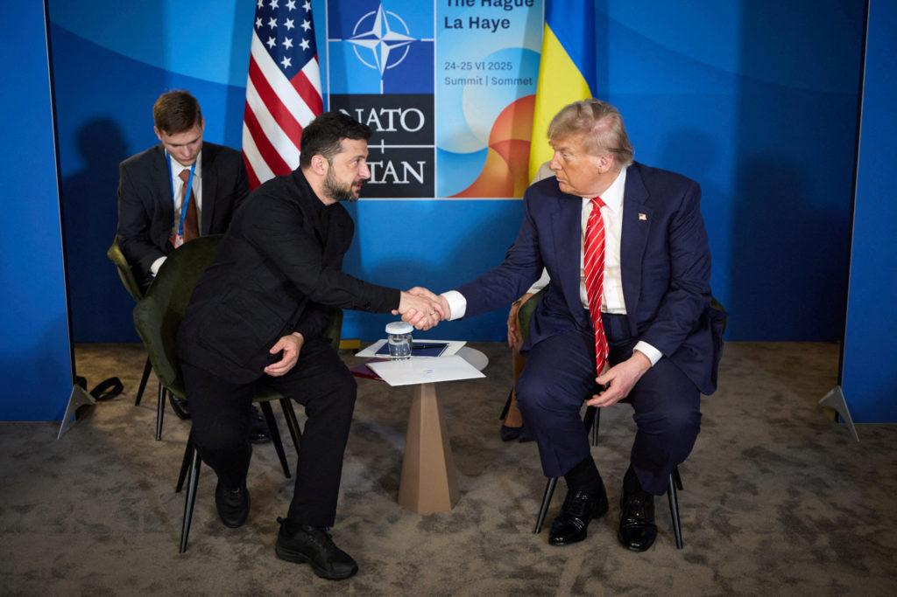
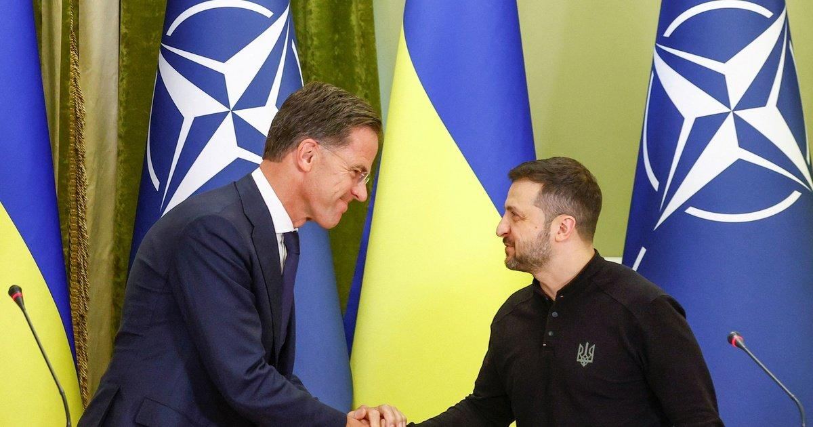
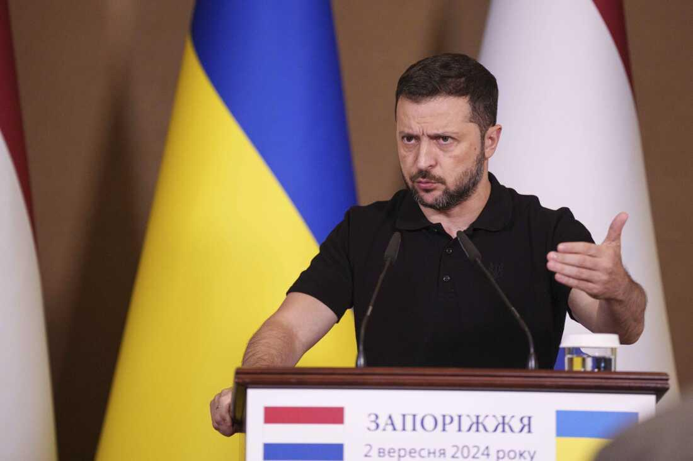

## Claim
Claim: "In a press conference on December 9, 2024 Ukrainian President Volodymyr Zelenskyy said: 'I will ask Biden to invite me to NATO ... there's no point in talking to Trump.'"

## Actions
```
image_search("Zelenskyy Biden NATO Trump December 9 2024 press conference")
```

## Evidence
### Evidence from `image_search`
The search results include an article from scdailygazette.com, published on September 27, 2024, featuring an image of Volodymyr Zelenskyy () and an article from Al Jazeera with an image of President Biden at a press conference (). Another source from breakingdefense.com was also found, but it has no content.

*   [Source](https://scdailygazette.com/2024/09/27/zelenskyy-in-washington-meets-with-u-s-leaders-to-beef-up-support-for-ukraine/)
*   [Source](https://www.aljazeera.com/news/2024/7/12/key-takeaways-from-president-bidens-big-boy-nato-news-conference)
*   [Source](https://breakingdefense.com/2024/07/zelenskyy-implores-us-to-continue-aid-for-ukraine-amid-election-uncertainty/)


## Elaboration
The evidence provides images of Zelenskyy and Biden, and mentions press conferences. However, the provided sources do not contain the specific quote attributed to Zelenskyy in the Claim. The scdailygazette.com article is from September 27, 2024, and the Al Jazeera article is from July 12, 2024, which are both before the December 9, 2024 date mentioned in the Claim.

The search results do not provide any information to verify the Claim.

To verify the Claim, I would need to find a transcript or recording of a press conference held by Zelenskyy on December 9, 2024, or a reliable news report quoting him.


## Actions
```
image_search("Zelenskyy press conference December 9 2024 NATO Trump")
```

## Evidence
### Evidence from `image_search`
The search results include an article from pbs.org that features an image of Zelenskyy and Trump shaking hands at a NATO summit and discusses a meeting between them ([https://www.pbs.org/newshour/world/trump-meets-with-zelenskyy-at-nato-summit-says-ukraine-war-is-a-mess-for-putin](https://www.pbs.org/newshour/world/trump-meets-with-zelenskyy-at-nato-summit-says-ukraine-war-is-a-mess-for-putin)). 

Another source from cfr.org includes an image of Volodymyr Zelenskyy ([https://www.cfr.org/report/ukraine-nato-and-war-termination](https://www.cfr.org/report/ukraine-nato-and-war-termination)). 


## Elaboration
The new evidence includes an article from pbs.org that shows Zelenskyy and Trump at a NATO summit. However, the article does not contain the quote from the Claim. The search results still do not provide any information to verify the Claim.

To verify the Claim, I would need to find a transcript or recording of a press conference held by Zelenskyy on December 9, 2024, or a reliable news report quoting him.


## Actions
```
image_search("Zelenskyy December 9 2024 press conference transcript")
```

## Evidence
### Evidence from `image_search`
The search results include a transcript of an interview with Zelenskyy from nbcnews.com and an image of Zelenskyy at a press conference on September 2, 2024, from npr.org (). The abcnews.go.com source has no content. None of the sources contain the quote from the Claim.


## Elaboration
The evidence does not support the Claim. The search results did not yield any transcripts or reports of a press conference on December 9, 2024, where Zelenskyy made the statement in the Claim.


## Final Judgement
The fact-check involved searching for evidence of a press conference on December 9, 2024, where Zelenskyy made the statement. The search results provided images and articles related to Zelenskyy, Biden, Trump, and NATO, but none of them contained the specific quote from the Claim. The search also included attempts to find a transcript of a press conference on the specified date, but without success.

The claim is not supported by the evidence. There is no evidence to verify the claim. `false`

### Verdict: FALSE

### Justification
The claim that Volodymyr Zelenskyy made the specified statement in a press conference on December 9, 2024, cannot be verified. Multiple searches for relevant press conferences, transcripts, and news reports did not yield any evidence supporting the claim.
