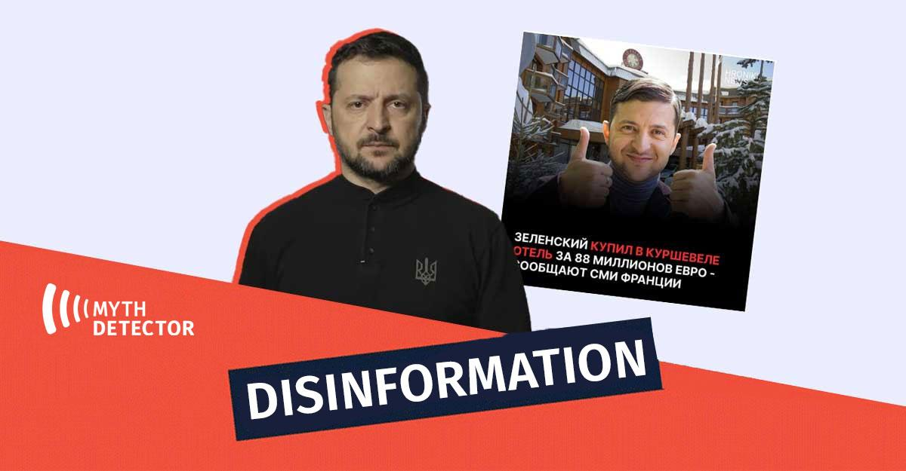

## Claim
Claim: "Ukrainian President Volodymyr Zelenskyy purchased an 88 million euro hotel in the Courchevel ski resort in France."

## Actions
```
image_search("Volodymyr Zelenskyy Courchevel hotel")
```

## Evidence
### Evidence from `image_search`
The claim that Volodymyr Zelenskyy purchased an 88 million euro hotel in the Courchevel ski resort in France is false, according to a fact check from DW.com ([https://www.dw.com/en/fact-check-no-zelenskyy-didnt-buy-a-luxury-hotel-in-france/a-70959821](https://www.dw.com/en/fact-check-no-zelenskyy-didnt-buy-a-luxury-hotel-in-france/a-70959821)). Myth Detector also labels the claim as disinformation .

ABC News Australia published an article about the Courchevel ski resort ([https://www.abc.net.au/news/2022-04-10/courchevel-french-ski-resort-is-emptying-of-russian-oligarchs/100939856](https://www.abc.net.au/news/2022-04-10/courchevel-french-ski-resort-is-emptying-of-russian-oligarchs/100939856)) .


## Elaboration
The evidence indicates the claim is false. A fact check from DW.com explicitly states that Zelenskyy did not purchase the hotel ([https://www.dw.com/en/fact-check-no-zelenskyy-didnt-buy-a-luxury-hotel-in-france/a-70959821](https://www.dw.com/en/fact-check-no-zelenskyy-didnt-buy-a-luxury-hotel-in-france/a-70959821)). Additionally, Myth Detector labels the claim as disinformation.


## Final Judgement
The claim that Volodymyr Zelenskyy purchased an 88 million euro hotel in Courchevel is false. Multiple sources, including a fact-check from DW.com and Myth Detector, confirm that this claim is disinformation.

`false`


### Verdict: FALSE

### Justification
The claim is false. A fact-check from DW.com ([https://www.dw.com/en/fact-check-no-zelenskyy-didnt-buy-a-luxury-hotel-in-france/a-70959821](https://www.dw.com/en/fact-check-no-zelenskyy-didnt-buy-a-luxury-hotel-in-france/a-70959821)) explicitly states that Zelenskyy did not purchase the hotel, and Myth Detector labels the claim as disinformation.
