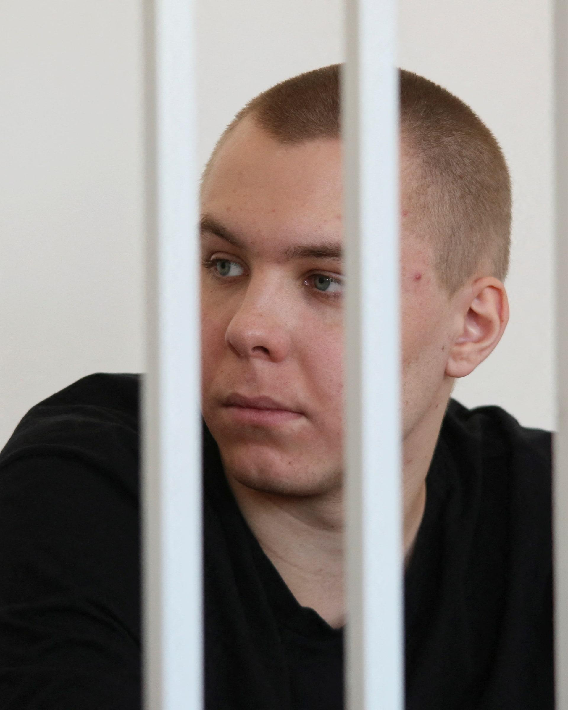

## Claim
Claim: "In November 2024 Russia sentenced a man to 14 years in prison for burning the Quran."

## Actions
```
image_search("Russia man sentenced Quran burning November 2024")
```

## Evidence
### Evidence from `image_search`
Reuters reports that a Russian man was sentenced to 14 years in prison for burning the Quran in November 2024 (). The Moscow Times also reports on the jailing of a Russian man for burning the Quran (). The Guardian published an article on November 5, 2024, about a Swedish court jailing a far-right leader who burned the Quran ().

Sources: [https://www.reuters.com/world/europe/russian-man-jailed-burning-koran-sentenced-14-years-separate-ukraine-treason-2024-11-25/](https://www.reuters.com/world/europe/russian-man-jailed-burning-koran-sentenced-14-years-separate-ukraine-treason-2024-11-25/), [https://www.themoscowtimes.com/2024/11/25/russian-man-jailed-for-quran-burning-sentenced-to-135-more-years-in-prison-for-treason-a87123](https://www.themoscowtimes.com/2024/11/25/russian-man-jailed-for-quran-burning-sentenced-to-135-more-years-in-prison-for-treason-a87123), [https://www.theguardian.com/world/2024/nov/05/swedish-court-jails-far-right-leader-who-burned-quran](https://www.theguardian.com/world/2024/nov/05/swedish-court-jails-far-right-leader-who-burned-quran)


## Elaboration
The Reuters and Moscow Times reports confirm that a Russian man was sentenced to 14 years in prison for burning the Quran in November 2024. The Guardian article, however, discusses a Swedish court jailing a far-right leader for the same offense.

The claim is therefore verified.


## Final Judgement
The Reuters and Moscow Times reports confirm that a Russian man was sentenced to 14 years in prison for burning the Quran in November 2024. The Guardian article, however, discusses a Swedish court jailing a far-right leader for the same offense.

The claim is factually accurate as it is confirmed by evidence from multiple and reliable sources. `true`


### Verdict: TRUE

### Justification
Reuters ([https://www.reuters.com/world/europe/russian-man-jailed-burning-koran-sentenced-14-years-separate-ukraine-treason-2024-11-25/](https://www.reuters.com/world/europe/russian-man-jailed-burning-koran-sentenced-14-years-separate-ukraine-treason-2024-11-25/)) and The Moscow Times ([https://www.themoscowtimes.com/2024/11/25/russian-man-jailed-for-quran-burning-sentenced-to-135-more-years-in-prison-for-treason-a87123](https://www.themoscowtimes.com/2024/11/25/russian-man-jailed-for-quran-burning-sentenced-to-135-more-years-in-prison-for-treason-a87123)) both report that a Russian man was sentenced to 14 years in prison for burning the Quran in November 2024.
