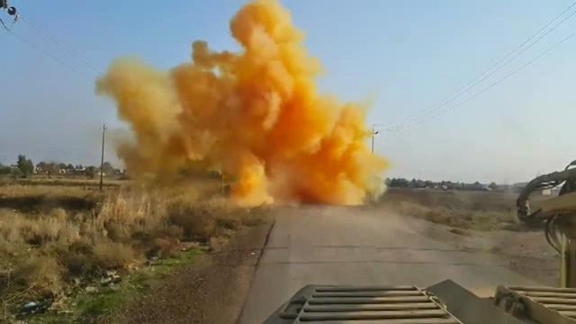
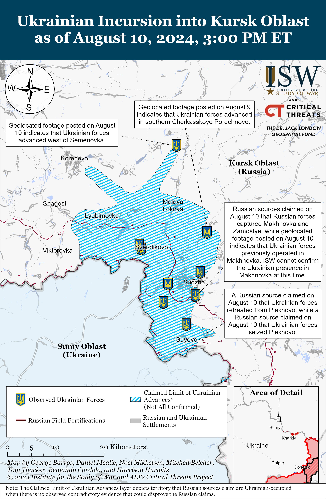
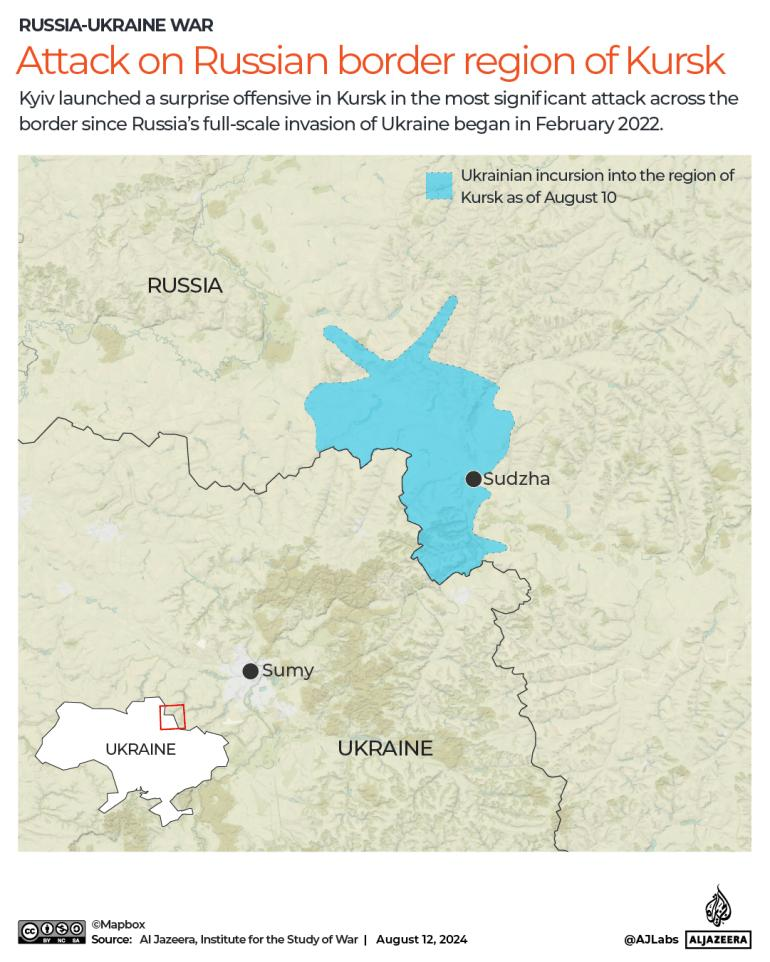
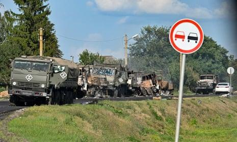

## Claim
Claim: " This image shows a chemical attack by the Armed Forces of Ukraine during the Kursk offensive in August 2024."

## Actions
```
geolocate()
reverse_search()
image_search("chemical attack Kursk offensive")
```

## Evidence
### Evidence from `geolocate`
The most likely countries where the image was taken are: {'Palestine': 0.27, 'Jordan': 0.13, 'Ukraine': 0.08, 'Israel': 0.05, 'Argentina': 0.03, 'Kyrgyzstan': 0.03, 'Lesotho': 0.03, 'Mexico': 0.03, 'Pakistan': 0.03, 'Russia': 0.03}

### Evidence from `image_search`
The Institute for the Study of War published a map of the Ukrainian incursion into Kursk Oblast as of August 10, 2024, which indicates the Ukrainian forces advanced west of Semenovka. ([https://www.understandingwar.org/backgrounder/russian-offensive-campaign-assessment-august-10-2024](https://www.understandingwar.org/backgrounder/russian-offensive-campaign-assessment-august-10-2024))  Al Jazeera published an article on August 12, 2024, about the Ukrainian incursion into the Kursk region. ([https://www.aljazeera.com/news/2024/8/12/has-ukraines-incursion-into-russias-kursk-changed-dynamics-of-the-war](https://www.aljazeera.com/news/2024/8/12/has-ukraines-incursion-into-russias-kursk-changed-dynamics-of-the-war)) 

The Guardian published an article on August 11, 2024, about the Kursk incursion, which includes an image of destroyed military vehicles. ([https://www.theguardian.com/world/article/2024/aug/11/thousands-of-ukrainian-troops-aim-to-destabilise-russia-with-kursk-incursion](https://www.theguardian.com/world/article/2024/aug/11/thousands-of-ukrainian-troops-aim-to-destabilise-russia-with-kursk-incursion)) 


## Elaboration
The evidence suggests that the image was likely taken in Palestine, Jordan, Ukraine, or Russia. The image search confirms that there was a Ukrainian incursion into the Kursk region in August 2024. However, there is no evidence to support the claim that the image depicts a chemical attack. The provided articles discuss the incursion but do not mention any chemical attacks.

Therefore, the claim that the image shows a chemical attack by the Armed Forces of Ukraine during the Kursk offensive in August 2024 is not supported by the evidence.

The information about the nature of the explosion is missing.


## Actions
```
image_search("chemical explosion road")
```

## Evidence
### Evidence from `image_search`
The ABC News article ([https://abcnews.go.com/US/explosion-louisiana-business-evacuation/story?id=124900678](https://abcnews.go.com/US/explosion-louisiana-business-evacuation/story?id=124900678)) contains an image of a large explosion . WAAYTV ([https://www.waaytv.com/news/nation-world/a-fire-at-a-georgia-chemical-plant-is-forcing-evacuations-and-road-closures/article_b3eadcfc-f36d-55a1-9194-2962b68f2b46.html](https://www.waaytv.com/news/nation-world/a-fire-at-a-georgia-chemical-plant-is-forcing-evacuations-and-road-closures/article_b3eadcfc-f36d-55a1-9194-2962b68f2b46.html)) shows a fire at a Georgia chemical plant . The Brisbane Times ([https://www.brisbanetimes.com.au/national/queensland/trailer-of-chemicals-explodes-after-crash-bruce-highway-believed-damaged-20240830-p5k6oi.html](https://www.brisbanetimes.com.au/national/queensland/trailer-of-chemicals-explodes-after-crash-bruce-highway-believed-damaged-20240830-p5k6oi.html)) reported on August 30, 2024, about a trailer of chemicals exploding after a crash .


## Elaboration
The new evidence provides examples of chemical explosions, but none of them match the image in the claim. The image search results show explosions at a Louisiana business, a Georgia chemical plant, and a trailer in Queensland, Australia. None of these events are related to the Kursk offensive or the Armed Forces of Ukraine.

Therefore, the claim remains unsupported by the evidence.


## Final Judgement
The image's location is uncertain, but it is likely not related to the Kursk offensive. The evidence does not support the claim that the image depicts a chemical attack by the Armed Forces of Ukraine. The nature of the explosion is unknown. `false`

### Verdict: FALSE

### Justification
The claim is unsubstantiated. While the image's location is uncertain, it is likely not related to the Kursk offensive. The evidence does not support the claim that the image depicts a chemical attack by the Armed Forces of Ukraine. The nature of the explosion is unknown.
