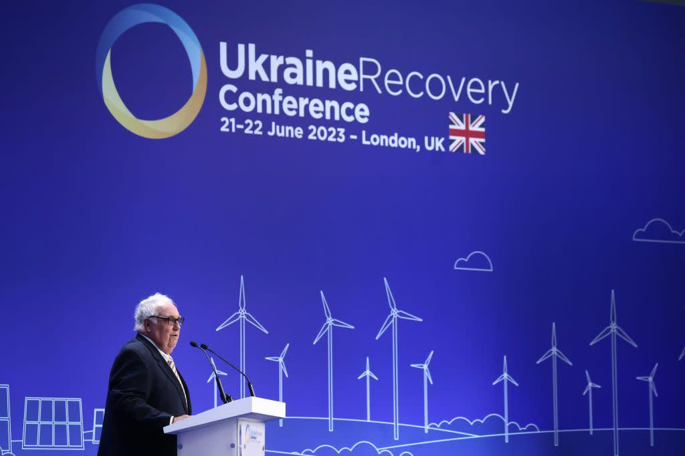
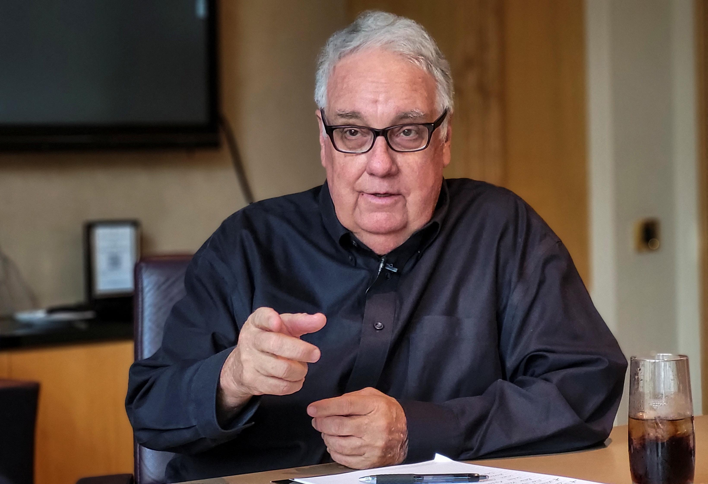

## Claim
Claim: "Warren Buffett has given more than $500 million to Ukraine since 2022."

## Actions
```
image_search("Warren Buffett Ukraine donations")
```

## Evidence
### Evidence from `image_search`
The search results include an image of Howard Buffett with Volodymyr Zelenskyy from [Business Insider](https://www.businessinsider.com/howard-buffett-gives-500-million-to-ukraine) . Another source from [Philanthropy News Digest](https://philanthropynewsdigest.org/news/other-sources/article/?id=14667666&title=US-philanthropist-pledges-$300-million-for-Ukraine-in-2024) mentions a US philanthropist pledging $300 million for Ukraine in 2024 .


## Elaboration
The evidence suggests that Howard Buffett, not Warren Buffett, has been involved in donating to Ukraine. The Business Insider article shows Howard Buffett with Volodymyr Zelenskyy, and the Philanthropy News Digest mentions a $300 million pledge by a US philanthropist.

The evidence does not provide information about Warren Buffett's donations to Ukraine. Therefore, the claim cannot be verified.

To verify the claim, information about Warren Buffett's donations to Ukraine since 2022 is needed.


## Actions
```
image_search("Warren Buffett Ukraine donations 2022")
```

## Evidence
### Evidence from `image_search`
From [Source](https://www.reuters.com/world/europe/us-philanthropist-buffett-warns-against-ukraine-fatigue-2023-09-20/): 
Content: Reuters reports on Howard Buffett's warnings against Ukraine fatigue. 


## Elaboration
The new evidence continues to focus on Howard Buffett's involvement with Ukraine, specifically mentioning his warnings against "Ukraine fatigue" in a Reuters report.

The evidence still does not provide any information about Warren Buffett's donations to Ukraine.

The claim remains unverified due to the lack of evidence regarding Warren Buffett's financial contributions to Ukraine.


## Actions
```
image_search("Warren Buffett charity donations Ukraine")
```

## Evidence
### Evidence from `image_search`
From [Source](https://www.victoryharvest.com.ua/en/news/velikij-drug-ukrayini-govard-baffet-nadaye-500-miljoniv-gumanitarnoyi-dopomogi): 
Content: The search result from victoryharvest.com.ua shows an image of Howard Buffett with Volodymyr Zelenskyy. 


## Elaboration
The evidence consistently points to Howard Buffett's involvement in donating to Ukraine. The images and articles repeatedly feature Howard Buffett and his philanthropic efforts.

There is no evidence in any of the search results to support the claim that Warren Buffett has donated to Ukraine.

The claim is unverified.


## Final Judgement
The fact-check reveals that the evidence consistently points to Howard Buffett's donations to Ukraine, not Warren Buffett. Multiple search results and articles confirm Howard Buffett's involvement, including images of him with Volodymyr Zelenskyy. There is no evidence found to support the claim that Warren Buffett has donated more than $500 million to Ukraine since 2022.

The claim is not supported by the evidence, as all the evidence points to Howard Buffett's donations, not Warren Buffett's. `false`


### Verdict: FALSE

### Justification
The fact-check reveals that the evidence consistently points to Howard Buffett's donations to Ukraine, not Warren Buffett. Multiple sources, including [Business Insider](https://www.businessinsider.com/howard-buffett-gives-500-million-to-ukraine) and [Reuters](https://www.reuters.com/world/europe/us-philanthropist-buffett-warns-against-ukraine-fatigue-2023-09-20/), confirm Howard Buffett's involvement. There is no evidence to support the claim that Warren Buffett has donated more than $500 million to Ukraine since 2022.
