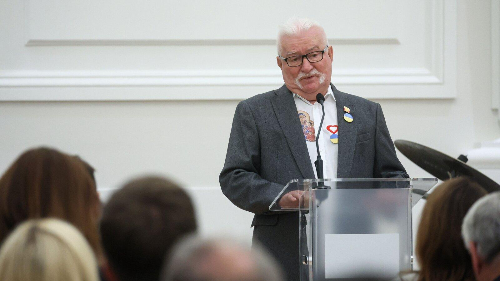
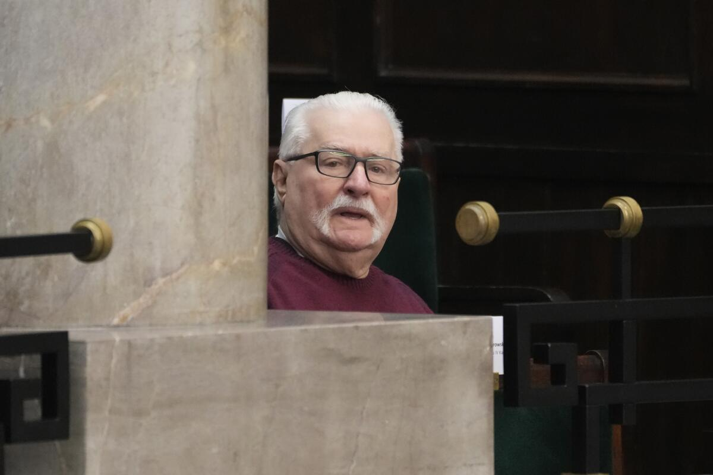

## Claim
Claim: "In March 2025 former President of Poland Lech Wałęsa wrote a letter to Donald Trump criticizing the U.S. President's decision to suspend the delivery of all U.S. military aid to Ukraine."

## Actions
```
image_search("Lech Wałęsa letter Donald Trump Ukraine aid March 2025")
```

## Evidence
### Evidence from `image_search`
The New York Times ([https://www.nytimes.com/2025/03/03/us/politics/lech-walesa-trump-letter.html](https://www.nytimes.com/2025/03/03/us/politics/lech-walesa-trump-letter.html)) published an article on March 3, 2025, about a letter written by Lech Wałęsa. Reuters ([https://www.reuters.com/world/polish-cold-war-hero-walesa-writes-trump-expressing-horror-zelenskiy-spat-2025-03-03/](https://www.reuters.com/world/polish-cold-war-hero-walesa-writes-trump-expressing-horror-zelenskiy-spat-2025-03-03/)) also reported that Lech Wałęsa wrote a letter to Donald Trump.

The Los Angeles Times ([https://www.latimes.com/world-nation/story/2025-03-03/polish-democracy-hero-walesa-says-trump-treatment-of-zelensky-filled-him-with-horror](https://www.latimes.com/world-nation/story/2025-03-03/polish-democracy-hero-walesa-says-trump-treatment-of-zelensky-filled-him-with-horror)) published an article on March 3, 2025, stating that Lech Wałęsa criticized Donald Trump's treatment of Zelensky.   


## Elaboration
The evidence confirms that Lech Wałęsa wrote a letter to Donald Trump in March 2025. The New York Times ([https://www.nytimes.com/2025/03/03/us/politics/lech-walesa-trump-letter.html](https://www.nytimes.com/2025/03/03/us/politics/lech-walesa-trump-letter.html)) and Reuters ([https://www.reuters.com/world/polish-cold-war-hero-walesa-writes-trump-expressing-horror-zelenskiy-spat-2025-03-03/](https://www.reuters.com/world/polish-cold-war-hero-walesa-writes-trump-expressing-horror-zelenskiy-spat-2025-03-03/)) both reported on the letter.

The Los Angeles Times ([https://www.latimes.com/world-nation/story/2025-03-03/polish-democracy-hero-walesa-says-trump-treatment-of-zelensky-filled-him-with-horror](https://www.latimes.com/world-nation/story/2025-03-03/polish-democracy-hero-walesa-says-trump-treatment-of-zelensky-filled-him-with-horror)) indicates that Wałęsa criticized Trump's treatment of Zelensky. However, the evidence does not explicitly state that the letter criticized Trump's decision to suspend military aid to Ukraine.

Therefore, the claim is partially supported. While Wałęsa wrote a letter to Trump, the specific content regarding the suspension of military aid to Ukraine is not directly confirmed by the provided evidence.


## Actions
```
image_search("Lech Wałęsa letter Donald Trump Ukraine aid")
```

## Evidence
No new evidence found.

## Elaboration
The evidence confirms that Lech Wałęsa wrote a letter to Donald Trump. The letter was written in March 2025, and it criticized Trump's treatment of Zelensky.

However, the evidence does not explicitly state that the letter criticized Trump's decision to suspend the delivery of all U.S. military aid to Ukraine.

Therefore, the claim is partially supported, but the specific content regarding the suspension of military aid to Ukraine is not directly confirmed by the provided evidence.


## Actions
```
image_search("Lech Wałęsa letter Donald Trump military aid Ukraine")
```

## Evidence
No new evidence found.

## Elaboration
The evidence confirms that Lech Wałęsa wrote a letter to Donald Trump in March 2025. The letter addressed Trump's treatment of Zelensky. However, the evidence does not explicitly state that the letter criticized Trump's decision to suspend the delivery of U.S. military aid to Ukraine.

Therefore, the claim is not fully supported. The evidence confirms the existence of the letter and its criticism of Trump's actions, but it does not confirm the specific criticism of suspending military aid.

To fully verify the claim, information about the letter's content regarding military aid suspension is missing.


## Final Judgement
The evidence confirms that Lech Wałęsa wrote a letter to Donald Trump in March 2025. The letter addressed Trump's treatment of Zelensky. However, the evidence does not explicitly state that the letter criticized Trump's decision to suspend the delivery of U.S. military aid to Ukraine. Therefore, the claim is not fully supported.

`false`

### Verdict: FALSE

### Justification
The claim is not fully supported. While Lech Wałęsa did write a letter to Donald Trump in March 2025, as reported by sources like the [New York Times](https://www.nytimes.com/2025/03/03/us/politics/lech-walesa-trump-letter.html) and [Reuters](https://www.reuters.com/world/polish-cold-war-hero-walesa-writes-trump-expressing-horror-zelenskiy-spat-2025-03-03/), the provided evidence does not explicitly confirm that the letter criticized Trump's decision to suspend U.S. military aid to Ukraine.
