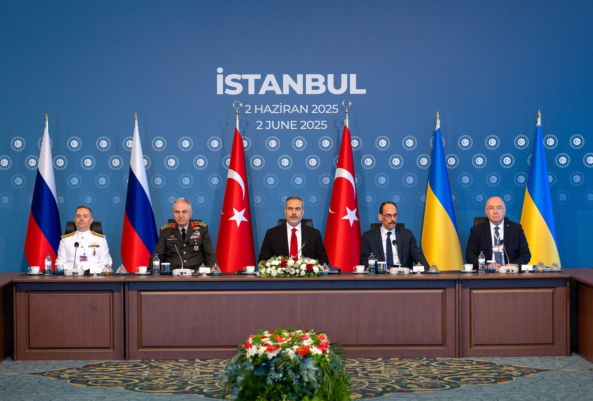
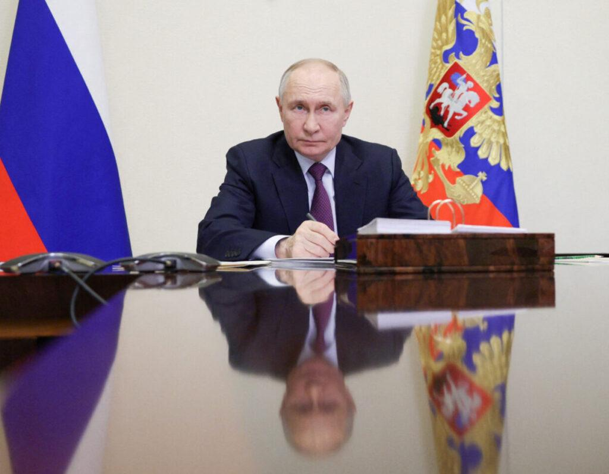
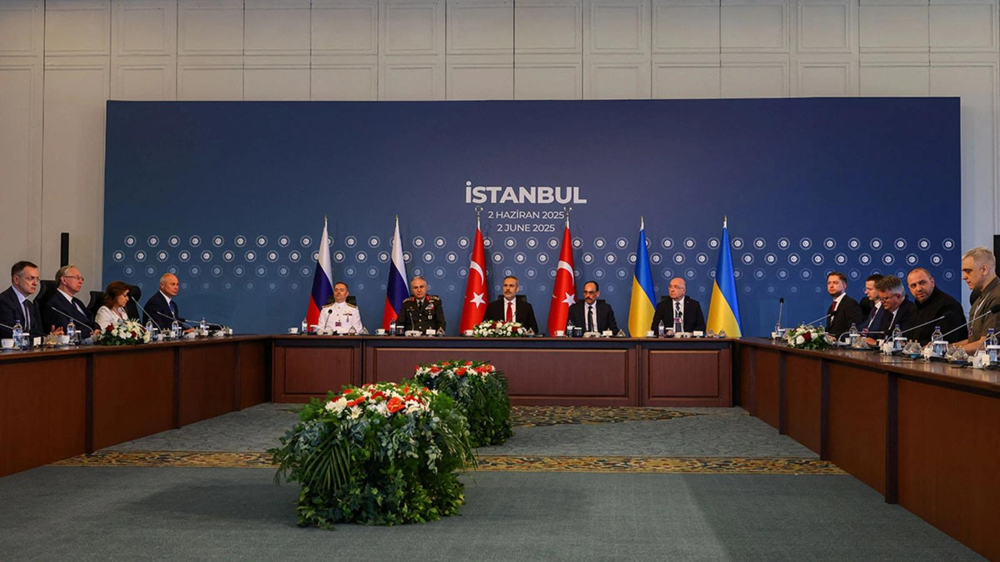

## Claim
Claim: "In early 2025, Ukraine and Russia had reached a peace deal in their years-long war."

## Actions
```
image_search("Ukraine Russia peace deal 2025")
```

## Evidence
### Evidence from `image_search`
CNN published an article about Russia-Ukraine peace talks in Istanbul on June 2, 2025, as reported in [Source](https://www.cnn.com/2025/06/02/europe/russia-ukraine-peace-talks-turkey-drone-attack-intl) . The Atlantic Council discusses a Putin-friendly peace deal, and the search result includes an image of Putin .

CFR.org contains an image of a meeting in Istanbul on June 2, 2025, with flags of Russia, Turkey, and Ukraine, as stated in [Source](https://www.cfr.org/article/russia-and-ukraine-agree-prisoner-swap) .


## Elaboration
The evidence indicates that peace talks between Russia and Ukraine took place in Istanbul on June 2, 2025, as reported by CNN ([Source](https://www.cnn.com/2025/06/02/europe/russia-ukraine-peace-talks-turkey-drone-attack-intl)) and CFR.org ([Source](https://www.cfr.org/article/russia-and-ukraine-agree-prisoner-swap)). However, the evidence does not explicitly state whether a peace deal was reached in early 2025.

The Atlantic Council discusses a "Putin-friendly peace deal," but the provided evidence does not confirm if such a deal was finalized or when it might have occurred.

To verify the claim, information is missing about the outcome of the peace talks and whether a deal was reached in early 2025.


## Actions
```
image_search("Ukraine Russia peace deal early 2025")
```

## Evidence
No new evidence found.

## Elaboration
The evidence confirms peace talks occurred in Istanbul on June 2, 2025, but does not confirm a peace deal was reached in early 2025. The search for additional evidence did not yield any new information.

Therefore, the claim cannot be verified with the available evidence.


## Actions
```
image_search("Ukraine Russia peace agreement signed 2025")
```

## Evidence
No new evidence found.

## Elaboration
The evidence indicates peace talks occurred in Istanbul on June 2, 2025, but does not confirm a peace deal was reached in early 2025. Additional searches did not yield any new information.

The claim cannot be verified with the available evidence.


## Final Judgement
The evidence shows that peace talks occurred in June 2025, but there is no evidence to confirm that a peace deal was reached in early 2025. Therefore, the claim is not supported by the available information. `false`


### Verdict: FALSE

### Justification
The evidence indicates that peace talks between Russia and Ukraine took place in Istanbul on June 2, 2025, as reported by CNN ([Source](https://www.cnn.com/2025/06/02/europe/russia-ukraine-peace-talks-turkey-drone-attack-intl)) and CFR.org ([Source](https://www.cfr.org/article/russia-and-ukraine-agree-prisoner-swap)). However, the evidence does not confirm that a peace deal was reached in early 2025. Additional searches did not yield any new information to support the claim.
