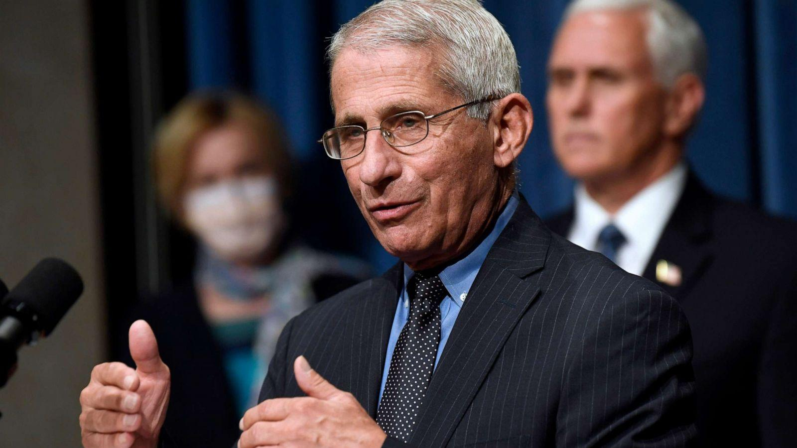
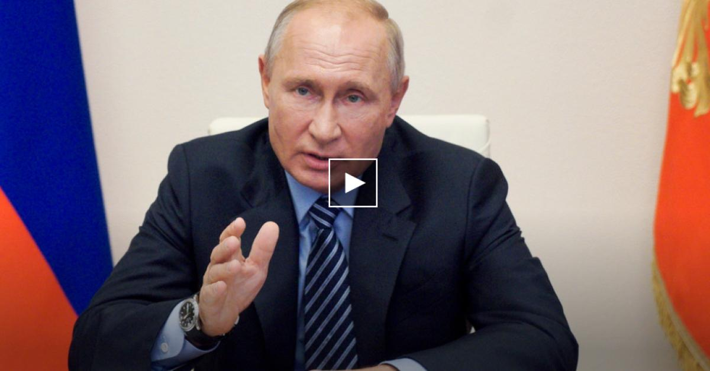
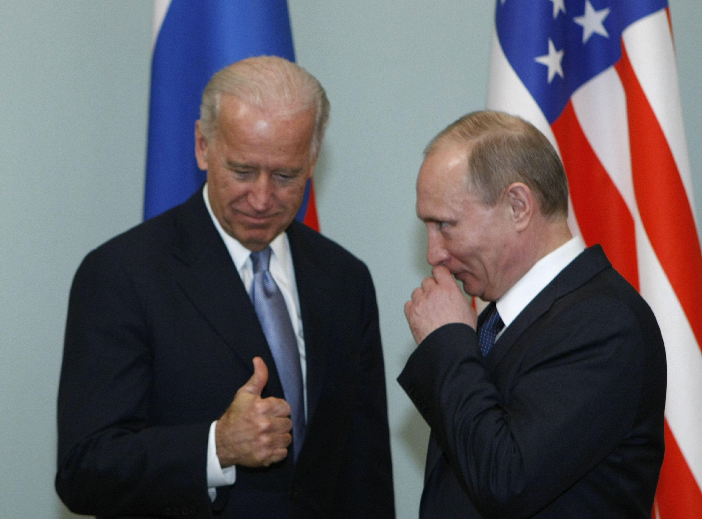
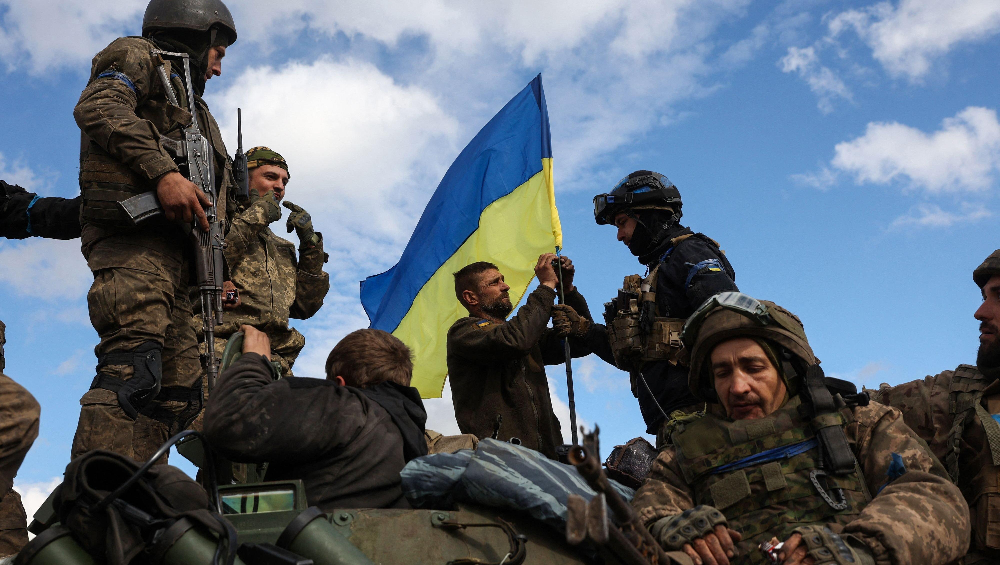
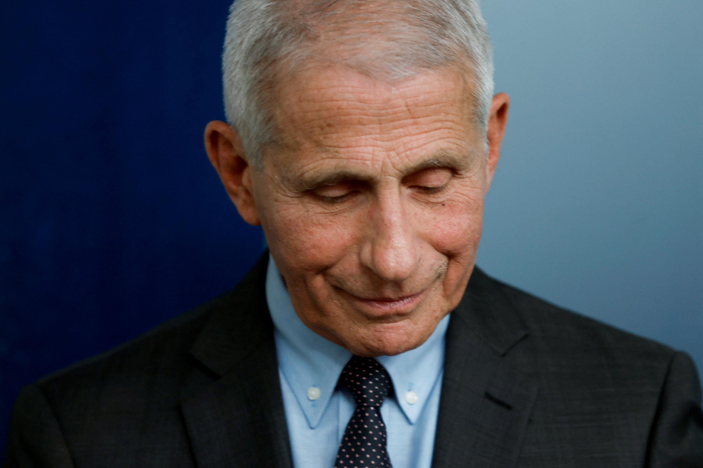

## Claim
Claim: "In January 2025, Russian President Vladimir Putin was seeking to have Dr. Anthony Fauci in the U.S. extradited to Russia in exchange for ending the war in Ukraine."

## Actions
```
image_search("Vladimir Putin Anthony Fauci extradition")
```

## Evidence
### Evidence from `image_search`
The search results include articles from ABC News ([https://abcnews.go.com/US/fauci-doubts-russias-covid-19-vaccine-safe-effective/story?id=72309297](https://abcnews.go.com/US/fauci-doubts-russias-covid-19-vaccine-safe-effective/story?id=72309297)) and National Geographic ([https://www.nationalgeographic.com/science/article/fauci-seriously-doubts-russia-coronavirus-vaccine-is-ready-cvd](https://www.nationalgeographic.com/science/article/fauci-seriously-doubts-russia-coronavirus-vaccine-is-ready-cvd)) featuring images of Dr. Anthony Fauci (, ).

Another search result from Duke Health ([https://dhvi.duke.edu/news/experts-express-doubts-over-russias-vaccine-claim](https://dhvi.duke.edu/news/experts-express-doubts-over-russias-vaccine-claim)) contains an image of Vladimir Putin ().


## Elaboration
The search results show images of Dr. Anthony Fauci and Vladimir Putin. However, the provided evidence does not contain any information about Putin seeking Fauci's extradition in exchange for ending the war in Ukraine.

Therefore, the claim cannot be verified with the available evidence.


## Actions
```
image_search("Putin Fauci extradition Ukraine war")
```

## Evidence
### Evidence from `image_search`
The search results include an image of Vladimir Putin from CNN ([https://www.cnn.com/2021/06/13/europe/putin-russia-cyber-criminals-intl](https://www.cnn.com/2021/06/13/europe/putin-russia-cyber-criminals-intl))  and an image of Ukrainian soldiers from The Economist ([https://www.economist.com/europe/2022/12/23/making-sense-of-vladimir-putins-war](https://www.economist.com/europe/2022/12/23/making-sense-of-vladimir-putins-war)) . Another source from MWI ([https://mwi.westpoint.edu/what-is-russias-theory-of-victory-in-ukraine/](https://mwi.westpoint.edu/what-is-russias-theory-of-victory-in-ukraine/)) has no content.


## Elaboration
The new search results provide images of Vladimir Putin and Ukrainian soldiers, but they still do not contain any information about Putin seeking Fauci's extradition in exchange for ending the war in Ukraine.

Therefore, the claim remains unverified.


## Actions
```
image_search("Anthony Fauci Russia extradition Ukraine war")
```

## Evidence
### Evidence from `image_search`
From [Source](https://www.reuters.com/world/us/trump-says-he-ended-security-former-top-covid-official-anthony-fauci-2025-01-24/): 
Content: Reuters published an article on January 24, 2025, featuring an image of Dr. Anthony Fauci. 


## Elaboration
The latest search result from Reuters ([https://www.reuters.com/world/us/trump-says-he-ended-security-former-top-covid-official-anthony-fauci-2025-01-24/](https://www.reuters.com/world/us/trump-says-he-ended-security-former-top-covid-official-anthony-fauci-2025-01-24/)) provides an image of Dr. Anthony Fauci and mentions a publication date of January 24, 2025. However, this article does not contain any information about the extradition of Fauci or the war in Ukraine.

The claim remains unsupported by the evidence.


## Final Judgement
The fact-check involved multiple image searches to find evidence supporting the claim. The search results provided images of Vladimir Putin and Dr. Anthony Fauci, as well as articles about the war in Ukraine. However, none of the search results provided any information about Putin seeking Fauci's extradition in exchange for ending the war in Ukraine. Therefore, the claim cannot be verified. `false`


### Verdict: FALSE

### Justification
The fact-check involved multiple image searches to find evidence supporting the claim. While the searches yielded images of Dr. Anthony Fauci and Vladimir Putin, along with articles related to the war in Ukraine, none of the provided sources, including a Reuters article from January 24, 2025, mentioned Putin seeking Fauci's extradition in exchange for ending the war. Therefore, the claim is unsupported by the available evidence.
